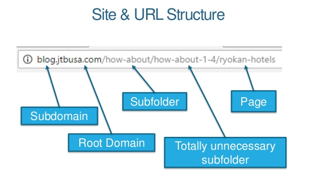
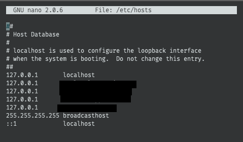

# 로컬에서 서브 도메인 활용하기

## 개요

- 다국어 작업을 서브 도메인을 이용해야 되는데 로컬에서 테스트 하기가 애매해서 구글링 하다 발견한 내용을 정리했다.
- 이 포스팅은 엄청 간단하게 내가 이해한 내용을 바탕으로 쓸 예정이다.
- 아래는 이미지 1개정도 넣어야 될 것 같아 URL 구조 이미지를 추가했으니 참고!!



## 로컬에서 호스트 설정하기

### windows 환경

- CMD 커맨드 프롬프트를 관리자 권한으로 열고 아래 명령어를 입력한다.

``` javascript
notepad c:\Windows\System32\Drivers\etc\hosts
```

### mac/Linxus 환경

- mac/linxus 사용자는 sudo 권한으로 아래 명령어를 입력한다.

``` javascript
sudo nano /etc/hosts
```

- 현재 mac을 사용하고 있으므로 mac 기준으로 설명할 텐데 크게 다른 점은 없어 보인다.
- 위에 명령어를 입력하면 터미널에서 코드 수정할 수 있는 화면이 나온다.



- 익숙한 localhost가 보인다.
- vue에서 로컬 서버를 실행시킬 때 **http://localhost:3000**이 바로 **http://127.0.0.1:3000이다!**
- 검은색으로 가린 부분이 내가 추가하고 싶은 도메인을 입력하면 된다.
- 예를 들면,

``` javascript
127.0.0.1 local.naver.com
127.0.0.1 local.google.com
```

- 이런 식으로 작성하면 된다.
- 그러면 [http://local.google.com:3000으로](http://local.google.com:3000) 접속하면 **http://127.0.0.1:3000** 요기로 접속한 거랑 같다!
- 그래서 내가 적용한 코드는 아래와 같다.
- 로컬, 개발환경, 실 배포 환경 3가지로 나눴다.
- window.location.host를 하게 되면 port 앞부분을 쓱 불러온다.
- 이걸로 체크해 분기 처리했다.

``` javascript
const host = window.location.host
const isLocalEn = data.name.toLowerCase() === 'en'

if (host.includes('local')) {
  if (isLocalEn) {
    window.location.href = `http://en-local.example.com:3000${this.$route.fullPath}`
  } else {
    window.location.href = `http://local.example.com:3000${this.$route.fullPath}`
  }
  return
}
if (host.includes('dev')) {
  if (isLocalEn) {
    window.location.href = `https://en-dev.example.com${this.$route.fullPath}`
  } else {
    window.location.href = `https://dev.example.com${this.$route.fullPath}`
  }
  return
}

// if (process.env.NODE_ENV === 'production') {
if (isLocalEn) {
  window.location.href = `https://en.example.com${this.$route.fullPath}`
} else {
  window.location.href = `https://example.com${this.$route.fullPath}`
}
// }
return
```

## 결론

- 로컬에서 테스트하기 막막했었는데 이 방법으로 하니 서비스 환경과 동일하게 작업할 수 있어 좋았다.

## 참고

- Vue.js - How to handle multiple subdomains on a single app. : [https://medium.com/@apalshah/vue-js-how-to-handle-multiple-subdomains-on-a-single-app-cba9b1 f916c4](https://medium.com/@apalshah/vue-js-how-to-handle-multiple-subdomains-on-a-single-app-cba9b1f916c4)

- localhost와 127.0.0.1의 차이 : [https://m.blog.naver.com/tajo70/100202261837](https://m.blog.naver.com/tajo70/100202261837)