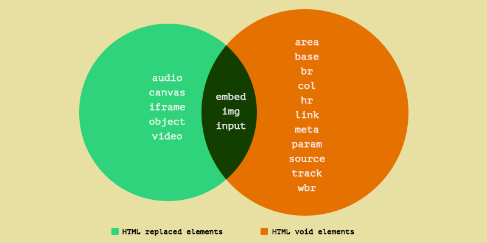
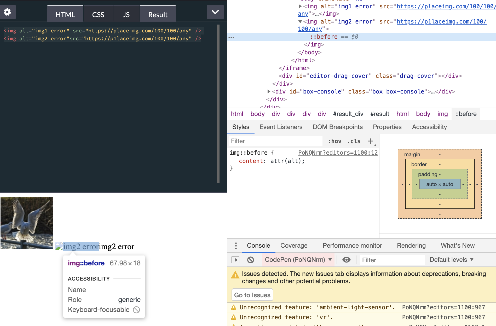
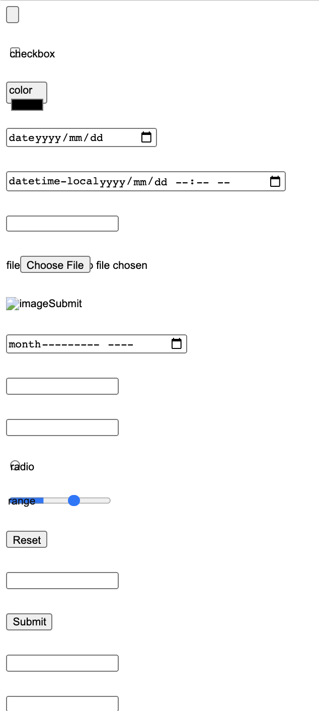
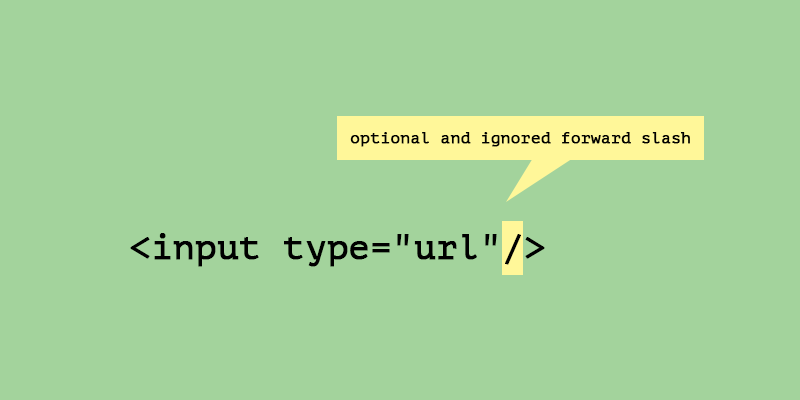

# input, image 등에서 ::before 를 사용할 수 없는 이유?

## 개요

- CSS 작업하다보면 `::before, ::after` 를 이용해서 처리할때가 있다. 하지만, 어떤 태그에서 작동이 안하는 경우가 있습니다. 이걸 한번 알아봅시다.
- `::before, ::after` `pseudo-elements`(가상 요소)는 텍스트 입력하는 태그들과, 이미지 또는 영상을 보여주는 태그에는 사용할 수가 없다. 그 이유는 `repalced elements`(대체요소)때문이다, HTML 표준 [렌더링 섹션](https://html.spec.whatwg.org/multipage/rendering.html#replaced-elements)에 특별한 카테고리에 자세한 설명이 있으니 참고하길 바랍니다.

> `<audio>,<canvas>,<embed>,<iframe>,,<input>,<object>,<video>`

- `img,input,embed` 는 가상요소가 될수도있고 대체요소가 될 수 있습니다.



## img 예제

```html
// html

 // wrong img
url // css img::before { content: attr(alt); // }
```

### ::before 정의(MDN참고)

> CSS에서, ::before는 선택한 요소의 첫 자식으로 가상 요소를 하나 생성합니다. 보통 content 속성과 함께 짝지어, 요소에 장식용 콘텐츠를 추가할 때 사용합니다. 기본값은 인라인입니다.

- 즉, 해당 요소에 추가로 스타일을 입히거나, 추가로 요소를 넣을때 사용합니다.
- 위 예제를 계속 살펴보자. 코드를 실행시키고, 크롬 개발자도구를 열어 확인했습니다.
- [코드 예제(on CodePen)](https://codepen.io/DUCKHEE/pen/PoNQNrm?editors=1100)



- 2번째 img를 불러오지 못하므로 대체 텍스트 `alt` 에 적어둔 메세지가 보입니다.
- 근데 1개가 아니고 2개가 중복으로 보인다. 바로 `::before` 에서 `content: attr(alt)` 를 사용해서 `img::before` 에 `alt` 텍스트가 보여지게 됩니다.
- 2개의 img 태그를 살펴보면 첫번째에서는 `::before` 가 삽입되지 않고 두번째에서만 삽입되었습니다. 즉, 브라우저 환경이나, 여러가지 요인에 따라 replaced element(대체 요소), `void element` (무효요소?)로 나눠집니다.
- replaced element는 `::before, ::after` 가상 요소를 포함한 모든 내용을 element로 대체된다고 합니다.([관련 내용 on github](https://github.com/w3c/csswg-drafts/issues/625#issuecomment-450410371))

## Replacement Element(대체요소)에만 적용되는 CSS 속성

- **object-fit, object-position**이 있다.([MDN 링크](https://developer.mozilla.org/ko/docs/Web/CSS/object-fit))
- object-fit : 속성은 `img`나 `video` 요소와 같은 Replaced Element(대체 요소)의 콘텐츠 크기를 어떤 방식으로 조절해 요소에 맞출 것인지 지정합니다.
- object-position : 속성을 사용해 대체 요소 콘텐츠가 콘텐츠 박스 내에 위치할 지점을 바꿀 수 있습니다.

```html
// html
<div class="wrap">
  
</div>

// css .wrap { height: 200px; height: 400px; background-color: grey; } img {
object-fit: contain; /* object-fit: fill; object-fit: cover; object-fit:
scale-down; object-fit: none; */ height: 100%; width: 100%; }
```

- [코드 예제(on Codepen)](https://codepen.io/DUCKHEE/pen/ZEWrOpZ)

## input도 알아보자.

- `input`도 Replaced element(대체요소), Void Elements(무효요소) 둘다 가능하므로 명확하게 정의를 내릴수가 없다.
- 그래서 `semi-replaced` 라는 용어를 CSS spec editor Tab Atkins가 사용했다.([사용한 링크](https://github.com/whatwg/html/issues/2948#issuecomment-323821560))
- `input` 태그 예제를 살펴보자

```html
// html
<input type="button" />
<input type="checkbox" />
<input type="color" />
<input type="date" />
<input type="datetime-local" />
<input type="email" />
<input type="file" />
<input type="hidden" />
<input type="image" />
<input type="month" />
<input type="number" />
<input type="password" />
<input type="radio" />
<input type="range" />
<input type="reset" />
<input type="search" />
<input type="submit" />
<input type="tel" />
<input type="text" />
<input type="time" />
<input type="url" />
<input type="week" />

// css input { display: block; margin-bottom: 30px; } input::before { content:
attr(type) }
```

- [코드 예졔(on Codepen)](https://codepen.io/DUCKHEE/pen/oNxELEB)



- `::before` 가 적용된 요소들도 있고 없는 요소들도 있다.

## Void Elements(무효요소)란?

- HTML tag는 기본적으로 element(요소)가 아니다.
- tag는 단지 마크업내 요소에 처음과 끝을 구분하는 역할이다.
- Void Elements는 end tag를 가지고 있지 않으므로 요소안에 컨텐츠를 포함할 수 없다.
- 오직 Start tag만 가지고 있다.

  ```html
  <input type="url" />
  ```



- Void Elements

```docs
area
base
br
col
embed
hr
img
input
link
meta
param
source
track
wbr
```

## 결론

- 간단하게 `::before, ::after` 가상 요소가 작동안되는 태그들만 확인하려고 했는데 생각보다 정보도 없고 스펙문서를 봐야되는 상황이 왔습니다.
- 아직 원서를 정확하게 읽고 이해할 수준이 되지 않아 간단하게 살펴봤습니다.
- **Replaced Element 에는 가상 요소를 사용할 수 없다** 라고 결론을 짓겠습니다.

## 참조

- [https://webplatform.news/issues/2020-08-26](https://webplatform.news/issues/2020-08-26)
- [https://catalin.red/html-replaced-void-elements/](https://catalin.red/html-replaced-void-elements/)
- [https://github.com/w3c/csswg-drafts/issues/625#issuecomment-450410371](https://github.com/w3c/csswg-drafts/issues/625#issuecomment-450410371)
- [https://developer.mozilla.org/en-US/docs/Web/CSS/object-fit](https://developer.mozilla.org/en-US/docs/Web/CSS/object-fit)
- [https://stackoverflow.com/questions/38779034/list-of-replaced-elements](https://stackoverflow.com/questions/38779034/list-of-replaced-elements)
- [http://ahmed.amayem.com/html-replaced-elements-non-replaced-elements-examples/](http://ahmed.amayem.com/html-replaced-elements-non-replaced-elements-examples/)
- [https://github.com/whatwg/html/issues/2948](https://github.com/whatwg/html/issues/2948)
