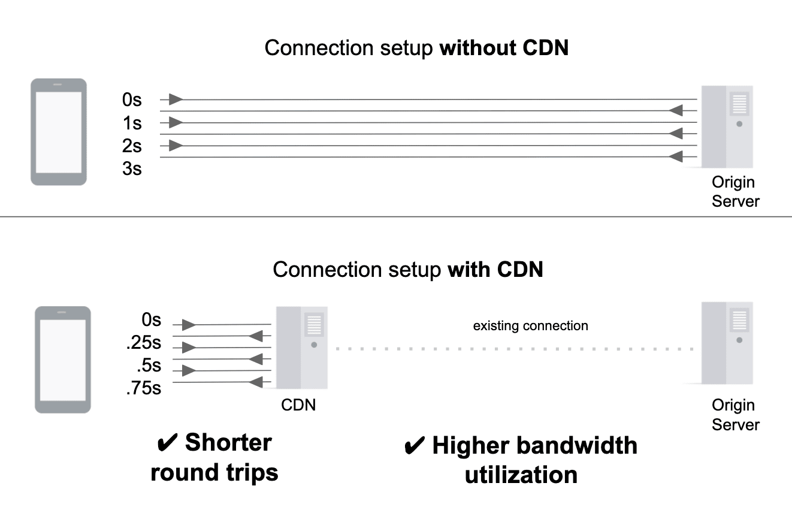
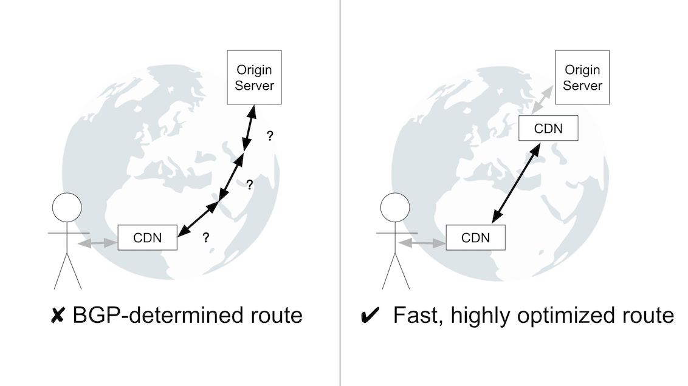
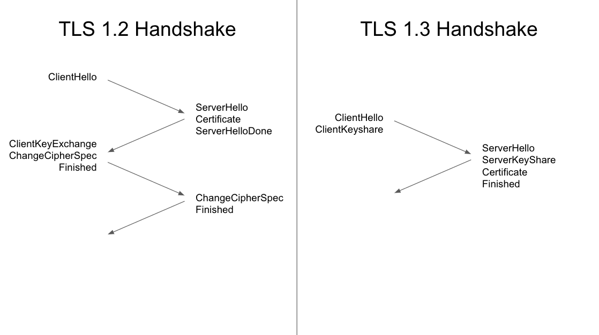

# CDNs(Content delivery networks)에 대해 알아보자 #1

- AWS CloudFront를 사용중인데 CDN, 캐쉬 관련해서 대략적인 개념만 알고 있는 상태다.
- 웹 최적화를 검색하는 도중 CDN관련 내용이 있어 간단하게 정리하겠다.
- [web.dev](https://web.dev/content-delivery-networks/) 여기 포스팅을 참고 했다.


## 개요

- **CDN**은 분산된 서버 네트워크를 사용해 사용자들에게 리소스를 제공함으로써 사이트 성능을 향상시킨다. CDN은 서버 부하(서버 로드)를 줄이기 때문에, 서버 비용을 절감하고, 트래픽 급증(traffic spkies) 처리에 적합하다.
- 이 포스팅은 CDN이 작동하는 법, CDN 설정 최적화, 플랫폼을 고르는법과 설정하는 법을 알려준다.
- CDN은 캐시 된 컨텐츠를 제공하는 걸로 잘 알려져 있지만, 캐쉬 할수 없는 컨텐츠를 제공할때도 좋다.
- CDN의 성능 이점은 다음과 같은 원칙에 의해 이루어진다.
  - CDN서버들은 **origin servers : CDN이 컨텐츠를 불러오는 서버**보다 사용자에게 더 가깝게 위치해 있다. 그러므로 **round-trip time(RTT) : 왕복시간 요청-응답**가 짧다.
  - CDN서버들은 네트워크 최적화를 통해 직접 origin servers에서 사용자에게 컨텐츠를 제공하는것보다 빠르다.
  - CDN캐시를 사용하면 origin server에게 요청(request)을 하지 않는다.

## 리소스 제공(Resource delivery)

- CDN을 사용하여 origin server에서 리소스를 제공할때, 사용자와 사용자 근처에 있는 CDN서버간에 새로운 연결이 만들어진다.
- CDN과 origin server간의 데이터 전송은 CDN의 네트워크에 발생한다. CDN과 origin server 지속적인 연결을 유지한다.
- 이를 통해 얻는 장점은 2가지이다.
  - 새로운 연결은 가능한 한 사용자와 가까운 CDN과 연결하면 불필요한 연결 설정 비용을 줄일 수 있다.(새로운 연결은 비용이 많이 들고, RTT가 필요하다.)
  - 미리 연결되어 있는 경우에는 최대 가능한 데이터 처리량을 즉시 전송이 가능하다.



- 일부 CDN은 인터넷에 분산 된 여러 CDN 서버들을 통해 트래픽을 origin server로 라우팅함으로써 향상시킨다.
- 여러 CDN끼리의 연결(connections)은 **Border Gateway Protocol(BGP)**보다 안정적이고, 높은 최적화된 경로를 통해 발생한다.
- BGP는 인터넷 라우팅 프로토콜이지만 성능 지향적이 아니다. 따라서, BGP가 결정한 경로는 CDN 서버간에 최적화된 경로보다 성능이 떨어질 수 있다.



## 캐시(Caching)

- CDN server에 리소스를 캐싱하면 리소스를 제공받기 위해 origin server까지 요청을 할 필요가 없다. 따라서, 리소스를 더 빨리 제공 받을 수 있다.
  
### 캐시에 리소스 추가(Adding resources to the cache) 

- 가장 일반적인 방법은 필요한 리소스를 CDN server에서 "pull" 리소스를 하는것이다. origin pull이라고 한다.
- 특정 리소스를 캐시 CDN에서 처음 요청하면 CDN은 origin server에 요청하고 응답받은걸 캐시한다.
- 이러한 방식으로 캐시되지 않은 리소스들이 캐시된다.

### 캐시에서 리소스 제거(Removing resources from the cache)

- CDN은 캐시 제거를 사용해 캐시에서 필요하지 않는 리소스들을 제거하는 방식을 사용한다.(**Cache eviction**)
- 사이트 오너는 명시적으로 캐시에 있는 리소스를 제거할 수 있다.(**Purging as cache invalidation**)

#### Cache eviction

- 캐시는 한정된 저장 용량을 가지고 있다. 저장 용량을 꽉 차게 되면 최근에 접근하지 않은 리소스들을 제거하거나 용량이 큰 리소스들을 제거한다.
- 하나의 CDN 서버에서 제거된 리소스가 전체 CDN 서버에서 제거되었음을 의미하지는 않는다.(여러개 CDN 서버가 존재하는데 그중 1개의 CDN에서 제거될 경우를 말하는것 같습니다.ㅋㅋ)

#### Purging

- 퍼징(Purging)은 Cache eviction처럼 기다리는게 아니고 바로 제거해버리는 메커니즘이다.
- CDN 서버에서 캐쉬된 리소스를 즉각 삭제를 지원하는 경우 동적인 컨텐츠(dynamic content)를 관리하는데 용이하다.(긴 TTL를 사용하는 컨텐츠) 이 동적인 콘텐츠을 캐시하고 업데이트될때마다 캐시된 콘텐츠를 삭제한다.
- 이 방식을 사용해 언제 업데이트 되는지 모르는 동적인 리소스의 캐싱 기간을 최대한 길게 유지할 수 있다. 이 기법을 **hold-till-told-caching**이라고 한다.

- 또한, 규모에 따라 퍼징을 사용할때 **캐시 태그(cache tags)**, **삭제 캐시 키(surrogate cache keys)**라는 개념을 사용한다.
- 이 매커니즘은 하나의 리소스에 식별자를(tags) 연결한 다음, 태그를 사용해 세분화된 삭제를 할 수 있다.
- 예를 들면, 사이트 하단 푸터가 포함된 `/about, /blog` 리소스에 `footer`라는 태그를 추가한다. 사이트 하단 푸터가 업데이트 되면 `footer`태그를 가진 CDN에 있는 모든 리소스를 퍼징한다.

### 캐시 가능한 리소스(Cacheable resources)

- 리소스를 캐싱할 수 있는 지, 캐싱하는 방법은 public, private, static(정적), dynamic(동적)에 따라 달라진다.

#### Private Resources

- Private Resource는 개인정보를 포함하고 있으므로 CDN에 캐시되면 안된다. Private Resource는 header에 `Cache-Control: private`으로 표시된다.

#### Pulblic Resources

- Public Resources는 개인정보를 포함하고 있지 않으므로 CDN에 캐시할수 있다. header에 `Cache-Control: no-store`,`Cache-Control: private`이 없으면 캐시가 가능하다.
- assets이 얼마나 자주 변경되는지에 따라 캐시 기간이 달라진다.

#### Dyanamic content

- Dynamic content는 API 응답, 쇼핑몰 같은 리소스의 유형이다. 이런 리소스가 자주 변경된다고 해서 캐싱이 되지 않는것은 아니다.
- 예를 들면, 트래픽이 몰릴 시간에 매우 짧은 시간(예 5초) 동안 캐싱하면 데이터 갱신 영향을 최소화하면서 origin server에 부하를 줄일 수 있다.

#### Static content

- Static content는 자주 변경되지 않는 이미지, 비디오, 라이브러리 등 리소스 유형이다. static content는 변경되지 않으므로 6개월 또는 1년 등 긴 TTL(Time to Live)로 캐시해야 한다.

## CDN 고르기

- 일반적으로 CDN을 선택 할때 성능(퍼포먼스)를 가장 중요하게 고려된다. 물론 CDN 가격 측정, 지원, CDN이 제공하는 다른 기능들도 물론 고려해야 된다.

### 성능(Performance)

- CDN의 성능 전략은 지연 시간 최소화(minimizing latency)와 캐시 적중률의 최대화(maximizing cache hit ratio) 서로 반비례한다. 즉 지연 시간이 최소화될수록 캐시 적중률은 나빠진다. 반대로 지연시간이 길어질수록 캐시 적중률은 높아진다.
- 지연 시간 최소화를 위해 CDN 서버인 PoP(points of presence)가 많으면 캐시 적중률을 나빠진다.
- CDN 서버 100개랑 1개를 비교해보면 100개는 전세계에 많이 분포되어 있어서 지연률이 낮다. 하지만 CDN 1개는 캐시 1번만 되면 100% 캐시 적중률을 가지고 더이상 오리진서버에 요청하지 않지만 CDN 100개 서버의 경우에는 캐시 안된 CDN서버 근처 사용자들이 요청을 해야 캐시가 된다.
- 그래서 사용자와 가까운 Pop를 엣지캐시(edge caches)라고 한다. 엣지캐시는 높은 캐시 적중률을 가진 중앙PoP의 도움을 받는다. 사용자가 엣지캐시에 요청했는데 캐시된 리소스가 없으면 엣지캐시에서 오리진 서버대신 캐시된 리소스가 있는 중앙PoP에 요청한다. 이 경우에는 캐시된 리소스를 받지만 지연시간이 조금 오래 걸린다.
- CDN 성능은 지리, 시간대 등의 이유로 성능차이가 날 수 있다. CDN 성능을 직접 조사해보는것은 좋은 생각이지만, CDN으로 얻은 정확한 성능을 예측하기는 쉽지 않다.

#### 추가적인 기능들(Additional features)

- CDN는 일반적인 핵심 기능이외에도 다양한 기능을 제공한다. 일반적으로 제공되는 기능은, 로드 밸런싱, 이미지 회적화, 비디오 스트리밍, 엣지 컴퓨팅(edge computing), 보안 관련(security products)이다.

## CDN을 설정 및 준비하는 방법(How to setup and configure a CDN)

- CDN을 전체 사이트에 제공해야 한다. CDN을 셋업하려면 CDN provider에 등록한 다음 CNAME DNS record를 업데이트 해야 한다.
- 예를 들면, www.example.com의 CNAME 레코드는 example.my-cdn.com을 가리킨다. 이러한 변경으로 사이트로의 트래픽은 CDN를 통해 라우팅 된다.
- www.example.com으로 접속하면 example.my-cdn.com으로..

``` html
www.example.com -> example.my-cdn.com (CNAME) 
example.my-cdn.com -> 211.231.99.250 (A record)
```

- 모든 리소스가 아닌 특정 리소스(예: 정적리소스)만 CDN를 사용해야 한다면 별도의 CNAME 레코드를 생성하여 작업할 수 있다.
- static.example.com CNAME을 만들어 example.my-cdn.com을 가리킨다. 또한 CDN에서 서비스 중인 리소스의 URL을 static.example.com 도메인을 가리켜야 한다.

## 캐시 적중률 향상시키기(Improving cache hit ratio)

- 효율적인 CDN 셋업은 캐시에서 가능한한 많은 리소스들을 제공한다. 캐시 적중률(Cache Hit ratio : CHR)로 측정되어진다. 캐시 적중률은 정해진 시간내에 캐시 적중 횟수를 총 요청 수로 나눈 값으로 정의된다.(cache hit / request)
- CHR 최적화할때 가장 먼저 확인해야 되는 부분은 모든 캐시 가능한 리소스들이 캐시가 되고 있는지 그리고 정확한 시간 동안 캐시되고 있는지 확인하는 것이다.
- 그 다음은 논리적으로 동등한 서버 응답이 별도로 캐시되지 않도록 CDN 세팅을 fine tune(미세하게 조정)한다. 쿼리 매개변수, 쿠키, 요청 헤더와 같은 요소가 캐싱에 영향을 미치기 때문이다.

### Initial audit

- 대부분 CDNs들은 캐시 분석을 제공한다. 그리고 [WepPageTest](https://webpagetest.org/),[Lighthouse](https://web.dev/uses-long-cache-ttl/) 와 같은 도구로 페이지 정적 리소스들이 캐싱되고 있는 빠르게 확인이 가능하다. 각 리소스의 HTTP 캐시 헤더를 체크한다. 최적화된 TTL을 사용하면 불필요한 origin server 요청을 줄일 수 있다.
- 최소한 CDN에서 리소를 캐싱하려면 아래와 같은 헤더들중에 1개는 있어야 한다.
  - `Cach-Control: max-age=`
  - `Cach-Control: s-max-age=`
  - `Expires`
- 자세한 내용은 여기 참고하면 됩니다. [https://web.dev/http-cache/](https://web.dev/http-cache/)
  
### Fine tuning

- CDN 캐시가 작동하는 방법을 간단하게 설명하면, 리소스의 URL을 키로 사용하여 캐시를 하고 캐시된 자원을 부른다.
- URL를 키로 사용하긴 하지만 Query params, header 등의 설정에 따라 달라진다.

#### Query params

- 기본적으로 CDN은 query params를 리소스를 캐싱할때 영향을 준다.
  - 불필요한 query params
    - `exmple.copm/blog`
    - `exmple.copm/blog?referral_id=2zjk`
    - 위 2개는 같은 리소스를 호출하지만 각각 별도로 캐시한다.
    - `referral_id` query param을 무시하는 CDN설정을 하면 1개의 캐시로 사용이 가능하다.
  
  - Query params 순서
    - 대부분의 사이트에서는 Query Params순서에 따라 리소스가 변경되지 않으므로 중요하지 않다. 하지만 CDN은 Query params 순서에 따라 캐시를 하므로 순서를 정렬하여 URL를 정규화시키면 캐시를 효율적으로 할 수 있다.

#### Vary

> Vary : 서버는 자신이 캐쉬한 응답을 적절한 Accept-Encoding 요청 헤더를 보낸 클라이언트에게만 보내도록 Vary: Accept-Encoding으로 설정할 수 있다.
> Vary HTTP 응답 헤더는 원 서버로부터 신선한 리소스를 요청하지 않고 캐시된 응답이 사용될 수 있는지를 결정하기 위해 이후의 요청 헤더를 일치시키는 방식을 결정합니다.

- Vary 응답 헤더는 특정 URL에 요청된 헤더(예를 들면, 요청 헤더에 `Accept-Language, Accept-Encoding`)에 따라 서버 응답이 달라질 수있음을 캐시에 알려준다. 
  - `Accept-Language: en-US`
  - `Accept-Language: kr-KO`
  - 다른 컨텐츠를 캐시하고 제공한다.
- Vary역시 요청 헤더를 정규화시켜서 각각 따로 캐시될 수 있는 것들을 효율적으로 하나의 캐시로 관리 할 수 있다.
  - `Accept-Language: en-US`
  - `Accept-Language: en-US,en;q=0.9`
  
#### Cookies

- 쿠키는 쿠키 헤더를 통해 요청시 설정된다.(`Set-Cookie`)
- 캐시가 일반적으로 이 헤더를 포함하는 서버 응답을 캐시하지 않는 경우, 불필요한 `Set-Cookie`를 하지 말아야 한다.

## Performance features

- 이제 CDN에서 제공해주는 성능을 높여주는 기능들을 살펴보자.

### Compression

- 모든 텍스트 기반 응답은 `gzip` 또는 `Brotli`를 사용하여 압축되어진다. 만약 선택할 수 있으면 압축률이 더 좋은 `Brotli`를 선택해라.

### TLS 1.3

- TLS 1.2보다 성능이 좋고 새로나온 TLS 1.3를 사용해라
- TLS 1.3은 TLS handshake를 2회 왕복에서 1회로 단축한다.
- 

### HTTP/2 and HTTP/3

- HTTP2, HTTP3 둘다 HTTP1보다 훨씬 좋은 성능을 제공한다. 하지만 HTTP3는 아직 표준이 아니므로 HTTP2를 현재 사용하는 것을 추천한다.
- HTTP2는 multiplexing, stream prioritization, server push, header compression의 기능들을 제공한다.

### Image optimization

- CDN은 이미지 전송 크기를 줄이기 위해 자동으로 적용될 수 있는 이미지 최적화에 포커스를 둡니다. 예를 들면, EXIF 데이터 제거, 무손실 압축 적용, 이미지를 최신 파일 형식(ex: WebP)으로 변환등을 제공한다.

### Minification

- Javascript,css,html에 불필요한 문자를 제거해준다. CDN보다 원본에서 축소를 하는것이 좋다.

## 결론

- CDN을 사용해라
- 가능한한 캐싱을 적극적으로 사용해라
- CDN에서 제공하는 기능들을 사용해라
- web.dev사이트를 보고 번역하면서 정리를 하려고 했는데 뒤로 갈수록 이해가 되지않아서 많이 부족합니다. 부족한 부분은 아래 링크를 통해 원문을 살펴보시길 바랍니다.

## 참조

- [원서 사이트 web.dev](https://web.dev/content-delivery-networks/)
- [6.1 쿠키와 캐싱](https://feel5ny.github.io/2019/11/16/HTTP_011_02/)