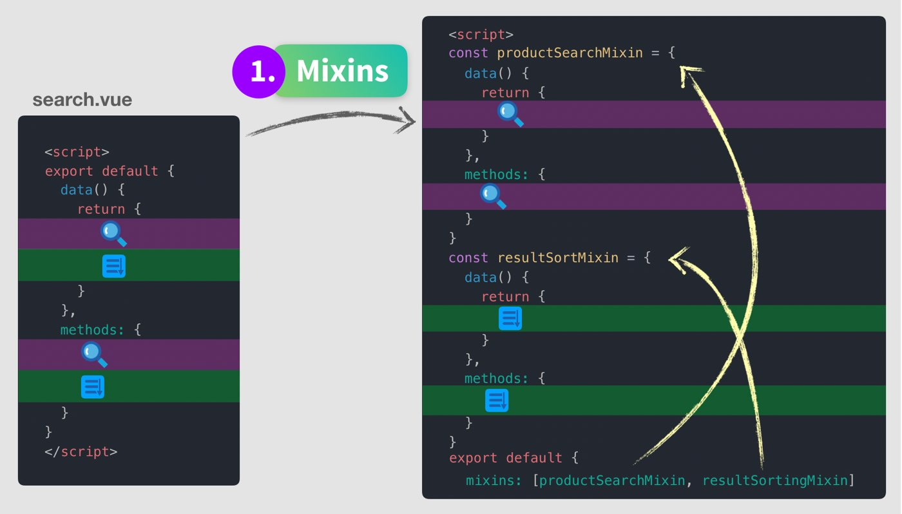
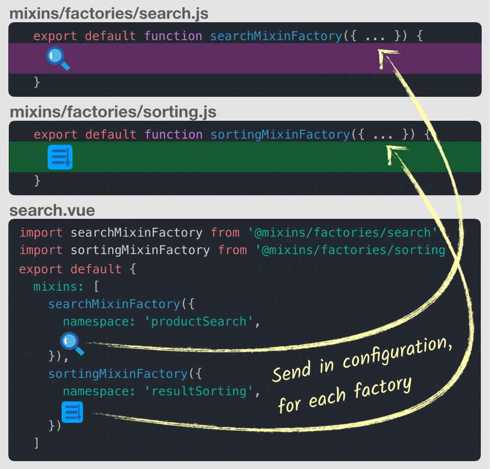
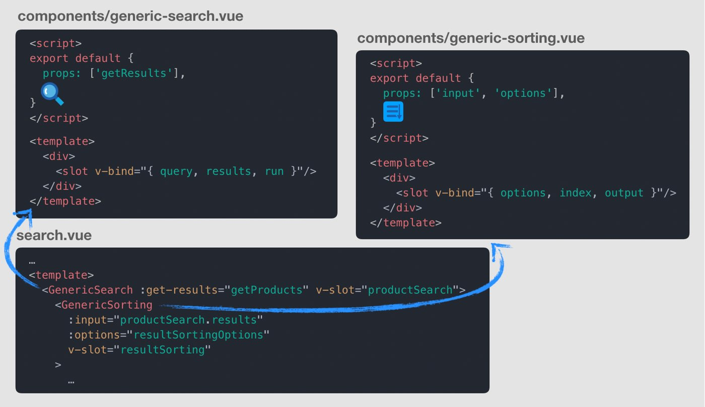
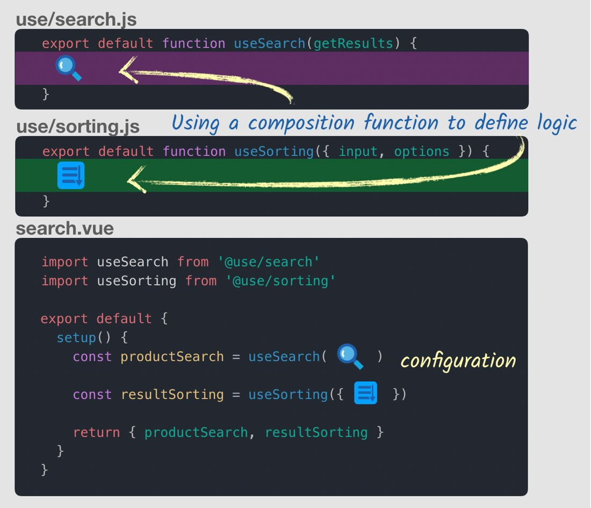

# Vue3 Composition API에 대해 알아보자

> Vue3가 나오면서 Composition API가 제공되고 있다. Composition API가 왜 나왔는지 알아보고 뭔지 알아보자.

## 개요

- Vue2 한계
- Setup & Reactive References
- Methods
- Computed Properties
- The Reactive Syntax

## Vue2 한계

### 컴포넌트가 커지면 커질수록 가독성이 떨어짐

- 예를 들면, 검색어를 입력하고 해당 검색어로 찾은 정렬된 결과를 보여주는 컴포넌트를 살펴보자.

``` javascript
// Vue2
export default {
  data() {
    return {
      검색어 로직(Search)
      결과 정렬(Sorting)
    }
  },
  methods: {
    검색어 로직(Search)
    결과 정렬(Sorting)
  }
}

// Vue3
export default {
  setup() {
    검색어 로직(Search)
    결과 정렬(Sorting)
  }
}
```

- Vue3는 기능별 로직이 모여있어 관리하기 편하다.
- 가독성, 유지보수 측면에서 좋다.
- 하지만 setup() 안에 무자비하게 많은 코드를 넣게 될 경우 문제가 생긴다. 이때는 composition function을 기능별로 만든다.

``` javascript
export default {
  setup() {
    return { ...useSearch(), ...useSorting() }
  }
}

// Composition Functions
function useSearch() {
  검색어 로직(Search)
}
function useStoring() {
  결과 정렬(Sorting)
}
```

### 모든 코드 재사용 패턴에 단점이 있다.

#### Mixins



- 장점
  - 기능별로 구성이 가능하다.

- 단점
  - property 이름때문에 충돌 나기 쉽다.(중복 된 이름 사용할 경우)
  - Mixins 상호작용에 대한 명확하지 않은 관계(믹스인으로 부르기만해서 그런듯?)
  - 다른 컴포넌트에서 Mixins을 사용하려고 할때 재사용하기가 쉽지않다.(안에 설정 변경이 힘들다는 이야기 같음)

#### Mixins Factory

- Mixins에 마지막 단점을 극복하기 위해 Mixins Factory를 살펴보자. 설정을 보냄으로써 Mixins을 커스텀할 수 있다.


- 장점
  - 이제 코드 설정할 수 있으므로 쉽게 재사용이 가능하다.
  - Minxis의 상호작용에 대한 좀 더 명확한 관계

- 단점
  - 네이밍에 대한 강력한 컨벤션과 규율이 필요하다.
  - 여전히 암시적인 속성 추가를 가지고 있다. 어떤 속성이 노출되는지 알아 내기 위해 Mixins 내부를 봐야 된다.

#### Scoped Slots



- 장점
- Mixins의 모든 단점을 해결한다.

- 단점
  - 설정은 템플릿에서 끝내고, 렌더링하려는 항목만 포함해야 한다.
  - 템플릿의 들여쓰기가 증가하여 가독성이 나빠진다.
  - 노출된 프로퍼티들은 템플릿에서만 사용이 가능하다.
  - 1개가 아닌 3개의 컴포넌트를 사용하니 성능이 좋지 않다.


- 3개의 재사용 패턴은 각각 단점이 있다. Vue3의 Composition API는 4번째 코드 재사용 패턴을 제공한다.

#### Composition API



- composition API사용해 컴포넌트를 만들었다. setup 메서드안에서 import된 함수을 사용한다.

- 장점
  - 코드량 길이가 길지 않아, 컴포넌트의 함수 기능을 추가하는 것이 쉽다.
  - 이미 익숙한 함수 다룬다.
  - 단지 기능들인 Mixins, Scoped 보다 유연하다.
  - 코드 편집기에서 Intellisense, autocomplete가 작동한다.

- 단점
  - composition 함수를 정의하려면 low level API를 학습해야 한다.
  - 표준 문법 대신 이제 컴포넌트 작성하는 방법이 2가지가 되었다.

### Vue2에서 TypeScript 지원이 열악하다

## Setup & Reactive References

> Composition API의 setup 메서드, Reactive References에 대해 알아보자.

- Vue2가 deprecated되지 않고 Vue3에서 그대로 사용이 가능하다.


### Setup

``` html
<template>
  <div>Capacity: {{ capacity }}</div>
</template>
<script>
export default {
  setup() {
    // more code to write
  }
};
</script>
```

- `setup`은 `beforeCreate` 훅 전에 실행된다.
- 아래 옵션들이 평가되기전에 실행된다.
  - Components
  - Props
  - Data
  - Methods
  - Computed Properties
  - Lifecycle methods
- `this` 접근 불가하다.
- `setup`은 2개의 전달 인자를 가진다.
- `props`는 reactive하고 watch가 가능하다.
- `context`는 유용한 데이터 접근이 가능하다.(not reactive)

``` javascript
import { watch } from "vue";
export default {
  props: {
    name: String
  },
  setup(props) {
    watch(() => {
      console.log(props.name);
    });
  }
};

setup(props, context) {
  context.attrs;
  context.slots;
  context.parent;
  context.root;
  context.emit;
}
```

### Reactive References

``` html
<template>
 <div>Capacity: {{ capacity }}</div>
</template>
<script>
import { ref } from "vue";
export default {
  setup() {
    const capacity = ref(3); // Reactive Reference를 만드는 코드
    return { capacity } // 사용할 수 있게 return!
  }
};
</script>
```

- `ref(3)`은 원시타입 integer (3)을 객체로 감싸, 변화를 추적한다.
- `data()`가 객체로 감싸는것을 기억해라.
- template에서 사용할 수 있게 객체의 프로퍼티로 return 해줘야 한다.

### vue2에서 사용하려면

```javascript
import { ref } from "vue"; // vue3
import { ref } from "@vue/composition-api"; // vu2
```

- [ref 예제](https://codesandbox.io/s/vigorous-poitras-bbbh4?file=/src/components/HelloWorld.vue)

## 참조

- [vue-mastery](https://www.vuemastery.com)
- [VueCompositionAPI](https://composition-api.vuejs.org/api.html#ref)
- [vue.js](https://v3.vuejs.org/)
