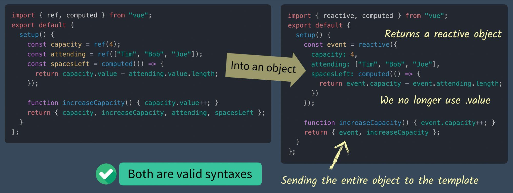

# Vue3 Composition API에 대해 알아보자#2

> Vue3가 나오면서 Composition API가 제공되고 있다. Composition API가 왜 나왔는지 알아보고 뭔지 알아보자.

## 개요

- Methods
- Computed Properties
- The Reactive Syntax

## Methods

- 메서드는 Vue 인스턴스에서 사용된다.(함수라고 생각하면 된다.)
- 아래 코드에서 `capacity`를 1씩 증가시키는 메서드를 만들어보자.

``` html
<template>
  <div>Capacity: {{ capacity }}</div>
</template>
<script>
import { ref } from "vue";
export default {
  setup() {
    const capacity = ref(3);
    return { capacity };
  }
};
</script>
```

- vue2에서 메서드 사용은 아래 코드와 같다.(`data()`사용했을시)

``` javascript
methods: {
  increase_capacity() {
    this.capacity++;
  }
}
```

- vue3에서는 setup 메서드 안에서 만든 다음 return 내보내준다.

``` html
<template>
  <div>
    <p>Capacity: {{ capacity }}</p>
    <button @click="increaseCapacity()">Increase Capacity</button>
  </div>
</template>

<script>
import { ref } from "vue";
export default {
  setup() {
    const capacity = ref(3);

    function increaseCapacity() { // <--- 새로운 함수
      capacity++; // 에러
      capacity.value++; // 정상
    }
    return { capacity, increaseCapacity };
  }
};
</script>
```

- `template`에서는 `ref`를 찾으면 자동으로 `value`을 호출하므로 `capacity.value` 대신 `capacity`로 사용이 가능하다.

## Computed Properties

- `computed`는 간단한 연산일떄만 사용하는 것이 좋다.
- `computed`를 알아보기 위해서는 `attending` 참여자 배열을 코드에 추가해보자.

``` html
<template>
  <div>
    <p>Capacity: {{ capacity }}</p>
    <button @click="increaseCapacity()">Increase Capacity</button>
    <h2>Attending</h2>
    <ul>
      <li v-for="(name, index) in attending" :key="index">
        {{ name }}
      </li>
    </ul>
  </div>
</template>
<script>
import { ref } from "vue";
export default {
  setup() {
    const capacity = ref(4);
    const attending = ref(["Tim", "Bob", "Joe"]); // <--- 새로운 참여자 배열
    function increaseCapacity() {
      capacity.value++;
    }
    return { capacity, attending, increaseCapacity };
  }
};
</script>
```

- 수용 가능한 인원을 `capacity` 참석자가 `attending` 남은 자리를 `spacesLeft`이다. `spacesLeft`를 `computed`로 만들어 보자.

``` javascript
// Vue2
computed: {
  spacesLeft() {
    return this.capacity - this.attending.legnth;
  }
}
// Vue3
const spacesLeft = computed(() => {
  return capacity.value - attending.value.length;
})
```

- `computed`를 적용한 최종 코드

``` html
<template>
  <div>
    <p>Spaces Left: {{ spacesLeft }} out of {{ capacity }}</p>
    <h2>Attending</h2>
    <ul>
      <li v-for="(name, index) in attending" :key="index">
        {{ name }}
      </li>
    </ul>
    <button @click="increaseCapacity()">Increase Capacity</button>
  </div>
</template>
<script>
import { ref, computed } from "vue";
export default {
  setup() {
    const capacity = ref(4);
    const attending = ref(["Tim", "Bob", "Joe"]);

    const spacesLeft = computed(() => { 
      return capacity.value - attending.value.length;
    });

    function increaseCapacity() {
      capacity.value++;
    }
    return { capacity, attending, spacesLeft, increaseCapacity };
  }
};
</script>
```

- Composition API인 `computed`를 불러온다. 익명한수를 하고 `spacesLeft`에 할당한다. `setup`의 `return` 값으로 반환한다.

## The Reactive Syntax

- 기존에는 `ref`를 이용해 원시타입 객체로 감싸 reactive하게 만들었다.
- 다른방법으로는 `reactive`로 감싸는 법이 있는데 한번 알아보자.
- 아래 이미지는 왼쪽이 `ref`, 오른쪽이 `reactive` 사용한 코드이다.



### rective 

- `data`와 비슷
- `computed`도 객체안에 있다.
- `.value` 사용할 필요 없다. (event를 접근하기 떄문)
- `event` 객체를 반환한다.
- 둘다 작동은 되지만 best practice는 아니다. 그건 밑에서 살펴보자.

#### 구조분해(Destructuring)

- 위 `setup` 리턴 코드를 보면 `event`를 반환한다.

``` javascript
return { event, increaseCapacity }
```

- `event.capacity` ,`event.spacesLeft` 등 이런식으로 접근해야 되는데 매우 비효율적이다.
- 아래 코드 처럼 편하게 사용하는 방법을 알아보자.

``` html
<p>Spaces Left: {{ spacesLeft }} out of {{ capacity}}</p>
```

- `event` 객체를 구조분해를 하면서 reactive을 유지하는 방법을 찾아보자.
- 아래 코드들은 reactive을 유지하지 못하므로 사용할 수 없다.

``` javascript
return { ...ev ent, increaseCapacity };
return { event.capacity, event.attending, event.spacesLeft, increaseCapacity }
```

### Introducing toRefs

- `toRefs`라는 메서드를 사용해 `event`를 구조분해 시켜보자.
- 기본 객체를 reactive 객체로 변환시켜준다.

``` html
<template>
  <div>
    <p>Spaces Left: {{ spacesLeft }} out of {{ capacity }}</p>
    <h2>Attending</h2>
    <ul>
      <li v-for="(name, index) in attending" :key="index">
        {{ name }}
      </li>
    </ul>
    <button @click="increaseCapacity()">Increase Capacity</button>
  </div>
</template>
<script>
import { reactive, computed, toRefs } from "vue";
export default {
  setup() {
    const event = reactive({
      capacity: 4,
      attending: ["Tim", "Bob", "Joe"],
      spacesLeft: computed(() => {
        return event.capacity - event.attending.length;
      })
    });
    function increaseCapacity() {
      event.capacity++;
    }
    return { ...toRefs(event), increaseCapacity };
    return toRefs(event); // toRefs만 반환하는 경우
  }
};
</script>
```

- 최종 코드 : [codesandbox-vue3-composition-API-2](https://codesandbox.io/s/vigorous-poitras-bbbh4?file=/src/App.vue)

## 참조

- [vue-mastery](https://www.vuemastery.com)
- [VueCompositionAPI](https://composition-api.vuejs.org/api.html#ref)
- [vue.js](https://v3.vuejs.org/)
