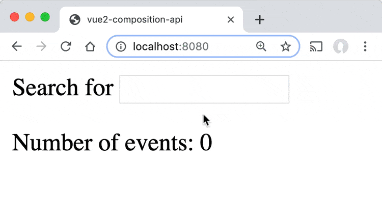
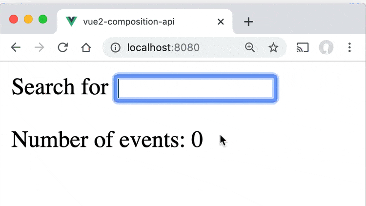
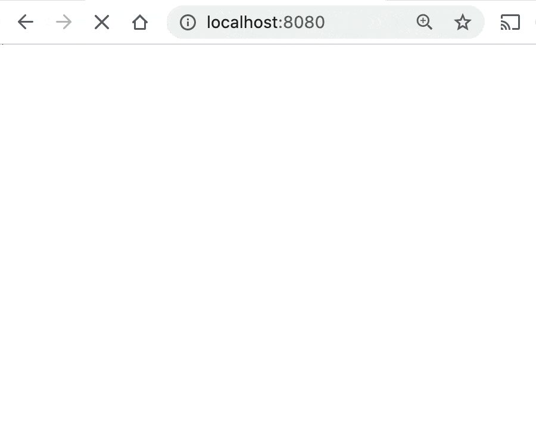

# Vue3 Composition API에 대해 알아보자

> Vue3가 나오면서 Composition API가 제공되고 있다. Composition API가 왜 나왔는지 알아보고 뭔지 알아보자.

## 개요

- Modularizing(모듈)
- Lifecycle Hooks(라이프사이클 훅)
- Watch
- Suspense

## Modularizing(모듈)

- Composition API 사용하는 이유는 기능별로 구분, 코드 재활용이다.
- 모듈을 통해 구현해보자.
- 현재 코드는 아래와 같다.

```html
<template> ... </template>
<script>
  import { ref, computed } from "vue";
  export default {
    setup() {
      const capacity = ref(4);
      const attending = ref(["Tim", "Bob", "Joe"]);
      const spacesLeft = computed(() => {
        return capacity.value - attending.value.length;
      });
      function increaseCapacity() {
        capacity.value++;
      }
      return { capacity, attending, spacesLeft, increaseCapacity };
    },
  };
</script>
```

### 컴포지션 함수로 빼기(Extracting into a Composition Function)

```html
<template> ... </template>
<script>
  import { ref, computed } from "vue";
  export default {
    setup() {
      return useEventSpace(); // <--- 여기가 컴포지션 함수로 분리한 부분
    },
  };
  function useEventSpace() {
    const capacity = ref(4);
    const attending = ref(["Tim", "Bob", "Joe"]);
    const spacesLeft = computed(() => {
      return capacity.value - attending.value.length;
    });
    function increaseCapacity() {
      capacity.value++;
    }
    return { capacity, attending, spacesLeft, increaseCapacity };
  }
</script>
```

- `useEventSapce()` 함수를 `exrpot default {}` 외부에 작성하고 분리했다. 그 함수를 `setup()` 내부에서 사용한다.
- 이제 컴포지션 함수를 파일로 분리해보자.

```javascript
// use/event-space.vue
import { ref, computed } from "vue";

export default function useEventSpace() {
  const capacity = ref(4);
  const attending = ref(["Tim", "Bob", "Joe"]);
  const spacesLeft = computed(() => {
    return capacity.value - attending.value.length;
  });
  function increaseCapacity() {
    capacity.value++;
  }
  return { capacity, attending, spacesLeft, increaseCapacity };
}
```

- 여기서 디렉토리명을 `use`를 사용했는데 `composables, hooks`도 좋은 네이밍이니 마음에 드는걸로 사용하면 된다.
- 파일로 분리한 `useEventSpace`를 불러와보자. `import` 구문을 추가하고 `setup()`안에 불러온 함수를 사용하면 된다.

```html
<template> ... </template>
<script>
  import useEventSpace from "@/use/event-space";
  export default {
    setup() {
      return useEventSpace();
    },
  };
</script>
```

### 다른 합성 함수를 추가하기(Adding another Composition Function)

- `use/event-mapping.js` 컴포지션 함수를 추가해보자.

```html
<template> ... </template>
<script>
  import useEventSpace from "@/use/event-space";
  import useMapping from "@/use/mapping";
  export default {
    setup() {
      return { ...useEventSpace(), ...useMapping() };
    },
  };
</script>
```

- 간단하게 `import` 함수를 추가하고 불러와서 추가해주기만 하면 끝난다.
- 위 코드는 어떤 데이터 속성이나 메서드가 있는지 확인이 불가능하다.(예전 Mixins 단점이다.) 명시적으로 나타내보자.

```html
<template> ... </template>
<script>
  import useEventSpace from "@/use/event-space";
  import useMapping from "@/use/mapping";
  export default {
    setup() {
      const {
        capacity,
        attending,
        spacesLeft,
        increaseCapacity,
      } = useEventSpace();
      const { map, embedId } = useMapping();

      return {
        capacity,
        attending,
        spacesLeft,
        increaseCapacity,
        map,
        embedId,
      };
    },
  };
</script>
```

- 위와 같이 명시적으로 컴포지션 함수의 리턴 객체의 속성들을 나타낼 수 있다.

## Lifecycle Hooks(라이프사이클 훅)

- 라이플 사이클 훅은 컴포넌트가 특정 상태에 도달되었을때 실행된다.
- Vue2에서 사용하고 있는 라이프사이클을 살펴보자.

  - beforeCreate : options이 처리되기전, 인스턴스가 초기화된 후 바로 실행된다.
  - creatd : 인스턴스가 생성된 직후 호출된다.
  - beforeMount : DOM이 마운트 되기 직전 실행된다.
  - mounted : 인스턴스가 마운트 되었을떄(브라우저 업데이트) 실행된다.
  - beforeUpdate : reactive 데이터가 변경되고, DOM이 리렌더 되기전에 실행된다.
  - updated : reative 데이터가 변경되고, DOM이 리렌더 된 다음 실행된다.
  - beforeDestory : 뷰 인스턴스가 제거되기 직전 실행된다.
  - destoryed : 뷰 인스턴스가 제거 된 후 실행된다.

- Vue2에 라이프사이클에 있지만 친근하지 않은 라이프 사이클 훅

  - activated :" keep-alive 인 컴포넌트가 활성화 될 때 호출된다.(when a component inside is toggled on)
  - deactivated : keep-alive인 컴포넌트가 비활성화 될 때 호출된다.(when a component inside is toggled off)
  - errorCaptured : 자식 컴포넌트로부터 에러가 발생되었을대 호출된다.

- 자세한 내용은 여기 참고 [lifecycle](https://vuejs.org/v2/api/#Options-Lifecycle-Hooks)
- Vue3에서는 `beforeDestory()`가 `beforeUnmount()`, `destroyed()` 가 `unmounted()`로 사용될 수 있다.
- 컴포넌트가 마운트, 언마운트되기떄문에 더 좋은 네이밍이라서 변경했다고 한다.

### 컴포지션 API 라이프사이클 메서드(Composition API LifeCycle Methods)

- Vue3 컴포지션 API에서는 `setup()` 안에 라이프사이클 메서드에 `on`을 추가해 콜백 훅을 만들 수 있다.

```javascript
import {
  onBeforeMount,
  onMounted,
  onBeforeUpdate,
  onUpdated,
  onBeforeUnmount,
  onUnmounted,
  onActivated,
  onDeactivated,
  onErrorCaptured,
} from "vue";

export default {
  setup() {
    onBeforeMount(() => {
      console.log("Before Mount!");
    });
    onMounted(() => {
      console.log("Mounted!");
    });
    onBeforeUpdate(() => {
      console.log("Before Update!");
    });
    onUpdated(() => {
      console.log("Updated!");
    });
    onBeforeUnmount(() => {
      console.log("Before Unmount!");
    });
    onUnmounted(() => {
      console.log("Unmounted!");
    });
    onActivated(() => {
      console.log("Activated!");
    });
    onDeactivated(() => {
      console.log("Deactivated!");
    });
    onErrorCaptured(() => {
      console.log("Error Captured!");
    });
  },
};
```

- 컴포지션 API 사용할떄는 `beforeCreate`, `created` 필요 없다.
- `beforeCreate`는 `setup()` 이전에 실행되고 `created`는 `setup()` 이후에 실행되기 떄문이다.

### Vue3 라이프 사이클 새로운 메서드

- 이 메서드들은 Vue3 소스에서만 작동된다.(Vue2에서 composition API 호출해도 안된다.)
- onRenderTracked : reactive dependency가 렌더 함수에서 처음 접근 되었을떄 호출 된다. dependency는 추적된다. 디버깅에을 위해 추적중인 dependency를 확인하는데 좋다.(called when a reactive dependency is first being accessed in the render function, during render. This dependency will now be tracked. This is helpful to see which dependencies are being tracked, for debugging.)
- onRenderTriggered : 새로운 렌더가 트리거될때 호출된다. 어떤 dependency가 컴포넌트를 리렌더했는지 검사할 수 있다.(최적화에 도움이 된다고 합니다.)(Called when a new render is triggered, allowing you to inspect what dependency triggered a component to re-render.)
- 정확히 이해하지는 못했습니다. 나중에 사용할때 한번 더 공부해야겠네요.

## Watch

- 아래 코드는 간단한 검색 인풋 박스 예제이다.
- 인풋에 입력하면 결과에 맞는 result 값을 반환해준다.

```html
<template>
  <div>
    Search for <input v-model="searchInput" />
    <div>
      <p>Number of events: {{ results }}</p>
    </div>
  </div>
</template>
<script>
  import { ref } from "@vue/composition-api";
  import eventApi from "@/api/event.js"; // 더미 API

  export default {
    setup() {
      const searchInput = ref("");
      const results = ref(0);
      results.value = eventApi.getEventCount(searchInput.value);

      return { searchInput, results };
    },
  };
</script>
```



- 원하는 결과대로 작동이 되지 않는다.
- `setup()`이 처음 실행될때 `results.value = eventApi.getEventCount(searchInput.value);` 이게 1번 실행된다.
- `sercrhInput`이 업데이트될때마다 다시 실행되지 않는다.
- 이 부분을 고칠려면 `watchEffect`를 사용하면 된다.

### watchEffect

- next tick 에서 실행되는 함수이다. 콜백함수안에 있는 reactive dependencies 추적한다. dependencies가 변경되면 콜백함수를 재실행한다.
- [watchEffect](https://medium.com/better-programming/using-vue-watcheffect-to-track-reactive-dependencies-7c99d76304e7)

```javascript
setup() {
  const searchInput = ref("");
  const results = ref(0);

  watchEffect(() => {
    results.value = eventApi.getEventCount(searchInput.value);
  });

  return { searchInput, results };
}
```

- 첫 실행떄 `searchInput`을 추적하고 `searchInput`이 변경되면 API를 요청해 `results`를 업데이트 한다.



- 변경사항에 대해 자세하게 보고 싶으면 `watch`를 사용한다.

```javascript
watch(searchInput, () => {
  ...
});
```

- 새로운 값, 예전 값에 접근하고 싶으면 콜백함수에 파라미터 값을 지정한다.

```javascript
watch(searchInput, (newVal, oldVal) => {
  ...
});
```

- 여러 reactive dependcies를 사용하려면 아래와 같이 코드를 작성한다.

```javascript
watch([firstName, lastName], ([newFirst, newLast], [oldFirst, oldLast]) => {
  ...
});
```

## Suspense

- 백엔드 데이터를 불러올때 API를 많이 호출한다. API 데이터가 로드될때, 좋은 인터페이스는 로딩을 표시한다.Vue에서는 `v-if`,`v-else`문으로 로딩중일때, 로딩완료되었을때 분기로 `HTML`을 2개 작성하여 보여준다.
- API 호출하는 컴포넌트가 여러개 있을 경우, API호출하는 컴포넌트마다 작성해야되므로 코드는 복잡해진다.
- Vue3에서는 React16.6에서 나온 `Suspense`에 가져왔다. 비동기 작업이 완료될때까지 기다릴수 있게 해준다.

```html
<template>
  <Suspense>
    <template #default>
      <!-- 비동기 호출이 1개 이상있는 컴포넌트들 -->
    </template>
    <template #fallback>
      <!-- 로딩중일때 보여주고 싶은것 -->
    </template>
  </Suspense>
</template>
```

- 기본적으로 `#default`를 렌더링하려고 하나 만약 여기에 `setup()`에 비동기 호출이 있으면 비동기 호출이 완료될때까지 `#fallback`을 보여준다. 완료되면 `#default` 보여준다.
- 예제를 살펴보자.

```html
<template>
  <Suspense>
    <template #default>
      <Event />
    </template>
    <template #fallback> Loading... </template>
  </Suspense>
</template>
<script>
  import Event from "@/components/Event.vue";
  export default {
    components: { Event },
  };
</script>

// Event
<template> ... </template>
<script>
  import useEventSpace from "@/composables/use-event-space";
  export default {
    async setup() {
      const {
        capacity,
        attending,
        spacesLeft,
        increaseCapacity,
      } = await useEventSpace();
      return { capacity, attending, spacesLeft, increaseCapacity };
    },
  };
</script>
```

- `await useEventSpace()` API 호출을 한다. 호출이 완료될때까지는 Loading... 메세지가 보이고 완료되면 `Event` 컴포넌트가 보여진다.



- `Suspense`는 한개뿐아니라 여러개의 API 호출에서도 사용이 가능하다.

```html
<template>
  <Suspense>
    <template #default>
      <Event />
      <Event />
    </template>
    <template #fallback> Loading... </template>
  </Suspense>
</template>
```


- 강력한 점은 중첩된 컴포넌트 자식 API 호출이 모두 완료될때까지 기다린다.

### 에러 처리 방법

- API 호출할때 에러가 날 경우 `v-if`와 새로운 라이프 사이클 `onErrorCaptured`를 사용해 처리할수 있다.

```html
<template>
  <div v-if="error">Uh oh .. {{ error }}</div>
  <Suspense v-else>
    <template #default>
      <Event />
    </template>
    <template #fallback> Loading... </template>
  </Suspense>
</template>
<script>
  import Event from "@/components/Event.vue";
  import { ref, onErrorCaptured } from "vue";
  export default {
    components: { Event },
    setup() {
      const error = ref(null);
      onErrorCaptured((e) => {
        error.value = e;
        return true;
      });
      return { error };
    },
  };
</script>
```

- `onErrorCaptured`에서 `return true`는 오류 전파를 방지한다.(`propagation`)
- 이렇게 하면 브라우져 콘솔에서 에러를 발견할 수가 없다.

### 로딩 스켈레톤

- `Suspense`를 사용하면 스켈레톤을 쉽게 만들 수 있다.

```html
<template>
  <Suspense>
    <template #default>
      <Event />
    </template>
    <template #fallback> 여기에 Skeleton 코드 작성 </template>
  </Suspense>
</template>
```


## 참조

- [vue-mastery](https://www.vuemastery.com)
- [VueCompositionAPI](https://composition-api.vuejs.org/api.html#ref)
- [vue.js](https://v3.vuejs.org/)
