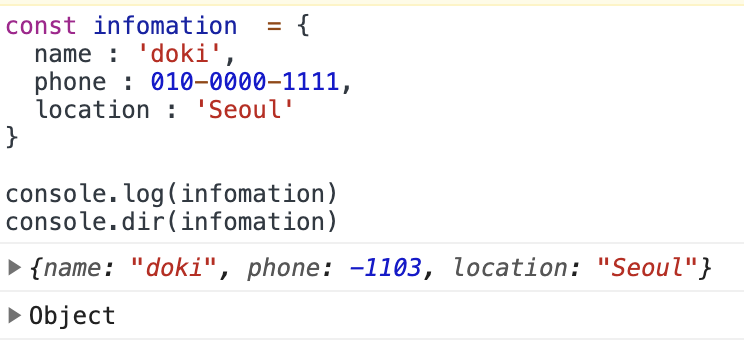
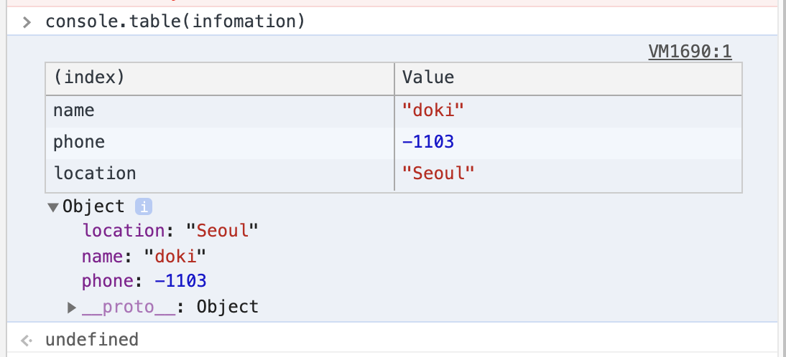
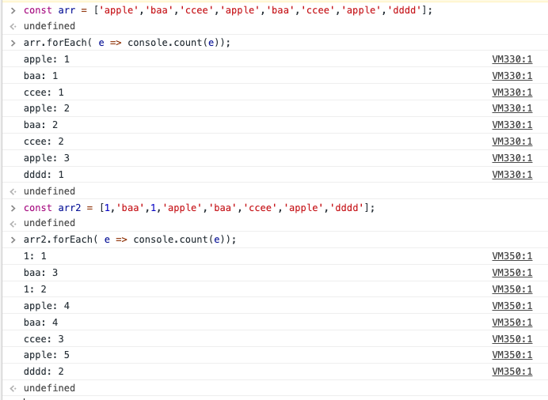
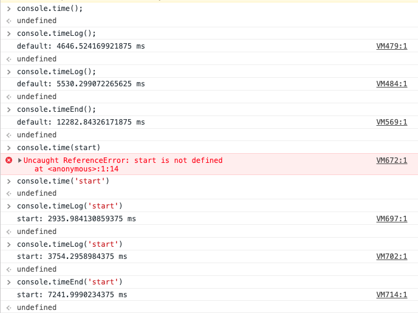
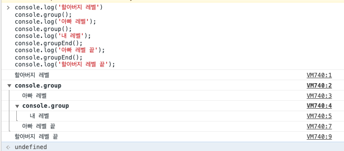
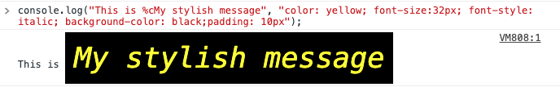
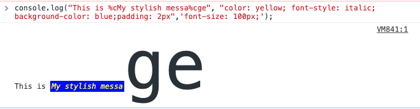

# 디버깅에 유용한 콘솔(Console) 알아보기

- 개발도중 브라우저에서 디버깅으로 주로 사용하는 명령어는 `consoel.log`이다.(데이터 값을 확인할때 주로 사용한다.)
- 브라우저에서는 `console.log` 말고 다른 명령어를 사용하여 더 효율적인 디버깅을 알아보자.

## console.dir()

- 이 명령어를 사용하기 위한 객체를 만들어 보자.

``` javascript
const infomation  = {
  name : 'doki',
  phone : 010-0000-1111,
  location : 'Seoul'
}

console.log(infomation)
console.dir(infomation)
```



- `Object` 라고 명시적으로 표시를 해줘서 정확한 타입을 알 수 있다.

## console.table()

- 이 명령어는 서버 응답으로 받은 긴 데이터를 확인할때 유용하다.

``` javascript
const infomation  = {
  name : 'doki',
  phone : 010-0000-1111,
  location : 'Seoul'
}

console.table(infomation)
```

- 명령어대로 테이블 형식처럼 보여지니 (index), value를 확인하기 쉽다.



## console.assert()

- 이 명령어는 주어진 조건이 거짓일때 콘솔에 에러 메시지를 출력한다. 참인 경우 아무것도 하지 않는다.
- 객체에 특정한 데이터가 잘 들어가 있는지 확인할때 유용할것 같다. 만약 정확한 데이터가 없으면 콘솔에 표시되므로 브라우저에서 디버깅이 가능하다.


## console.count()

- 카운터를 만들거나 눈이나 손을 이용해서 수동으로 세는 대신 `console.count()`를 사용해 몇번이나 호출되었는지 확인이 가능하다.



## console.time(), console.timeLog(), console.timeEnd()

- 작업 시간이 얼마나 걸리는지 체크할 떄 사용한다.
- `time()`는 타이머 시작 시간
- `timeLog()`는 경과 시간
- `timeEnd()`타이머 완료 시간
- 고유한 타이머 이름 지정도 가능하다.



## console.group(), console.groupEnd()

- 이 명령어들을 사용하면 부모, 자식, 외부, 내부에 대한 영역을 정확히 구분하여 확인이 가능하다.

``` javascript
console.log('할아버지 레벨')
console.group();
console.log('아빠 레벨');
console.group();
console.log('내 레벨');
console.groupEnd();
console.log('아빠 레벨 끝');
console.groupEnd();
console.log('할아버지 레벨 끝');
```



## 로그 스타일 적용

- `%c` 를 사용해 콘솔에 스타일을 입혀 꾸물수 있다.

``` javascript
console.log("This is %cMy stylish message", "color: yellow; font-size:32px; font-style: italic; background-color: black;padding: 10px");
```



- `%c` 여러개 사용 가능하다.

``` javascript
console.log("This is %cMy stylish messa%cge", "color: yellow; font-style: italic; background-color: blue;padding: 2px",'font-size: 100px;');
```



## 결론

- `console.log` 만 사용해왔고 그전에도 `dir, table` 등 여러개의 메소드를 알고 있었지만 큰 활용을 하지 못했다. 이번 계기로 다양한 콘솔 메소드를 사용해서 브라우저에서 최적화된 디버깅을 할 수 있도록 노력해봐야겠다.
- 그리고 `assert` 이 메소드를 잘 사용하면 아주 유용할것 같다.

## 참고

- [MDN 콘솔](https://developer.mozilla.org/ko/docs/Web/API/Console)