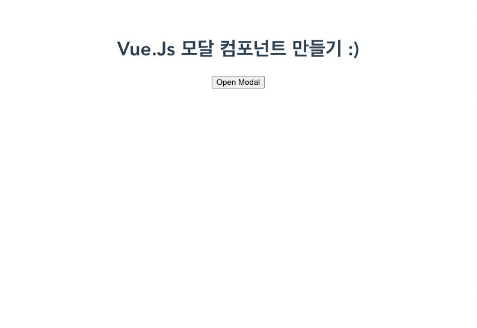
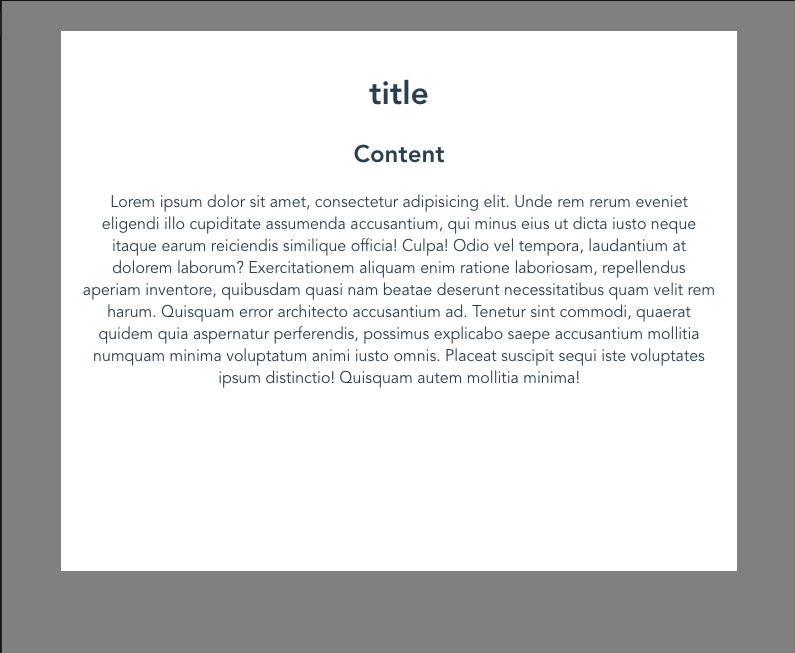

- 이번에는 Vue.js에서 모달 컴포넌트를 만드는 방법을 살펴보겠다.
- 항상 궁금했다. 모달 팝업, 모달 컴포넌트 등등 모달을 부르는 말을 듣고 대충 어떤건지 감이 오는데 정확히 어떤건지 몰라서 찾아봤다.

# 모달(Modal)이란?

> 간단하게 설명하면, 자식 윈도우에서 부모 윈도우로 돌아기전에 뜨는 창을 말한다. 예를 들면, '정말 종료하시겠습니다?','뒤로 가시겠습니까?' 이런 대화의 종류이다. 웹에서는 어떤 액션을 취한 뒤 알려주는 용도나, 긴급상황을 알려주는 용도 등으로 많이 사용 된다.

## 개요

- `App`, `Content`, `ModalView` 컴포넌트를 생성하기
- 버튼 누르면 모달이 보여지고 컨텐츠 밖을 클릭하면 사라진다.




## App 컴포넌트 만들기

- `Content, ModalView` 컴포넌트가 존재할 영역을 만들겠다. Vue 프로젝트를 생성하면 기본적으로 있는 `App.vue`에서 작성해보겠다.
- 우선 코드를 먼저 보자.

```html
// src/App.vue
<template>
  <div id="app">
    <h1>모달 컴포넌트 만들기 :)</h1>
    <ModalView v-if="isModalViewed" @close-modal="isModalViewed = false">
      <content />
    </ModalView>
    <button @click="isModalViewed = true">Open Modal</button>
  </div>
</template>

<script>
  import Content from "./components/Content";
  import ModalView from "./components/ModalView";

  export default {
    name: "App",
    components: {
      Content,
      ModalView,
    },
    data() {
      return {
        isModalViewed: false,
      };
    },
  };
</script>

<style>
  ...알아서 작성한다.;
</style>
```

- 우선 전체 코드는 위와 같다. 간단히 설명하면, 컴포넌트들을 불러서 배치하고, `isModalViewed`를 활용하여 모달 컴포넌트를 열고 닫기를 한다.
- `ModalView`가 `Content`를 감싸고 있다. 이렇게 함으로서, `ModalView`를 다른곳에서도 사용할 수 있고 모달에 보여질 내용을 쉽게 교체할 수 있다. `Content` 대신 `Notice` 컴포넌트를 넣어줘서 내용을 변경할 수 있다.
- 이렇게만 하고 `Content, ModalView` 컴포넌트가 없다면서 에러를 잔뜩 뿜어낼 것이다.
- 이제 `ModalView`를 만들어 보자.

## `ModalView` 모달 컴포넌트 만들기

- 이제 여기서 제일 중요한 모달 컴포넌트 역할을 하는 `ModalView`를 만들어 보자.
- 생성할 경로는 `src/components/ModalView.vue`이다.
- 역시 코드를 먼저 살펴보자.

```html
<template>
  <div class="modal">
    <div class="overlay" @click="$emit('close-modal')"></div>
    <div class="modal-card">
      <slot />
    </div>
  </div>
</template>

<script>
  export default {};
</script>

<style>
  /* Modal */
  .modal,
  .overlay {
    width: 100%;
    height: 100%;
    position: fixed;
    left: 0;
    top: 0;
  }
  .overlay {
    opacity: 0.5;
    background-color: black;
  }
  .modal-card {
    position: relative;
    max-width: 80%;
    margin: auto;
    margin-top: 30px;
    padding: 20px;
    background-color: white;
    min-height: 500px;
    z-index: 10;
    opacity: 1;
  }
</style>
```

- 총 3개의 요소로 이루어져 있다.
- 클래스 기준으로 `modal, overlay, modal-card`로 나누어져 있다.
  - `modal` : 컴포넌트를 감싸고 있는 부모
  - `overlay` : 컴포넌트 영역과 같은 크기를 가진 배경(모달이 열리면 내용말고 뒤에 있는 투명한 검정색 배경)
  - `modal-card` : 내용이 보여질 영역
- 오버레이(overlay)도 모달 마찬가지로 이야기만 듣고 어떤건지 감으로만 알아서 이번에 한번 찾아보았다.
- 덮어 씌우다, 위에 까는 것 이 정도의 의미로 나온다. 딤(dim)하고 번갈아 클래스명으로 사용했지만 overlary가 있어보이므로 이걸 사용하겠다.
- 여기서 알아본 곳은 `<slot />`하고 `style` 부분과 그리고 `@click="$emit('close-modal')` 중요한것 같다.
  - `<slot />`를 사용하면 이 부분을 정의할 수 있다.
  - `style`는 특별히 설명하지는 않겠다. 부모 기준으로 위에 배경을 깔고 가자 위에 내용을 보여준다라고만 알고 있자.
- 오버레이에 `@click="$emit('close-modal')` 클릭 이벤트를 정의해줘서 오버레이를 클릭시에 이벤트를 위로 보내주자!

```html
// App.vue
<ModalView v-if="isModalViewed" @close-modal="isModalViewed = false">
  <content />
</ModalView>
```

- `App.vue`에 있는 `ModalView`에서 `@close-modal` 이벤트를 수신해서 `isModalViewed` 값을 `false`로 변경한다.
- 그럼 `v-if`을 통해 `ModalView`가 보이지 않는다.
- `Content` 컴포넌트는 아무 내용이나 넣으면 되니 생략하겠다.

## 결론

- 모달 라이브러리가 많이 있으니 다양한 기능이 필요할때는 라이브러리를 찾아보고 마음에 드는게 있으면 사용하는 방법이 효율적이다.
- 간단한 모달을 만들거나 아니면 원하는 기능이 없는 경우나 시간적 여유가 많을때는 직접 만들어 보면서 기능을 추가해도 좋을 것같다.
- [소스코드](https://codesandbox.io/s/youthful-voice-keoyj?file=/src/App.vue)
