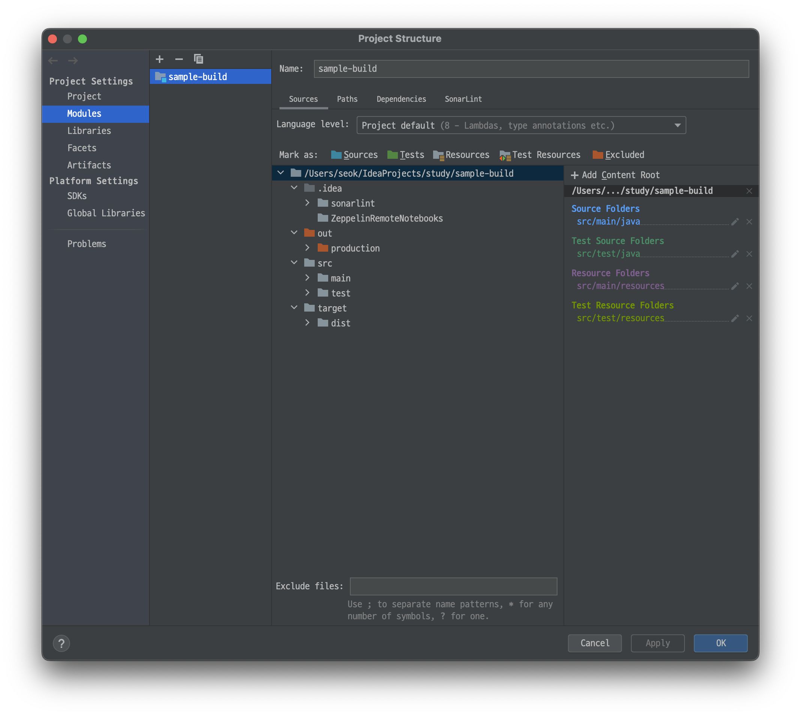

# Jar 알아보기

# Jar 다루기

> JAR(Java Archive, 자바 아카이브)는 여러 개의 자바 클래스 파일과 클래스들이 이용하는 관련 리소스(텍스트, 그림 등) 및 메타데이터를 하나의 파일로 모아서 자바 플랫폼에 응용 소프트웨어나 라이브러리를 배포하기 위한 소프트웨어 패키지 파일 포맷이다.
참고 - 위키백과
>

- Jar 파일..

자바 프로그래밍을 한 번이라도 다뤄본 사람이라면 .jar 파일을 본 적이 있을 것이다.
.jar 파일을 알고는 있지만 .jar 파일이 어떻게 만들어지는지 알아보기 위해 글을 작성한다.

빌드 도구의 역사를 보면 1세대 Make, 2세대 Ant, 3세대 Maven, 4세대 Gradle라고 보통 소개 하는 것 같다. Maven, Gradle을 주로 사용하겠지만, 여기서는 Ant를 활용하여 Java 프로젝트의 빌드를 자동화 해보도록 한다.

기본적인 Java 프로젝트를 생성, 인텔리제이의 Ant 빌드 도구로 예제를 만들어 본다.



기본적인 자바 프로젝트를 생성했으며, src 폴더 하위에 main, test 폴더를 두어 테스트 코드와 프로덕트 코드를 관리할 수 있도록 하였다.

첫 목표는 자바 코드가 서버에 올라가있을 때, 이를 class 파일로 컴파일 후, Runnable Jar 파일로 패키징 후 실행하는 것을 목표로 한다.
여기서는 인텔리제이로 수행되는 것을 정리하지만 서버에 올라가서도 동일하다.

## 1. 컴파일하기

- 상황
	- Hello, World! 라는 문자열을 출력하는 BuildApplication 클래스를 작성
- 목표
	- ant 빌드 도구를 통해 compile 하기

### BuildApplication 코드 작성

```java
public class BuildApplication {
   public static void main(String[] args) throws IOException {
      System.out.println("Hello, World!");
   }
}
```

### build.xml 파일 작성

```xml
<?xml version="1.0" encoding="utf-8" ?>
<project name="sample-project"  basedir=".">
	<target name="compile"> <!-- ① -->
		<javac srcdir="src" destdir="build/classes"/>
	</target>
</project>
```

①에서는 compile이라는 task의 내용은 src에 있는 파일들을 컴파일하여 나온 결과물을 build/classes에 생성하도록 정의하였다.

> 문제가 생겼다. .../build/classes" does not exist or is not a directory 라는 오류가 발생

### 해결 방법

- 폴더가 없다는 오류이기 때문에 폴더를 생성해주는 `mkdir`이라는 task를 작성
- `depends="init"` 이라는 의존성을 연결하여 classes라는 task 실행 전에 수행할 수 있도록 한다.

```xml
<?xml version="1.0"?>
<project name="sample-project" default="compile" basedir=".">
   <target name="init"> <!-- ① -->
      <mkdir dir="build/classes"/>
   </target>

   <target name="compile" depends="init"> <!-- ② -->
      <javac srcdir="src" destdir="build/classes">
      </javac>
   </target>
</project>
```

1. ①의 target은 mkdir 이라는 명령어를 통해 build/classes 폴더를 생성하는 작업을 init이라 명명한 task이다.
2. ②에서는 ①에 정의한 init task를 compile 단계 실행 전 수행될 수 있도록 depends 이라는 속성을 통해 설정하였다.

위 작업을 서버에서 수행하는 경우 ant compile 이라는 명령어를 통해 실행시키면 폴더를 만들고, build/classes 폴더에 src에 있는 자바 소스를 컴파일된 오브젝트를 생성한다.

```bash
ant compile
```

파일이 생성되었음을 확인이 되었다면 인텔리제이에서 실행해보도록 한다.

실행 방법은 build/classes 하위로 이동 후 java 명령어로 패키지/클래스명를 실행하도록 한다.
아래와 같이 Hello, World! 문자열이 출력된 것을 확인할 수 있다.


이정도 가지고는 자동화라 부르기 어렵다. 반복적으로 개발 -> 빌드 -> 배포 되는 환경을 만들기 위해서는 몇 가지 task가 더 필요할 것 같다.

### 잠깐 정리

1. 일반 자바 프로젝트 생성
2. task라는 단계에 compile, package, test, jar 등등 필요한 기능을 구현 할 수 있음을 확인
3. 빌드 서버에서 코드를 관리한다는 가정하에 compile, package, Jar파일 배포라는 사이클을 진행할 계획
4. compile task 구현 및 테스트

## 2. 반복적으로 컴파일 하기위한 준비 task 작성

우선 반복적으로 개발이 되면 classes 파일을 생성되니, 기존에 생성된 class 파일을 삭제 해야 할 것 같다.

- clean task 추가 후, init 작업 전 수행될 수 있도록 depends로 의존성 추가
	- 컴파일을 한다는 행위는 source 기반으로 지속적으로 결과 오브젝트가 생성될 수 있다는 것을 의미하기 때문에 새롭게 세팅할 수 있도록 초기화 task를 추가하도록 한다.

```xml
<?xml version="1.0"?>
<project name="sample-project" default="compile" basedir=".">

   <target name="clean" description="Clean output directories"> <!-- ① -->
      <delete dir="build"/>
   </target>

   <target name="init" depends="clean"> <!-- ② -->
      <mkdir dir="build/classes"/>
   </target>

   <target name="compile" depends="init">
      <javac srcdir="src" destdir="build/classes">
      </javac>
   </target>

</project>

```

1. ①에서 빌드된 오브젝트를 관리하는 build 폴더를 삭제하는 delete라는 task를 clean이라 정의한다.
2. ②에서는 ①에 정의한 clean target을 depends 속성을 통해 init target이 수행되기전에 실행될 수 있도록 한다.

target이 늘어날 수록 경로에 대한 부분이 반복적으로 사용되고 있는 것이 보인다. 이를 변수처럼 사용할 수 있는 property 태그를 활용한다.

## 3. 반복되는 경로 설정 변수화하기

- 몇 가지 task를 작성하다보니 공통적으로 사용되는 경로와 같은 내용이 있다.
- 이는 property라는 태그를 통해 변수화 할 수 있다.

```xml
<?xml version="1.0"?>
<project name="sample-project" default="compile" basedir=".">
   <property name="src.dir" location="src/main"/> <!-- ① -->
   <property name="build.dir" location="build"/> <!-- ② -->
   <property name="classes.dir" location="${build.dir}/classes"/> <!-- ③ -->

   <target name="clean" description="Clean output directories">
      <delete dir="${build.dir}"/>
   </target>

   <target name="init" depends="clean">
      <mkdir dir="${build.dir}"/>
      <mkdir dir="${classes.dir}"/>
   </target>

   <target name="compile" depends="init">
      <javac srcdir="${src.dir}" destdir="${classes.dir}"/>
   </target>
</project>

```

1. ①은 src/main 하위에 java, resources 폴더의 source의 위치를 정의
2. ②는 빌드한 파일을 위치할 경로를 정의
3. ③은 javac로 인해 생성되는 class 오브젝트 파일의 경로를 정의

프로젝트의 소스를 빌드하는 것을 시작으로 반복적으로 빌드되는 경우 시작 전 초기화 할 수 있는 기능만들어 보았다. 하지만 프로그램을 실행하기 위해서는 직접 java 명령어로 실행해야 하니 이를 실행할 수 있는 jar파일을 만들어보도록 한다.

## 4. Runnable Jar 만들기

자바 코드를 컴파일 한 뒤 프로그램을 실행하기 위해서 빌드 경로에 들어가 java 명령어로 프로그램을 실행시켜도 되긴 하지만, 그런 방식을 자동화라 부를 순 없다.

이제부터 해야 하는 일은 컴파일된 .class 파일들을 실행가능한 jar 파일로 만들어 실행할 수 있도록 해야 한다.

- 실행가능한 Jar 파일 만드는 방법
	- jar 파일을 실행하기 위한 가장 큰 설정은 Main-Class의 설정이다.
	- META-INF/MANIFEST.MF 파일은 실행가능한 jar파일을 만들기 위해 큰 역할을 한다.
- 빌드 도구 없이 jar파일 만드는 방법

```bash
mkdir -p build/classes/META-INF
echo "Main-Class: com.example.BuildApplication" > MENIFEST.MF
find ./src/main -name *.java > source_list.txt
javac -d build/classes -cp build/classes @sources_list.txt
jar cvfm sample-project-1.0.0.jar MENIFEST.MF -C build/classes
java -jar sample-project-1.0.0.jar

```

### ant 빌드 도구를 통한 jar 파일 만드는 방법

- jar라는 태그를 통해 jar파일 생성이 가능하다.
- 중요한 부분은 `menifest` 태그이다.
- jar 파일을 실행하게 되면 main 메서드가 존재하는 클래스를 찾을 수 없다고 나오게 됩니다.
- menifest 태그를 통해 main 메서드가 존재하는 BuildApplication 클래스를 설정하게 되면 실행가능한 jar파일이 생성된다.

```xml
<?xml version="1.0"?>
<project name="sample-project" default="compile" basedir=".">
   <property name="src.dir" location="src/main"/>
   <property name="build.dir" location="build"/>
   <property name="classes.dir" location="${build.dir}/classes"/>
   <property name="jar.dir" location="${build.dir}/jar"/>
   <property name="lib.dir" location="lib"/>
   <property name="project.version" value="1.0.0"/>
   <property name="groupid" value="com.example"/>

   <target name="clean" description="Clean output directories">
      <delete dir="${build.dir}"/>
   </target>

   <target name="init" depends="clean">
      <mkdir dir="${build.dir}"/>
      <mkdir dir="${classes.dir}"/>
   </target>

   <target name="compile" depends="init">
      <javac srcdir="${src.dir}" destdir="${classes.dir}"
             debug="true" failonerror="true" includeantruntime="false"/>
   </target>

   <target name="jar" depends="compile"> <!-- ① -->
      <jar destfile="${jar.dir}/${ant.project.name}-${project.version}.jar"
           basedir="${classes.dir}">
         <manifest> <!-- ② -->
            <attribute name="Main-Class" value="${groupid}.BuildApplication"/>
         </manifest>
      </jar>
   </target>
</project>

```

1. ①에서는 compile task를 통해 class파일로 만들어진 상황에서 build/classes 경로 내에 있는 오브젝트들을 build/jar경로에 sample-project-1.0.0.jar라는 아카이브 파일을 만들 수 있도록 jar라는 task를 정의
2. 다만 jar archive를 만들 때 manifest가 없는 경우 jar를 실행할 수 없기 때문에 ② 설정을 통해 entry point가 되는 class에 대한 정보를 갖고 있는 META-INF/MANIFEST.MF을 생성한다.

> **MENIFEST**

jar에 포함된 메타데이터 파일로 패키지 관련 데이터를 정의한다. jar 파일을 runnable jar로 만들기 위해서는 application의 기본 클래스를 menifest안에 정의해줘야 한다.

jar archive에는 META-INF/MENIFEST.MF가 정의되어 있어야한다.


## 5. 실행을 위한 task 작성

일반적으로는 build 와 run에 대한 정의를 별도의 스크립트로 제어하지만, 기능적으로는 ant build.xml 안에 정의가 가능하다.

```xml
<?xml version="1.0"?>
<project name="sample-project" default="compile" basedir=".">
   <property name="src.dir" location="src/main"/>
   <property name="build.dir" location="build"/>
   <property name="classes.dir" location="${build.dir}/classes"/>
   <property name="jar.dir" location="${build.dir}/jar"/>
   <property name="lib.dir" location="lib"/>
   <property name="project.version" value="1.0.0"/>
   <property name="groupid" value="com.example"/>

   <target name="clean" description="Clean output directories">
      <delete dir="${build.dir}"/>
   </target>

   <target name="init"> <!-- ① -->
      <mkdir dir="${build.dir}"/>
      <mkdir dir="${classes.dir}"/>
   </target>

   <target name="compile" depends="init">
      <javac srcdir="${src.dir}" destdir="${classes.dir}"
             debug="true" failonerror="true" includeantruntime="false"/>
   </target>

   <target name="jar" depends="compile">
      <jar destfile="${jar.dir}/${ant.project.name}-${project.version}.jar"
           basedir="${classes.dir}">
         <manifest>
            <attribute name="Main-Class" value="${groupid}.BuildApplication"/>
         </manifest>
      </jar>
   </target>

	<target name="run" depends="clean, jar"> <!-- ② -->
	   <java fork="true" jar="${jar.dir}/${ant.project.name}-${project.version}.jar"/>
	</target>
</project>
```

1. ①에서 이전에는 clean이라는 작업을 무조건 수행한 뒤, 빌드, 패키징을 수행했지만 앞으로 계속 늘어나는 task를 위해 clean을 별도의 작업으로 처리할 수 있도록 의존성을 제거한다.
2. ②에서는 clean, jar task를 수행한 뒤, jar 파일을 실행하는 task를 run으로 정의한다.

ant 빌드 도구를 통해 작성된 소스코드를 빌드, 패키지, 실행하는 task를 작성해보았다. 단순하게 실행하는 방법만 나열하여 내부적으로 어떠한 속성들이 필요로 했는지, 라이브러리를 의존하는 경우 어떻게 처리해야 하는지, 외부 프로퍼티 파일로 실행하는 방법 등등은 다음에 추가적으로 작성한다.