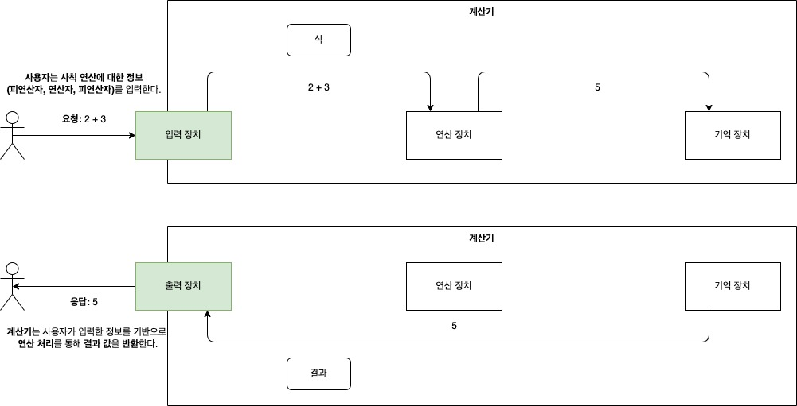
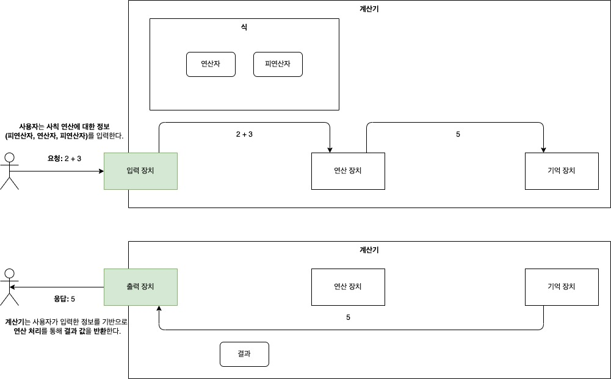

# 과제를 통해 얻으려고 했던 객체지향 프로그래밍

## 과제 선정 및 고찰

객체지향 프로그래밍을 한 번에 이해하는 것은 어렵다. 그리고 이를 학습 할 수 있도록 가이드 하는 것은 더 어렵다.

그래서 자연스럽게 객체지향을 접하기 위해 몇 가지 과제를 제시하여 객체지향을 자연스럽게 생각할 수 있는 방법을 찾아보려 한다.

문자열 계산기를 작성하기에 앞서 요구사항을 정리, 요구사항을 구현하기 위해 자바를 사용하는 기본적인 원리를 생각하며 구현

- 필요한 기능을 구현하기 위한 요구사항
- 자바 프로그래밍
	- 객체지향 프로그래밍 설계 원칙 5가지 원칙: SOLID
	- 객체지향의 4가지 특징(Encapsulation, Inheritance, Abstraction, Polymorphism)

### 고민

- 자바라는 객체지향 언어로 문자열 계산기를 구현하는 것을 통해 어떠한 것을 배울 수 있을까?
- 제한된 시간 내에 전달할 수 있는 자바의 문법, 개념은 어떠한 것들이 있을까?

## 계산기에 대한 정보

계산기를 구현하기 위해 계산기라는 개념과 기능등에 대해서 알아본다.

### 계산기 - [참고 - 계산기](https://ko.wikipedia.org/wiki/계산기)

#### 계산기의 정의 일부

> ... 어떠한 <mark style="background: #BBFABBA6;">사칙 연산을 포함한 계산</mark> 이나 여러 공학적 계산을 수행하는
> 장치이자 <mark style="background: #BBFABBA6;">정보처리 시스템</mark> 이다.

- 사칙 연산을 포함한 계산

#### 전자 계산기의 구성 요소와 관계

> ... 전자 계산기는 그 크기나 복잡성에 관계없이 기본적으로 <mark style="background: #FFF3A3A6;">연산 장치</mark>
> , <mark style="background: #FFF3A3A6;">제어 장치</mark> , <mark style="background: #FFF3A3A6;">기억 장치</mark>
> , <mark style="background: #FFF3A3A6;">입력 장치</mark> , <mark style="background: #FFF3A3A6;">출력 장치</mark> 등 다섯 장치로 구성되고, 이
> 장치들이 <mark style="background: #BBFABBA6;">서로 상호 작용</mark> 하여 <mark style="background: #FF5582A6;">연산</mark>
> , <mark style="background: #FF5582A6;">조합</mark> , <mark style="background: #FF5582A6;">판별</mark> 등의 기능을 수행한다.

1. 제어장치
	- 명령계수기(PC, IC)
	- 명령레지스터(IR)
	- 명령해독기
2. <mark style="background: #FF5582A6;">연산장치</mark>
	- 제어장치에 의해 살술 및 논리연산을 수행
	- 누산기
		- 산술 및 논리연산의 결과를 임시보관
3. <mark style="background: #FF5582A6;">기억장치</mark>
	- 입력장치로 읽어들인 데이터의 결과를 기억
	- 주기억장치
	- 보조기억장치
4. 입력장치
	- 마우스 ... 등등
	- 여기서는 키보드로 console에 입력
5. 출력장치
	- 모니터 ... 등등
	- 여기서는 console로 이를 확인

### 고민

- 계산기를 모른다는 가정하에 처음 계산기라는 기능, 장치를 분석하기 위해서 어디서 정보를 얻을 수 있을까?
- 도메인 지식과 프로그래밍 언어를 어떻게 조합해야 필요한 기능을 구현할 수 있을까?

## 설계 및 구현

### 그림 그리기

그림을 그리기 위해서는 상세한 부분을 바로 그리는 일이 없이 스케치라는 행위를 통해 작품에 대한 윤곽, 전체적인 구조, 매커니즘, 상세한 부분을 그리기 전 아이디어를 떠올리기 위한 작업을 한다고 한다.

개발에서도 이와 동일하게 스케치의 역할로써 요구사항을 큰 틀에서 구현하기 위해 의사코드(pseudocode)를 작성한다. 의사코드를 작성하는 것에 익숙하지 않다면 주석으로 구현해야할 내용을 순차적으로 작성해보는 것도
좋다.

여기서는 계산기를 구현하기 위해 어떠한 스케치를 해야할 지 생각해 본다.

### 계산기 동작 방식 떠올려보기

1. 사용자는 사칙 연산을 처리하기 위해 계산기의 <mark style="background: #FF5582A6;">입력 장치</mark> 에 <mark style="background: #FF5582A6;">
   식</mark> 을 입력한다.

2. 룰에서 벗어나지 않은 <mark style="background: #FF5582A6;">식</mark> 은 <mark style="background: #FF5582A6;">연산장치</mark> 에서 연산
   처리한다.

3. <mark style="background: #FF5582A6;">연산장치</mark> 에서 연산처리가 된 <mark style="background: #FFF3A3A6;">결과값</mark>
   은 <mark style="background: #FF5582A6;">기억장치</mark> 에 저장한다.
	- 사용자는 <mark style="background: #FF5582A6;">기억장치</mark> 에 입력한 식에 대한 <mark style="background: #FFF3A3A6;">결과값</mark> 를
	  반환 받을 수 있다.

### 계산기 동작 방식 2차 상세

1. 사용자는 사칙 연산을 처리하기 위해 계산기의 <mark style="background: #FF5582A6;">입력 장치</mark> 에 <mark style="background: #FF5582A6;">
   식</mark> 을 입력한다.

- 사칙연산을 처리하기 위한 식은 <mark style="background: #BBFABBA6;">피 연산자</mark> 와 <mark style="background: #BBFABBA6;">연산자</mark> 로
  이루어져 있다.
- <mark style="background: #FF5582A6;">식</mark> 은 몇 가지 규칙을 가지고 있다.
	- 식은 <mark style="background: #BBFABBA6;">피연산자</mark> 와 <mark style="background: #BBFABBA6;">연산자</mark> 로 이루어져 있다.
	- <mark style="background: #BBFABBA6;">피 연산자</mark> <mark style="background: #FFF3A3A6;">짝수개</mark>
	  와 <mark style="background: #BBFABBA6;">연산자</mark> <mark style="background: #FFF3A3A6;">홀수개</mark>가 존재한다.
	- <mark style="background: #FF5582A6;">식</mark> 의 룰을 벗어나는 경우 사용자에게 오류 메시지를 반환한다.

2. 룰에서 벗어나지 않은 <mark style="background: #FF5582A6;">식</mark> 은 <mark style="background: #FF5582A6;">연산장치</mark> 에서 연산
   처리한다.
	- <mark style="background: #FF5582A6;">식</mark> 에서 <mark style="background: #BBFABBA6;">연산자</mark> 를 분별하여 해당 연산자에
	  알맞은 <mark style="background: #FFF3A3A6;">연산처리</mark> 를 진행한다.
	- <mark style="background: #BBFABBA6;">연산자</mark> 에 해당하는 <mark style="background: #FFF3A3A6;">연산처리</mark> 는 변경가능성이 높다.

3. <mark style="background: #FF5582A6;">연산장치</mark> 에서 연산처리가 된 <mark style="background: #FFF3A3A6;">결과값</mark>
   은 <mark style="background: #FF5582A6;">기억장치</mark> 에 저장한다.
	- 사용자는 <mark style="background: #FF5582A6;">기억장치</mark> 에 입력한 식에 대한 <mark style="background: #FFF3A3A6;">결과값</mark> 를
	  반환 받을 수 있다.

### 계산기 동작 방식 3차 리펙토링

- 요구사항을 구현하기 위해서 계산기의 목적을 달성하기 위한 객체들을 작성 및 서로간의 상호작용을 통해 원하는 기능을 처리할 수 있게 되었다.

이를 중간에서 처리하기 쉬운 방식으로 개선 고민, 일부 함수형 프로그래밍 또는 데이터 처리를 빌더 API로 구현하는 방법 등등.. 미정

## 결론

돌아돌아 객체지향을 다시 공부하고 있는 입장에서 만약에 처음 프로그래밍 언어를 공부하던 시절로 돌아갔을 때 어떻게 학습했으면 더욱 효과적으로 객체지향 프로그래밍 언어를 학습할 수 있었을지 많은 고민이 된다.