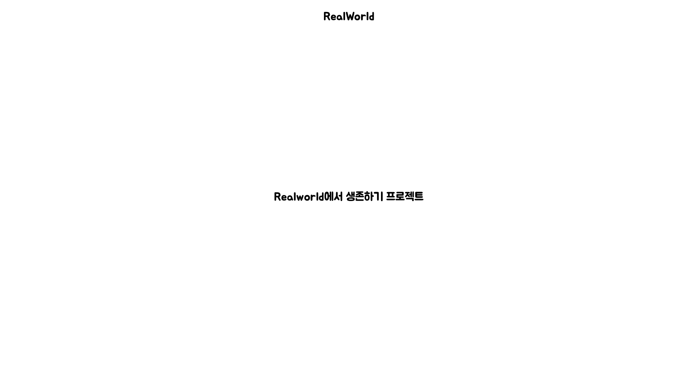
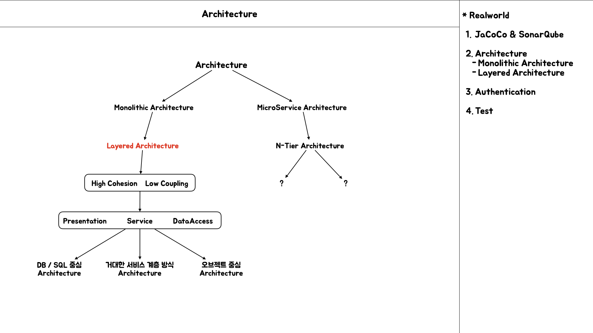
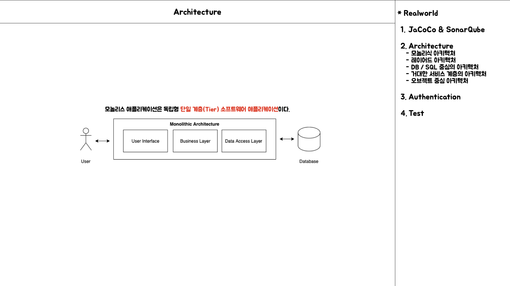
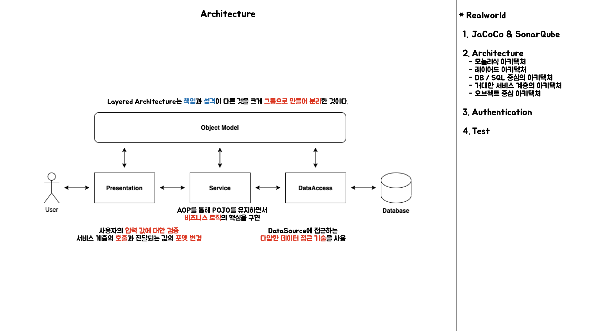
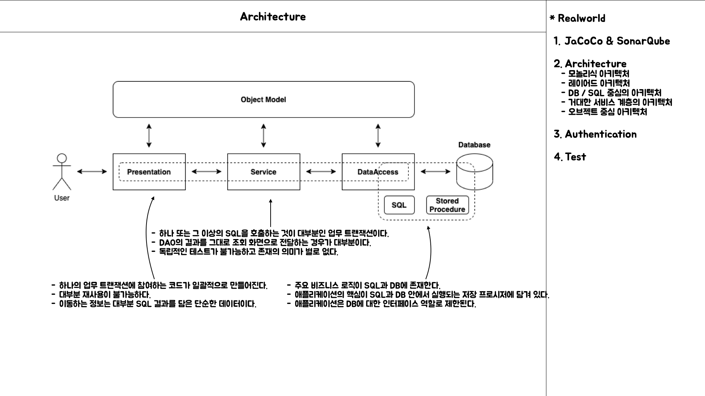
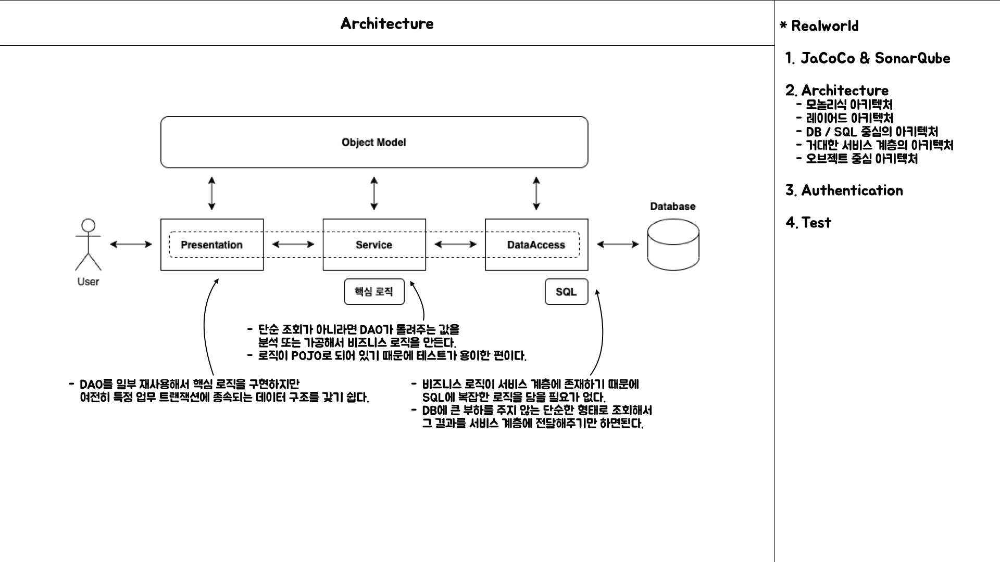
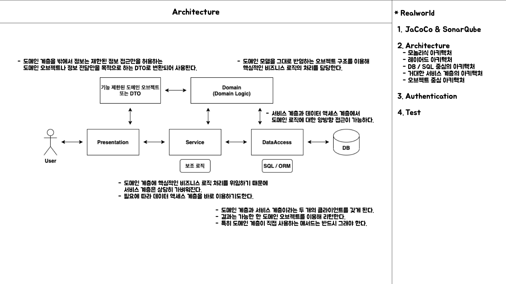

# RealWorld에 두 발자국

Assign: SR
Status: 6기, MeetCoder 스터디 발표

# Architecture

> "**`어떤 경계 안에 있는 내부 구성요소들이 어떤 책임을 갖고 있고, 어떤 방식으로 서로 관계를 맺고 동작하는지를 규정하는 것`" -** 토비의 스프링3 - 9.3 애플리케이션 아키텍처 내용

## Monolithic Architecture

- `모놀리식 애플리케이션`은 독립형 단일 계층 소프트웨어 애플리케이션이다.
- 서로 다른 모듈이 앱의 각 작업과 기능을 실행하는 책임이 있는 `마이크로서비스 아키텍처`와는 다르다.
- 모놀리식 애플리케이션은 마이크로 아키텍처에 비해 빌드, 테스트 및 배포가 용이하다.

> **모놀리식 아키텍처의 구조**

- 애플리케이션이 `단일 코드 베이스`에 `전체 애플리케이션 코드`를 포함하는 경우 `모놀리스 아키텍처`를 갖는다 말한다.
- `UI`, `비즈니스 로직`, `데이터 액세스` 등의 모두 다른 계층(`Layer`)이 동일한 코드 베이스에 있는 것이다.

> **모놀리식 아키텍처를 선택하는 이유?**

- 모놀리식 애플리케이션은 요구사항이 간단하고 서비스가 제한된 양의 트래픽을 처리할 것으로 예상되는 경우에 적합하다.
- 시간이 지남에 따라 사용자 기반과 트래픽이 기하급수적으로 증가하지 않을 것이 예상될 때 적합하다.
- 비즈니스의 초기 단계에서 `분산형 마이크로서비스 아키텍처`로 분기할 계획을 갖기 전에 `모놀리식 아키텍처`로 선택하는 경우가 있다.
- 이러한 결정에는 몇 가지 기준을 가질 수 있으며, 완벽한 답안은 찾기 힘들다.
- 왜냐하면 최근 스타트 업도 클라우드 기반으로 구축하고 배포하는 방식으로 설계하고 있기 때문에, 빠른 성장이 예상되는 경우 처음부터 마이크로서비스 아키텍처를 선택하기도 한다.
- 고정적인 생각으로 서비스 성장에 따라 맞춰서 프로젝트를 모놀리식 아키텍처로 시작하는 경우, 급격한 성장에 기존의 프로젝트를 제거하고, 마이크로서비스 아키텍처로 고도화 하려고 한다면 이는 시간적인 측면과 비용적인 측면에서 더 많은 비용을 들여야 할 지도 모른다.

> **모놀리식 아키텍처의 장점**
>
- **Simplicity(단순성)**
    - 모놀리식 애플리케이션은 모든 코드가 하나의 서버에 있기 때문에 개발, 테스트, 배포, 모니터링에 대한 관리가 간단하다.

> **모놀리식 아키텍처의 단점**

- **Continuous deployment(지속적인 배포)**
    - 해당 프로젝트의 사소한 코드 변경에도 전체 애플리케이션 프로젝트를 다시 배포해야 하기 때문에 `CD`는 모놀리식 아키텍처로 작성된 애플리케이션에서는 문제가 될 수 있다.
- **Regression testing(회귀 테스트)**
    - 레이어 간에 서로 밀접하게 결합되어 있어 배포가 완료된 후 전체 애플리케이션에 대한 테스트가 필요하다.
    - 한 레이어의 변경은 다른 레이어에 상당한 영향을 줄 수 있기 때문이다.
- **Single points of failure(단일 실패 지점)**
    - 모놀리식 응용 프로그램은 단일 실패 지점 치명적인 문제가 존재한다.
    - 계층 중 한 곳에 버그가 있는 경우에는 전체 응용 프로그램을 중단할 수 있다.
- **Scalability issues(확장성 문제)**
    - 단일 계층의 변경은 종종 모든 계층의 변경과 테스트를 필요로 하기 때문에 유연성과 확장성에 취약하다.
    - 코드의 크기가 증가하면 관리하기가 까다로워질 수 있다.
- **Cannot leverage heterogeneous technologies(이기종 기술을 활용할 수 없음)**
    - 모놀리식 아키텍처로 복잡한 애플리케이션을 구축하는 것은 호환성 문제로 인해 단일 코드베이스에서 이기종 기술을 사용하기 어렵기 때문에 까다롭다.
- **Not cloud-ready, hold state(클라우드 환경에 준비가 되어 있지 않다.)**
    - 일반적으로 모놀리식 애플리케이션은 정적 변수에 상태를 유지하기 때문에 클라우드에 적합하지 않다.
    - 클라우드 네이티브 애플리케이션이 원할하게 작동하고 클라우드에서 일관성을 유지하기 위해서는 분산되고 Stateless한 상태이어야 한다.

### Layered Architecture

책임과 성격이 다른 것을 크게 그룹으로 만들어 분리해두는 것을 아키텍처 차원에서 `**계층형 아키텍처(Layered Architecture)**`라 부른다.

> **모놀리식 아키텍처의 레이어드 아키텍처**
>
- 모놀리식 아키텍처는 컨트롤러 뒤에 서비스 레이어 인터페이스와 그 구현 클래스들을 갖는다.
- `비즈니스 로직`은 `도메인 모델`로 이동하고, 그 도메인 로직을 Service의 Business에서 사용하게 된다.

> **DB / SQL 중심의 로직 구현 아키텍처**
>
- SQL 쿼리의 결과 값이 기능을 정의하는 방식이다.
- 새로운 필드가 추가되거나 DB 테이블의 컬럼 이름이 변경되는 경우, 모든 계층에 영향을 주게 되는 방식이다.
- 업무의 내용이 바뀌면 모든 계층의 코드가 함께 변경되며, 종속적일 뿐만아니라 배타적이어서 다른 단위 업무에 재사용되기 힘들다.
- 초기 개발은 쉽다는 장점은 있지만 이러한 방식은 자바 코드를 단지 DB와 웹 화면을 연결해주는 단순한 인터페이스 도구로 전락시키게 된다.
- 객체지향의 장점을 활용할 수 없고, 각 계층의 코드가 긴밀하게 연결되어 중복을 제거하기도 쉽지 않다.
- 로직을 DB와 SQL에 많이 담게 될 수록 점점 확장성이 떨어진다.

> **거대한 서비스 계층 아키텍처**
>
- DB에는 부하가 걸리지 않도록 저장 프로시저의 사용을 자제하고 복잡한 SQL을 피하면서, 주요 로직은 서비스 계층의 코드에서 처리하도록 만드는 것이다.
- 비즈니스 로직을 DB의 저장 프로시저나 SQL에서 서비스 계층의 오브젝트로 옮겨왔기 때문에 애플리케이션 코드의 비중이 커진다.
- 거대 서비스 계층 방식에서는 DAO에서 단순한 결과를 돌려주게되고, 서비스 로직에서 정보를 분석, 가공하는 역할을 하게 된다.
- 상대적으로 단순한 DAO로직을 사용하고, 비즈니스 로직의 대부분을 서비스 계층에 집중하는 이런 접근 방법은 결국 서비스 계층을 비대하게 만든다.
- 애플리케이션의 코드에 비즈니스 로직이 담겨 있어 자바 언어의 장점을 활용하여 로직을 구현할 수 있고, 테스트 하기도 수월해진다.
- 계층별로 독립된 설계와 개발이 어렵고, 개발이 진행되면서 구현할 비즈니스 로직이나 설계에 변경이 생기거나 유지보수 중에 수정할 필요가 있을 경우 수정에 비용이 많이 들 수 있다.

> **오브젝트 중심의 아키텍처**
>
- 도메인에 종속적인 비즈니스 로직의 처리는 서비스 계층이 아니라 도메인 계층의 오브젝트 안에서 진행된다.
- 도메인 오브젝트가 기존 데이터 액세스 계층이나 기반 계층의 기능을 직접 활용할 수 있다.
- 서비스 계층은 트랜잭션의 경계를 설정하거나 특정 도메인 로직에 포함되지는 않지만 애플리케이션에서 필요로 하는 기반 서비스를 이용해야 하는 작업을 처리한다.
- 도메인 오브젝트 계층을 사용하는 경우, 도메인 오브젝트는 도메인 계층을 벗어나지 못하도록 설계하거나 규정하는 것이 좋다.
- 도메인 계층 밖으로 전달되는 경우는 별도로 준비된 정보 전달용 오브젝트에 도메인 오브젝트의 내용을 복사해서 넘겨줘야 한다.
- 이때 정보 전달용 오브젝트(Data Trans Object)라 불리며 DTO는 상태 변화를 허용하지 않고 읽기전용 객체로 사용한다.
- 도메인 계층은 응집도가 매우 높기 때문에 단위 테스트를 작성하기 편리하다.

## 정리

- 코드 레벨에서의 아키텍처에 대해서 알아보았다.
- 레이어 간의 관심사가 무엇인지 생각해 볼 수 있었다.
- 서비스, 도메인, DB 중에 어떤 부분에 비중을 두는지에 따라 어떠한 장점과 단점이 있는지 확인해보았다.
