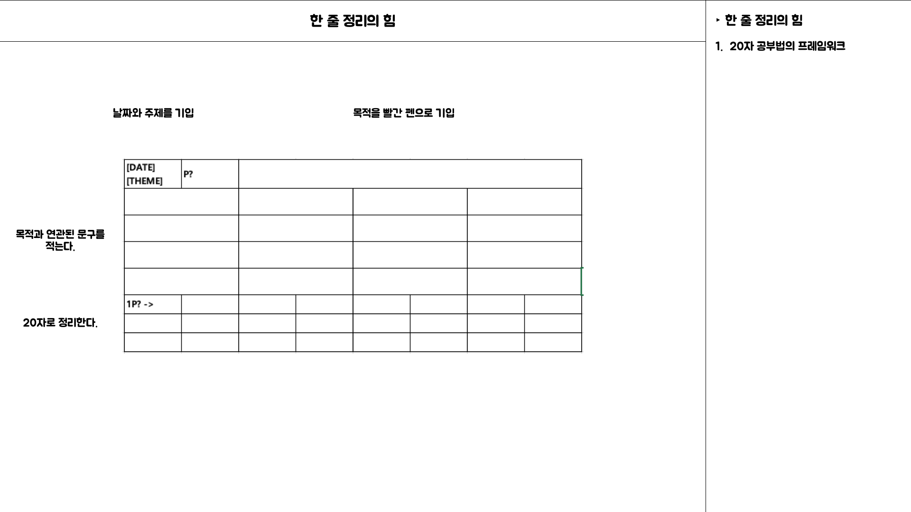
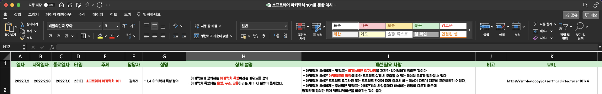

# Chapter 2. 지식의 핵심과 본질만 머릿속에 입력하는 방법

## Intro

이전에 이야기 했던 `1. 목적의 명확화`, `2. 사고 정리`, `3. 단적인 요약` 이라는 3개의 키워드를 명심하면서 배운 내용을 잊지 않고 오랫동안 기억하도록 입력하는 방법 알아보기

지난 주 내용으로 정리한 것을 20자 내외로 정리해본다.

> 지금은 내가 무엇을 배웠는지 거의 잊어버렸다.

> 요즘 세상은 배움이 소비가 되어 버린 시대다.

> 학습을 하나의 소비를 받아들이고 있기 때문이다.

> 소비형 학습관에서 투자형 학습관으로 전환한다.

> 사고를 정리하면서 배우고 있지 않기 때문이다.

> 배운 내용을 짧게 요약하고 있지 않기 때문이다.

> 한 장으로 자기만족에 그치는 업무 방식을 고친다.

> 가능하다면 20자 안팎의 글로 잘 정리해 보자

이렇게 20자 내외로 정리하는 이유는 `한 눈에 요점을 파악`하기 위함이다.

20자라는 구체적인 글자 수에 집착하는 이유를 저자는 시조, 원고지, 시험의 문항을 예시로 들어 아무 근거 없는 숫자가 아님을 이야기 하고 있다.

## `목표를 명확하게 하는` 세 가지 제약 조건

무작정 어떤 학습이나 일을 하던지간에 20자로 요약하려고 하면 쉽지 않다. 이러한 부분은 명백하게 반복을 통한 트레이닝이 필요하다. 저자는 토요타에서 일을 할 때 일상적으로 요약을 해야했고 이러한 계기를 통해 요약하는 능력이 비약적으로 향상되었다고 한다.

토요타에서는 일을 할 때 작성하는 기획서, 결재서, 품의서, 보고서, 회의록, 분석 자료, 검토서, 토론자료 등등 모든 종류의 서류를 A4 또는 A3 한장으로 정리한다는 기업 문화가 정착되어 있다.

이러한 자료를 작성하는 데에는 다음 `세 가지 제약`이 따른다.

> 종이 한 장에 정리해야 한다.
>

> 틀 안에서 정리해야 한다.
>

> 주제에서 벗어난 것은 쓸 수 없다.
>

### `제약1. 종이 한 장에 정리한다.`

종이 한 장이라는 조건은 너무 포괄적일 수 있다. 어떤 목적으로 작성하던지 간에 `특정한 주제`가 존재하기 때문에 프레임 위에 제목은 `‘무엇에 대해서 쓸 것인가’`를 작성한다.

### 제약2. 틀 안에서 정리한다.

그리고 여러 글 상자 또는 프레임 또는 틀이라 불리는 형식에 주제와 다른 내용을 작성하면 안된다. 이런식으로 제한된 공간 안에서 주제에 맞는 내용들(`키워드` 또는 `짧은 정리`)로만 채워서 최종적으로는 이러한 키워드로 다시 `20자 내외로  정리하는 것`이다.

### 제약3. 주제에서 벗어난 것은 쓰지 않는다.

이때 중요한 것은 `주제를 정해놓고 마음대로 주저리주저리 쓰지 않도록 제약`을 한다는 것이다.

책에서 예시로 제공하는 몇 가지 문서의 틀을 보면 아래와 같다.

- 기획서
    - 기획의 배경
    - 기획의 개요
    - 예산 및 발주처
    - 일정
- 출장 보고서
    - 출장 목적
    - 회의 결과
    - 앞으로의 대책
- 업무 진행 방법 예측에 대해
    - 출장 목적
    - 현상 파악
        - 문제
        - 문제점
        - 세부사항
    - 목표 설정
    - 원인 분석
    - 대책 마련
    - 실시 결과
    - 앞으로의 대책

### `사고를 정리`하기 위한 본질을 깨우치기

위에서 목표를 명확하게 하기 위해서 목표를 정하고 관련 키워드 들을 추려서 작성해보고 20자로 요약까지 해보았다.
이러한 작업을 하면서 한번 생각해 볼 것은 `정보를 정리하고`, `생각을 모으는 행동`을 하면서 하는지 작성하는지 다시 한번 생각해본다.

사고 정리란 정보를 정리하고, 생각을 모으는 것이다. 자료를 정리할 때도 그렇지만 업무를 볼 때나 공부를 할 때도 사고 정리가 연속적으로 일어난다.

두뇌는 주어진 주제에 대한 정보를 정리하고, 다시 그것들을 재료로 이런저런 생각을 모으기 때문이다. 이때 그저 생각만 하다보면 사고가 제멋대로 뻗어나가 저 ~ 기 안드로메다로 가게 된다. 이렇게 되면 머리 속에 쌓아놨던 정리 해놓은 내용들도 정리가 되지 않게 된다.

이러한 것을 주의하기 위해서 `제약`을 통해 `사고의 방향이 사방으로 뻗어나가는 것을 막는 것`이다.

그 결과 `“한마디로 정리하면?”`, `“이를 더 요약하면?”` 과 같은 행동을 반복하게 되고, 특정 주제 또는 키워드에 `더 깊이 생각`하게 된다. 깊이 생각한다는 것은 “`반복해서 사고를 정리한다`” 라는 뜻이 내포 되어 있음을 알 수 있다.

깊이 생각함으로써 우리는 “`어떤 것`”을 파악할 수 있고, 그 어떤 것이 바로 사고를 정리하고 있는 주제에 대한 `본질` 임을 알 수 있다.

<aside>
💡 `본질`이란 우리가 정리하기 위한 어떤 것들에 대한 `핵심`이고 많은 현상을 설명하는 근거이다.
</aside>

본질이라는 말이 추상적이기 때문에 갑자기 멍해질 수 있다. 예시를 들어보면 어떠한 업무를 통해 사고 정리를 반복한 결과, 내가 지금 맡고 있는 업무의 본질을 파악했다고 치면 내가 해야 하는 일의 중심 기둥에서 벗어나지 않고, 판단하며 행동할 수 있다. 그리고 충분히 응용이 가능하여 예측하지 못한 상황에서도 당황하지 않고 대처할 수 있다.

주변에서 이런저런 질문을 하더라도 일관된 대답을 할 수 있는 것 또한 본질을 파악하고 있기 때문이다. 이렇게 본질을 파악하는 힘은 업무를 원활하게 하는 학습 능력에 반드시 필요한 요소이다.

<aside>
💡 `본질`은 단순해서 단적인 말로 표현이 가능하다.
</aside>

다시 여기까지 내용을 20자로 정리하면

<aside>
💡 `학습`이란 `사고 정리`에 의한 `본질 탐구` 그 자체이다.
</aside>

표면적인 지식을 무턱대로 암기하거나, 하나하나 개별적으로 키워드를 이해해나가는 식으로 공부해서는 언젠가 거의 모든 내용을 잊게 된다. 공부란 그저 외우고 문제를 푸는 것이 아니라, 공부하고 있는 주제에 대한 본질을 파악하는 것이다.

본질을 파악하게 되면 현재 공부하고 있는 주제에 대해서 이해할 수 있고, 단적인 말로 표현할 수 있기 때문에 시간이 지나도 쉽게 기억을 떠올리게 해주는 간단한 입력 키워드를 축적할 수 있다.

정보를 정리하고, 생각을 모으는 행위를 반복하며 깊이 생각함으로써 본질을 파악하고 나면 배운 것을 단적으로 표현할 수 있다. 그리하면 입력한 것을 오래 기억할 수 있고, 업무에서도 활용하기 쉽다.

> 책에서 제공하는 20자 공부법 프레임워크

위 내용들 통한 나의 업무에 활용하기

위에서 정리한 내용을 토대로 실제 학습 또는 업무에 적용할 수 있도록 프레임워크(틀)을 만들어보도록 한다.
사람은 유사시에 평소의 습관대로 움직이기 때문에 이러한 연습을 통해 유사시 나오는 행동마저 컨트롤하기 위해 꾸준히 연습하는 것이 좋다. 책에서는 이러한 정리를 노트북이 아니라 종이에 손으로 작성하는 것을 권장한다. 하지만 그건 사용하는 사람의 선택적인 판단으로 놓는다.

책에서 이야기하는 목적을 여기서는 주제 + 설명 컬럼으로 대체한다.
주제는 생각 또는 의도가 들어가지 않고, 명확하게 구분할 수 있는 내용으로 작성한다.
업무로 치면 개발, 운영, 배포, PM 등등 정해져 있는 패턴으로 작성하는 것이 관리하기에 편리하다.

설명은 해당 주제에 따른 소주제에 속하는 내용으로 작성한다.
개발의 경우 서비스명 등등으로 작성하면 해당 서비스에 대한 어떠한 작업인지 명확하게 구분이 가능하다.

이러한 작업을 통해 `목적의 명확화`를 충족할 수 있다.

그리곤 `사고 정리`를 하기 위해 해당 주제에 대한 키워드 또는 정의 등을 자신이 이해할 수 있는 방식으로 요약하여 작성한다. 이때 나열되는 키워드를 그룹화하는 것이 정리하는데에 도움이 될 것이다.

최종적으로 `자신만의 방식으로 새롭게 풀어서 설명`할 수 있도록 정리하도록 한다. 이때는 한 문장을 그냥 작성하는 것이 목적이 아니라, 말로 설명이 가능해야 하기 때문에 `더 짧은 말로 바꿀 순 없는지`, `말의 어순을 바꿔서 보다 단적으로 표현할 순 없는지`, `수식 어구를 줄이거나 보충하여 더 이해하기 쉽게 할 수 없는지`를 생각하면서 필요 시 수정한다.

## 정리

오늘은 학습 또는 업무를 할 떄 `목적을 명확`하게 하고 `사고 정리`를 위해 프레임워크를 만들어 주제를 작성하고, 관련된 키워드를 나열 또는 그룹화 하여 요약하기 위한 요소들을 모아 보았다. 지금까지 해놓은 내용만으로도 20자로 요약이 가능하다. 하지만 조금 더 키워드를 잘 뽑아내고, 정제된 내용으로 요약하기 위해 다음 장에서는 질문하는 방법, 설명을 더 잘하기 위한 방법에 대해서 정리해보도록 한다.