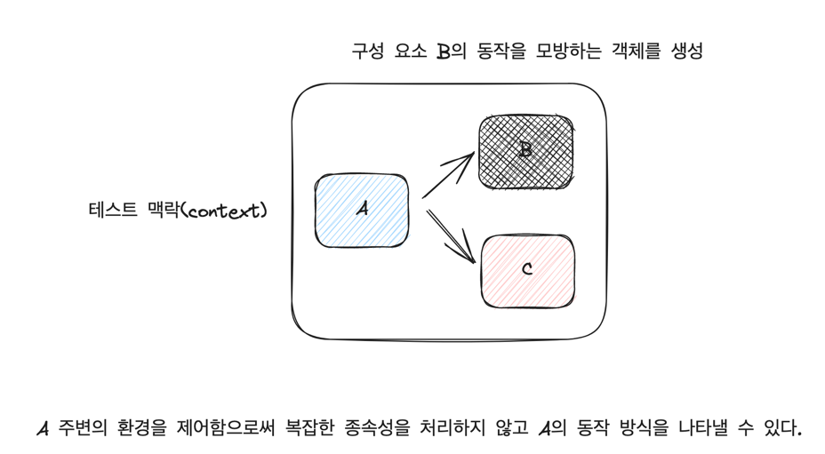

# 이펙티브 소프트웨어 테스팅 책을 읽고... (4)

- 지금까지 다뤘던 내용은 테스트 코드를 효율적으로 작성할 수 있도록 다양한 테스트 종류에 대해서 알아보았다.
- 여기서도 단위 테스트 내에 `테스트 더블` 이라는 개념 내에 `모의 객체`, `스텁`, `페이크`, `스파이`, `더미` 등의 구현 방식에 대해서 알아본다.

## 6. 테스트 더블과 모의 객체

- 목표
  1. 스텁, 페이크, 모의 객체를 사용해서 테스트를 단순하게 하는 방법
  2. 모의 객체가 무엇인지, 모의 객체를 언제 사용해야 하는지, 언제 사용하지 말아야 하는 지에 대한 이해
  3. 모의할 수 없는 객체를 모의 하는 방법

---

### 이전까지 상황

이전까지 테스트 방식은 클래스와 메서드를 분리하여 테스트를 진행해왔다.

그게 무슨말이냐면 

클래스는 상태를 갖는 값 객체에 대해서, 상태를 설정하고 테스트 대상 메서드를 호출한 후, 클래스가 기대하는 상태로 있는지 단언문을 통해 검증하는 방법을 하였다.

메서드는 상태가 없는 함수에 대한 테스트로 단일 메서드 호출에 입력을 전달하고, 출력 값을 확인하는 테스트를 진행하였다.

---

### 이제 테스트할 대상의 환경

이전과는 다르게 단일 클래스 만으로 이루어져있지 않고, 복잡한 동작을 여러 클래스로 나누어 유지 보수성을 향상시키기 위한 구조에 대해서 이야기 한다.

기능 개발은 일반적으로 기능 하나가 여러 작은 기능들이 모여서 이루어진다.

하지만 커다란 기능을 빠르게 테스트 해보기 위해서는 어떻게 해야 할까? 보다 효율적으로 테스트 할 수 있는 방법은 없을까?

- 작은 로직에 대한 테스트
  - 빠른 테스트
  - 사전 준비 비용이 적음
  - 검증해야 할 값의 수가 적음

- 큰 로직에 대한 테스트
  - 상대적으로 느린 테스트
  - 사전 준비 비용이 큼
  - 검증해야 할 값이 많음

### 고민해볼 것

> 의존성이 전이된 요소에 의존하지 않고 테스트하는 방법은 어떤 것들이 있을까?

### 테스트 더블

- 테스트 대상 외에 대상(의존성)을 사용하지 않는 방법

- 장점

1. 더 큰 제어권을 갖는다.
   - 가짜 객체에게 무엇을 해야할 지 쉽게 알려줄 수 있다.
     (특정 입력 값을 매개변수로 넣지 않고도 결과를 확정)

2. 시뮬레이션은 빠르다.
   - 종속성을 시뮬레이션하면 데이터베이스나 웹 서비스와 통신하고 응답을 기다릴 필요가 없다.

3. 클래스 간의 상호작용을 반영할 수 있다.
    - 계약이 어떻게 되어야 하는지, 개념적인 경계는 어떻게 나눌지를 반영할 수 있다.

- 결론
  - 개발자는 모의 객체를 사용하여 테스트를 쉽게 만들 수 있고, 모의 객체를 코드 설계의 지원 도구로 사용할 수 있다.

- 참고
  - [테스트 주도 개발로 배우는 객체지향 설계와 실천](https://product.kyobobook.co.kr/detail/S000001032969)
    - 모의 객체에 대한 인사이트를 얻을 수 있음

### 더미, 페이크, 스텁, 모의 객체, 스파이

- Dummy 
  - 테스트 대상 클래스에 전달되지만 절대 사용되지 않는 객체 
  - 인스턴스화된 객체가 필요하지만, 정상적인 동작을 보장하지 않음

- Fake
  - 시뮬레이션하려는 클래스 같이 실제로 동작하는 구현체지만 단순한 방법으로 동작

- Stub
  - 테스트 과정에서 수행된 호출에 대해 하드코딩된 응답을 제공
  - 페이크 객체와는 달리 스텁은 실제로 동작하는 구현체가 없다. 
  - 빈 목록, 한 요소가 포함된 목록, 여러 요소가 포함된 목록등을 반환하도록 설정가능

- Mock
  - 메서드의 응답을 설정할 수 있다는 점에서 스텁 같은 역할을 한다. 
  - 모든 상호작용을 저장해서 나중에 단언문에 활용할 수 있도록 해준다.

- Spy
  - 의존성을 감시 
  - 실제 객체를 감싸서 그 행동을 관찰 
  - 객체를 시뮬레이션하는게 아니라 감시하고 있는 근본 객체와의 모든 상호작용을 기록 
  - 모의 객체를 사용하는 것보다 실제로 구현하는게 훨씬 더 쉬움 
  - 테스트 대상 메서드가 의존 대상과 어떻게 상호작용하는지 단언하고자 하는 경우에 사용

### Stub vs Mock

- Stub과 Mock을 선택하는 조건 
  - 의존성이 너무 느린경우 stub 보다 mock 사용 
  - 의존성이 외부 인프라와 통신하는 경우 mock 사용 
  - 의존성을 시뮬레이션하기 힘든 경우 stub 사용

### 테스트 가능성

- 테스트 대상에 따라 테스트 방법을 선택하는 기준

- 엔티티
  - 비즈니스의 개념을 표현하는 클래스 
  - 모의하기 위한 비용이 큰 경우 인스턴스 생성 
  - 반대로 인스턴스를 생성을 위한 비용이 큰경우 모의 객체 생성

- 네이티브 라이브러리와 유틸리티 메서드
  - 라이브러리나 유틸리티 메서드를 모의하거나 스텁으로 만드는 일은 일반적이지 않다. 
  - 학습 테스트용 테스트 추천

- 충분히 단순한 의존성
  - 단순한 클래스의 경우 모의할 가치가 없다.

> 테스트하기 힘든 클래스에 대해서는 Wrapper 클래스를 만들어서 테스트 가능하게 만들어야 한다.

- [Martin Fowler - ClockWrapper](https://martinfowler.com/bliki/ClockWrapper.html)