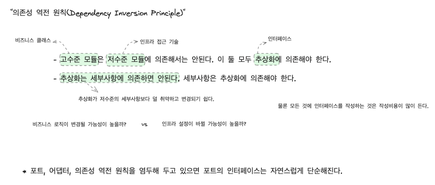

# 이펙티브 소프트웨어 테스팅 책을 읽고... (5)

## 7. 테스트 가능성을 위한 설계

- 목표
  1. 아키텍처, 설계, 구현 수준에서 테스트하기 쉬운 코드를 설계하는 방법
  2. 육각형 아키텍처, 의존성 주입, 관찰 가능성 및 제어 가능성에 대한 이해
  3. 테스트 가능성의 함정을 회피하는 방법

---

### 테스트 가능성이란?

> "테스트 대상 시스템이나 클래스, 메서드에 대해 자동 테스트를 얼마나 쉽게 작성할 수 있는지를 말한다."

- 테스트 하기 쉬운 시스템이란?

"테스트 하기 쉽다" 라는 의미는 테스트 대상이 단일 관심사에 집중하고 있기 때문에 테스트 코드를 작성하기 쉽다는 의미이다.

반대로 생각해보면 여러 관심사가 얽혀있는 시스템의 경우, 외부 리소스를 사용하는 시스템의 경우에는 핵심 관심사에 집중하기 어렵고 외부 환경에 영향을 쉽게 받을 수 있기 때문에 테스트 코드를 작성하기도 어렵고, 단언하기도 어렵다.

---

### 테스트 가능성을 위한 방법?

* 도메인 코드에서 인프라 코드를 분리하기

  * 도메인: 시스템의 핵심이 있는 곳
    - 모든 비즈니스 규칙
    - 로직
    - 엔티티
    - 서비스 및 이와 유사한 요소

  * 인프라스트럭처: 외부 의존성을 다루는 코드와 관련
    - 데이터베이스 쿼리를 다루는 코드
    - 웹 서비스 호출
    - 파일 읽기 / 쓰기

* 도메인과 인프라스트럭처가 공존하는 코드의 문제점

  - 테스트 코드를 작성하려는 경우 데이터 베이스를 다루는 부분을 스텁으로 쉽게 만들 수 없다.
  - 책임이 클수록 더 복잡해지고 버그가 발생할 가능성이 증가한다.
  - 필요한 부분에 집중한 테스트를 작성하기 어렵다.

---

### 명확한 책임 분리를 위한 소프트웨어 시스템의 아키텍처

### 핵사고날 아키텍처(또는 포트/어댑터) 패턴

### 의존성 주입과 제어 가능성

- 제어 가능성을 위한 일반적인 구현 전략
  - 의존성을 모의 객체, 페이크, 스텁 등으로 쉽게 교체할 수 있는 상황을 만든다.

- 의존성 주입의 장점
  - 테스트 도중 의존성을 모의 객체나 스텁으로 만들수 있도록 하여, 테스트 단계에서 생산성을 증대시킨다.
  - 의존성을 더 명확하게 해준다.
  - 관심사를 분리하기에 좋다.
  - 클래스가 더 확장성을 가지게 된다.

- 의존성을 주입받을 수 있도록 하는 장치

> "도메인과 인프라 클래스가 서로 가지게 될 추상적인 상호작용을 나타애는 인터페이스를 고안"

- 관심사의 분리
- 계층 간의 결합도를 줄임
- 계층 간 상호작용을 단순화

- [DIP in the Wild](https://martinfowler.com/articles/dipInTheWild.html)

---

- "의존성 역전 원칙(Dependency Inversion Principle)"

### 관찰 가능성을 높여 쉽게 단언하기

- 관찰 가능성이란?
  - 클래스 수준에서 기능이 기대했던 대로 동작하는지를 얼마나 쉽게 단언할 수 있는가에 관란 것이다.
  - ex) 클래스의 속성을 확인하기 위한 방법으로 getter를 사용하고 있는가? 아니면 isValid를 통해 유효한 상태인지를 확인하는가?

> 테스트 코드는 클래스의 행동을 쉽게 확인할 수 있어야 한다.

- 의존성을 전달하는 방법
  - 클래스 생성자와 메서드 매개변수로 전달하는 방법
  - 의존성을 사용하지 않고 메서드 매개변수를 통해 직접 원하는 값을 전달하는 방법의 장단점
    - 생성자를 통해 의존성을 받는 방법은 전체 클래스와 테스트의 복잡도를 약간 증가시키지만 클라이언트 클래스를 단순하게 만든다.
    - 매서드 매개변수로 데이터를 받는 방법은 클래스와 테스트를 단순하게 만들지만 클라이언트의 복잡도를 약간 증가시킨다.

### 테스트 가능성을 설계하는 방법

- 테스트 대상 클래스의 인스턴스를 만들기가 어려운가?
  - 의존성을 줄여서 설계하는 방법이 있을 것이다.!
- 테스트 대상 메서드를 호출하기 어려운가?
  - 사전 조건을 더 다루기 쉽게 하는 설계 방법이 있을 것이다.

### 테스트 대상 클래스의 응집도

- 응집도란?
  - 아키텍처상의 모듈, 클래스, 메서드 또는 어떤 요소든지 단 하나의 책임을 가지는 것

* 응집력 없는 클래스에 대한 테스트 스위트는 거대하다.
  - 테스트 스위트가 거대하다는 이야기는 테스트의 개수에 유의해야 한다는 것이다.
  - 테스트의 수가 합리적으로 생각하는 수준을 넘어서 증가하고 있다면 클래스나 메서드가 맡은 책임을 재평가해볼 때이다.
  - 일반적인 리펙토링 전략은 관심사가 다른 내용을 분리하는 것이다.

* 응집력 없는 클래스는 크기가 커지는 일을 멈추지 않는다.
  - 항상 같은 테스트 클래스로 돌아와서 새로운 테스트를 추가하고 있다면, 설계에 대한 고민을 해야한다.
  - 이는 적절한 추상화가 없는 것과 관련이 있다.
  - 크기가 계속 커지는 클래스는 SOLID 지침에 있는 단일 책임 원칙(Single Responsibility Principle, SRP), 개방 폐쇄 원칙(Open Closed Principle, OCP)을 모두 어긴다.
  - 일반적인 리펙토링 전략은 다양한 역할을 표현하는 추상화를 만들고, 각 계산 규칙을 각자의 클래스로 이동시키는 방법이 있다.
  - 이를 전략 패턴(Strategy Design Pattern)을 사용할 수 있다.

- 결합도란?
  - 응집력 있는 기능을 설계하기 위해 여러 클래스를 조합하여 큰 행위를 구성할 때, 결합도가 높은 설계를 할 가능성이 높다.

* 테스트를 통해 결합도가 높은 클래스를 발견하는 방법
  - 테스트 코드를 작성할 때 수 많은 의존성 인스턴스가 필요한 경우, 클래스 재설계를 고려하자.
  - 특정 테스트가 실패했을 때, 문제의 원인이 대상 클래스가 아니라 다른 의존 클래스가 원인인 경우, 클래스 재설계를 고려하자.

---

주저리 주저리 말이 많았다. 
