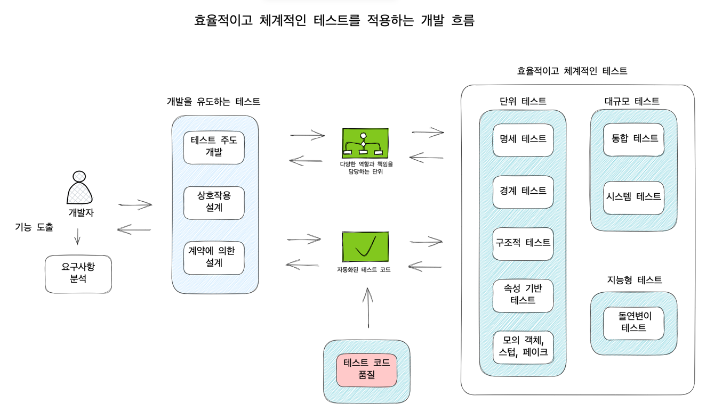
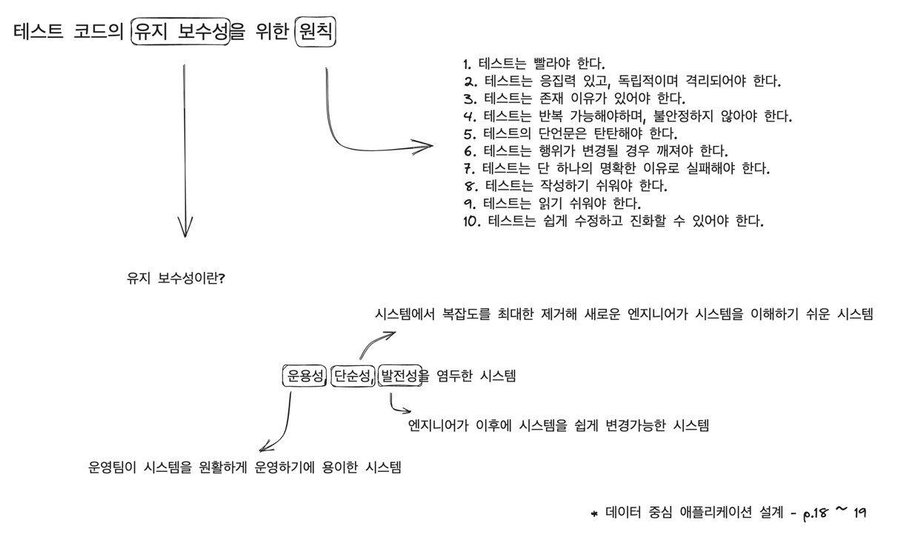

# 이펙티브 소프트웨어 테스팅 책을 읽고... (6)

## 10. 테스트 코드 품질

- 목표
  1. 우수하고 유지 보수하기 쉬운 테스트 코드를 작성하는 원칙과 모범 사례
  2. 테스트 코드의 이해와 발전을 전해하는 테스트 냄새를 없애는 방법

---

> "코드는 적극적으로 관리하지 않으면 부패하는 경향이 있다." - 리먼 소프트웨어 변화 법칙(1980)

제품 코드와 마찬가지로, `품질 좋은 테스트 코드`를 작성하기 위해 더 큰 노력을 기울이고 `유지보수` 하기 쉽게 해야 한다.

- `유지 보수성이 높은 코드`란 `복잡성 제어`가 가능한 코드를 말한다.

여기서는 테스트 코드의 이해와 발전을 저해하는 주요한 `테스트 냄새`라고 하는 기준을 알아보도록 한다. 

---

### 테스트 코드의 유지 보수성을 위한 원칙

- 유지 보수성이란?
  - 운용성, 단순성, 발전성을 염두한 시스템
    - 운용성이란, 운영팀이 시스템을 원활하게 운영하기에 용이한 시스템
    - 단순성이란, 시스템에서 복잡도를 최대한 제거해 새로운 엔지니어가 시스템을 이해하기 쉬운 시스템
    - 발전성이란, 엔지니어가 이후에 시스템을 쉽게 변경가능한 시스템

- 유지 보수성을 위한 원칙에는 어떤 것들이 있을까?
  1. 테스트는 빨라야 한다.
  2. 테스트는 응집력 있고, 독립적이며 격리되어야 한다.
  3. 테스트는 존재 이유가 있어야 한다.
  4. 테스트는 반복 가능해야하며, 불안정하지 않아야 한다.
  5. 테스트의 단언문은 탄탄해야 한다.
  6. 테스트는 행위가 변경될 경우 깨져야 한다.
  7. 테스트는 단 하나의 명확한 이유로 실패해야 한다.
  8. 테스트는 작성하기 쉬워야 한다.
  9. 테스트는 읽기 쉬워야 한다.
  10. 테스트는 쉽게 수정하고 진화할 수 있어야 한다.

### 유지 보수성을 위한 원칙을 짧게 정리

1. 테스트는 빨라야 한다.
   - 테스트 코드를 작성했으나 느리다고 생각되는 경우, 시도해볼만한 것들이 있다.
     - 모의 객체나 스텁을 이용해서 테스트의 일부 느린 구성요소를 대처한다.
     - 제품 코드를 재설계해서 느린 코드를 빠른 코드와 분리하여 테스트할 수 있도록 한다.
     - 느린 테스트를 자주 실행하지 않는 다른 테스트 스위트로 옮긴다.
     
    > * 빠르거나 느린 테스트를 구분하는 명확한 기준은 없다.

2. 테스트는 응집력 있고, 독립적이며 격리되어야 한다.
   - 테스트는 가능한 응집력 있고 독립적이며 격리되어야 한다.
     - 하나의 테스트 메서드가 하나의 기능이나 시스템의 행위를 테스트하는 것이 이상적이다.
   - 복잡한 테스트 코드는 무엇을 테스트하는 것인지 한눈에 볼 수 없을 뿐만 아니라 유지보수하기도 어렵다.
     -  복잡한 테스트 코드란, 다른 테스트의 결과에 의존하는 테스트 코드
   - 복잡한 테스트 코드를 개선하기 위해서는 ?
     -  테스트의 결과는 테스트 스위트에 있는 나머지 테스트와 함께 실행하든 항상 같도록 격리되어야 한다.

3. 테스트는 존재 이유가 있어야 한다.
   - 모든 테스트 코드는 유지 보수되어야 한다.
     - 테스트가 존재해야 할 타당한 이유가 없다면 존재하지 말아야 한다.
     - 완벽한 테스트 스위트를 만드는 일은 불가능하지만, 쓸모없는 테스트는 만들지 않는 게 좋다.

4. 테스트는 반복 가능해야 하며 불안정하지 않아야 한다.
   - 테스트가 불안정하다면 신뢰성을 읽고, 테스트와 관계없이 배포하게 될 것이다.
   - 불안정한 테스트 이유
     - 외부 자원이나 공유 자원에 의존하는 경우
     - 부정확한 타임아웃 (외부 API 통신을 하는 통합 테스트 상황에서 응답을 기다려야 하는 경우)
     - 다른 테스트 메서드와 예상치 못한 상호작용이 일어난 경우
     - 비동기식 대기, 동시성, 테스트 순서 의존성

5. 테스트의 단언문은 탄탄해야 한다.
   - 행위의 결과를 쉽게 관찰할 수 없는 경우, `관찰 가능성`을 높이도록 테스트 대상 클래스나 메서드를 리펙토링한다.
     - 테스트는 행위의 유효성을 완전히 검사하고 출력에 약간의 변화가 생기면 중단되어야 한다.

6. 테스트는 행위가 변경될 경우 깨져야 한다.
   - 행위가 깨졌음에도 테스트 스위트가 여전히 초록색이면 테스트에 문제가 있다는 것이다.

7. 테스트는 단 하나의 명확한 이유로 실패해야 한다.
   - 실패하는 테스트는 코드가 배포되기 훨씬 전에 문제가 있음을 알려준다.
     - 테스트 실패는 버그를 이해하고 고치는 첫 번째 단계로 테스트 코드를 통해 버그의 원인을 파악할 수 있다.

8. 테스트는 작성하기 쉬워야 한다.
   - 단위 테스트를 작성하는 일은 대부분 쉬운 경향이 있다.
     - 통합 및 시스템 테스트에서는 의존성이 높은 경향이 있고, 인프라를 설정하고 정리하는 테스트도 필요하다.
   - 테스트 인프라를 구축하는 데 시간을 투자하는 것은 필수이며, 장기적으로 성과를 보게된다.

9. 테스트는 읽기 쉬워야 한다.
   - 개발자가 코드를 작성할 때보다 읽는 데 더 많은 시간을 소비한다.
     - 읽는 시간을 절약하면 생산성이 올라간다. 리펙토링에 시간을 투자하는 것을 두려워하지 말자.
   - 테스트를 읽기 쉽게 하기 위한 두 가지 원칙
     1. 모든 정보(입력 및 단언문)가 충분히 명확한지 확인
     2. 복잡한 데이터 구조를 작성할 때마다 테스트 데이터 작성기를 사용
        - 테스트 데이터 빌더를 통한 명확하게 표현력있는 API를 사용하여 테스트 시나리오를 작성
   - 결론
     1. 테스트 데이터 빌더를 도입
     2. 정보의 의미를 설명하는 변수명을 사용
     3. 단언문을 명확하게 작성
     4. 코드에서 충분히 표현되지 않는 사항에 대해 주석 추가

10. 테스트는 쉽게 수정하고 진화할 수 있어야 한다.
    - 모든 코드에 대해 개방 폐쇄 원칙(OCP, Open closed principle)을 지킨 설계를 하는 것은 쉽지 않은 일이다.
      - 테스트 코드를 구현할 때 해야 할 일은 코드의 변경이 너무 고통스럽지 않도록 하는 것이다. 
      - 코드의 변경이 전혀 고통스럽지 않을 순 없으나, 그나마 줄일 수 있는 가장 쉬운 방법은 중복된 코드를 추출하는 것이다.

### 테스트 냄새

왜 외국사람들은 안좋은 것들을 냄새난다 할까?..

1. 과다한 중복
   - 중복 코드를 private 메서드나 외부 클래스로 추출할 수는 없을까?

2. 불명확한 단언문
   - 단언문이나 실패 이유를 바로 확인하기에 어렵지는 않은가?
   - 복잡한 비즈니스를 단언하려는 경우
     1. 단언문의 복잡성 일부를 추상화하는 맞춤형 단언문을 작성
     2. 단언문의 내용을 자연어로 설명하는 주석 추가
  > - 테스트가 충분히 응집력 있고, 단일 기능에 초점을 맞췄다면 단언문들은 전체 행위가 예상한 바와 같다는 것을 보장해야 한다.
  > - 단언문이 실패하는 경우 남은 테스트를 중지하지 않고 테스트가 끝나는 시점에 결과를 한번에 보고하는 기능을 사용하는 것은 어떨까?
  > - [AssertJ](https://joel-costigliola.github.io/assertj/assertj-core-features-highlight.html#soft-assertions)

3. 복잡하거나 외부에 있는 자원에 대한 잘못된 처리
   - 일반적으로 외부 자원을 낙관적으로 대하는 경우, 테스트에 대한 신뢰성이 떨어질 수 있다.
     - 자원 낙관주의를 회피하려면 테스트에서 자원이 이미 올바른 상태에 있다고 가정해선 안된다.
     - 테스트는 상태를 설정하는 책임을 져야 한다.
   - 테스트에서 자원을 항상 사용할 수 있다고 가정하는 경우, 테스트에 대한 신뢰성이 떨어질 수 있다.
     - 스텁과 모의 객체를 사용하여 외부 자원에 의존하지 않도록 한다.
     - 테스트가 외부 종속성 사용을 피할 수 없는 경우 테스트 스위트를 충분히 견고하게 만든다.
     - (외부 요소를 사용할 수 없어 테스트가 깨져 전체 테스트 스위트에 대한 자신감을 잃어버리는 것 보다 해당 테스트를 건너뛰는 것이 나은 경우가 있다.)

4. 너무 범용적인 픽스처
   - 픽스처란?
     - 테스트 대상 구성요소를 수행할 때 사용되는 입력값의 집합
   - 복잡한 테스트 시 거대한 픽스처가 생기는 것은 필연적이다.
     - 테스트가 실패하는 경우 거대한 픽스처를 살펴봐야 하는 상황이 생긴다.
     - 테스트의 본질을 이해하고 있는지 테스트의 픽스처가 가능한 구체적인지 재확인 해본다.

5. 민감한 단언문
   - 잘못된 단언문은 테스트가 실패해야할 때, 그렇지 않을 수도 있다.
     - 테스트 코드는 테스트 대상 구성요소의 세부 구현사항에 대해 가능한 탄력적으로 작성하여야 한다. 
     - 단언문 역시 내부 변화에 지나치게 민감해서는 안된다.
     - (문자열을 Equals가 아니라 contains로 포함여부를 판단하는 Condition<?> 클래스를 반환하는 메서드를 사용해보는 것도 좋은 방법이다.)

---

> 좋은 테스트의 FIRST 속성이 떠오르는 내용이었다.