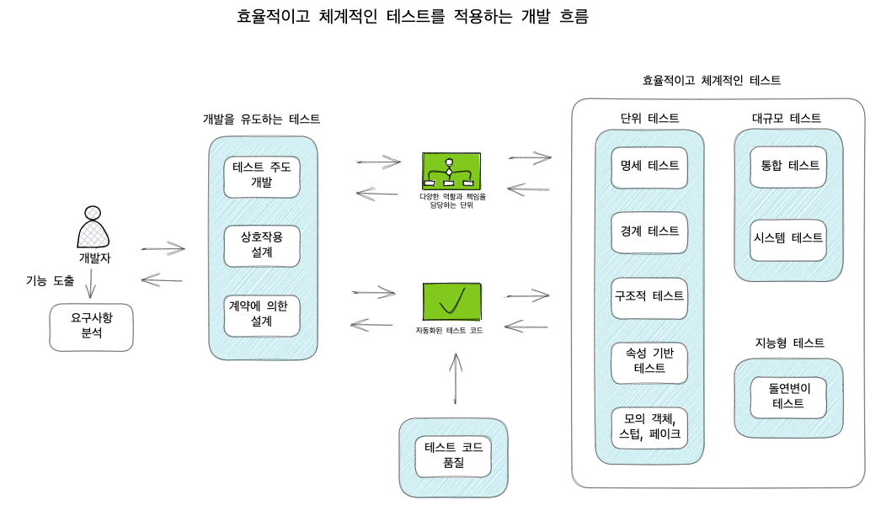
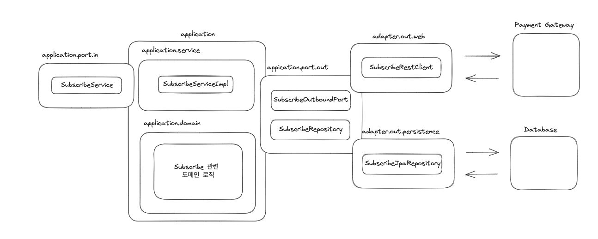
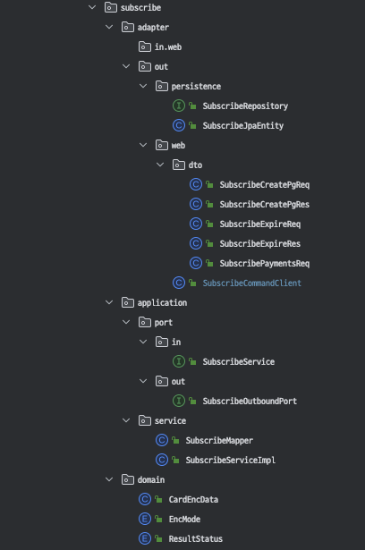

# 이펙티브 소프트웨어 테스팅 책을 읽고... (6)

## Intro



대부분의 서비스는 자체적으로 모든 기능을 A 부터 Z까지 신규 개발해서 제공할 수 없다.

따라서 서비스를 구현하기 위해, 서드파티 또는 제휴사를 통해 우리가 원하는 기능을 구현하는 것을 목표로 삼아야 한다.

내부적으로 관리가 가능한 부분에 대해서는 필요한 자원을 구축하고 이를 구현하고 검증이 가능하지만,

내부적으로 구현이 불가능한 부분에 대해서는 우리에게 필요한 자원을 제공하는 외부 리소스를 통해 필요한 기능을 쉽게 구현하도록 한다.

결국, 외부 리소스를 사용하기 위해서는 대외적으로 공개된 설계도를 통해 소프트웨어의 특징을 구현하려고 하는 요구사항에 맞게 사용해야 한다.

## 외부 리소스 특징 알아보기

우리는 특정 컨텐츠를 제공하고 있고, 이를 사용자에게 유료로 제공하기 위해 결제 시스템을 구축하고 있다.

결제 시스템 구축 전, 전자결제 심사와 같은 내용들은 생략하고, 기술적인 부분만 고려한다.

---

정기결제 서비스를 제공하기 위해서는 가맹점은 `빌키발급`, `빌키승인`, `빌키삭제` 등의 기능이 필요하다.

이를 구현된 기능으로 `빌키`를 발급받고, 이를 통해 결제를 진행하고, 이후에 빌키를 삭제하는 과정을 거친다.

고객은 단순하게 결제를 통해 카드번호, 유효기간, 생년월일, 카드비밀번호를 입력하고 결제 버튼을 누르지만,

가맹점은 내부적으로 빌키를 발급하고, 발급받은 빌키로 결제를 진행하게 된다.

이후에 일정주기, 보통 한달이 지나면 동일하게 빌키로 결제를 일으키고, 사용자가 정기결제를 취소하게 되면

가맹점이 관리하고 있던 빌키로 결제가 일어나지 않도록 빌키만료 요청을 통해 정기결제에 대한 사이클을 종료하게 된다.

- [정기결제를 위한 기능](https://github.com/nicepayments/nicepay-manual/blob/main/api/payment-subscribe.md)

## 외부 리소스를 사용하기 위한 설계

고객 관리 서비스에 대한 내용은 다루지 않는다. 오직 호출과 트랜잭션에 대한 부분만을 고민해본다.

- 클래스 구조



- 패키지 구조



### 정기결제 빌키 발급

도메인 영역에서 외부 서비스를 호출 하기위해 정기결제 관련 API 명세를  `SubscribeOutboundPort` 인터페이스로 정의

```java
public class SubscribeCommandClient implements SubscribeOutboundPort {

    @Retryable(retryFor = {ResourceAccessException.class, SocketTimeoutException.class}, // (1)
            maxAttempts = 3,
            backoff = @Backoff(delay = 1000, multiplier = 2))
    @Override
    public Pair<Integer, SubscribeCreatePgRes> issue( // (2)
                                                      final SubscribeCreatePgReq subscribeCreatePgReq
    ) {

        log.info("SubscribeRestTempleUseCase.issue : {}", subscribeCreatePgReq);

        ResponseEntity<SubscribeCreatePgRes> issuedSubscribeKey = restTemplate.postRestTemplate( // (3) 
                subscribeUrlProperties.getIssue(),
                merchantProperties.getToken(),
                mapper.toJson(subscribeCreatePgReq),
                SubscribeCreatePgRes.class
        );

        if (!issuedSubscribeKey.getStatusCode().is2xxSuccessful()) { // (4)
            log.error("SubscribeRestTempleUseCase.issue: {}", issuedSubscribeKey);
            throw new RuntimeException("정기결제 빌키발급 실패");
        }

        return Pair.of( // (5)
                issuedSubscribeKey.getStatusCode().value(),
                issuedSubscribeKey.getBody()
        );
    }
}
```

- (1) Retryable
    - `retryFor = {ResourceAccessException.class, SocketTimeoutException.class}`
        - 어떤 예외가 발생했을 때 재시도를 할 것인지 지정
    - `maxAttempts = 3`
        - 특정 연산을 최대 몇 번까지 재시도할 것인지 지정합니다. 이 경우에는 최대 3번의 재시도를 수행
    - `backoff = @Backoff(delay = 1000, multiplier = 2)`
        - 재시도 간의 지연 시간을 설정
        - `delay = 1000`
            - 1초의 지연 시간을 가짐
        - `multiplier=2`
            - 재시도할 때마다 지연 시간이 얼마나 늘어날 것인지를 나타내는 배수


- (2) public Pair<Integer, SubscribeCreatePgRes> issue(final SubscribeCreatePgReq subscribeCreatePgReq)
    - `Pair<Integer, SubscribeCreatePgRes>`
        - 외부 리소스를 호출하고, 응답을 받아오는데, 응답코드와 응답값을 함께 받아오기 위해 `Pair`를 사용
        - `Integer` : 응답코드
        - `SubscribeCreatePgRes` : 정기결제 PG 응답 명세

- (3) restTemplate.postRestTemplate(subscribe.issueUrl(), merchant.getToken(), mapper.toJson(subscribeCreatePgReq),
  SubscribeCreatePgRes.class)
    - `restTemplate.postRestTemplate`
        - 외부 리소스를 호출하기 위해 `RestTemplate`을 사용
        - `subscribe.issueUrl()`
            - 정기결제 발급 URL
        - `merchant.getToken()`
            - 가맹점 토큰
        - `mapper.toJson(subscribeCreatePgReq)`
            - 외부 리소스에 전달할 데이터
        - `SubscribeCreatePgRes.class`
            - 정기결제 빌키 발급의 응답 명세

- (4) !issuedSubscribeKey.getStatusCode().is2xxSuccessful()
    - 응답코드가 2xx가 아닌 경우
        - `log.error("SubscribeRestTempleUseCase.issue: {}", issuedSubscribeKey);`
            - 에러 로그 출력
        - `throw new RuntimeException("정기결제 빌키발급 실패");`
            - 런타임 예외 발생

- (5) Pair.of(issuedSubscribeKey.getStatusCode().value(), issuedSubscribeKey.getBody())
    - 응답코드와 응답값을 함께 리턴
        - `issuedSubscribeKey.getStatusCode().value()`
            - 응답코드
        - `issuedSubscribeKey.getBody()`
            - 응답값
            - `SubscribeCreatePgRes`
              - 정기결제 빌키 발급의 응답 명세

### 정기결제 시나리오 테스트 (통합 테스트)

- 구현부 통합 테스트

```java
@SpringBootTest
@DisplayName("정기결제 시나리오 테스트")
@TestInstance(PER_CLASS)
@TestMethodOrder(value = OrderAnnotation.class)
class SubscribeCommandClientIntegrationTest {

    @Order(1)
    @DisplayName("정기결제 빌키발급 테스트")
    @Test
    void issueBillingTest() {
        // given
        Id<String> orderId = new Id<>(UUID.randomUUID().toString().replace("-", ""));

        SubscribeCreatePgReq subscribeCreatePgReq =
                new SubscribeCreatePgReq.Builder(orderId, shinhanCardEncData() /* 테스트용 카드정보 */)
                        .returnCharSet(StandardCharsets.UTF_8.name()).build();

        // when
        Pair<Integer, SubscribeCreatePgRes> issueResponse = subscribeCommandClient.issue(subscribeCreatePgReq);

        // then
        SubscribeCreatePgRes issue = issueSubscribeConfirm(issueResponse);

        bid = issue.getBid();

    }

    @Order(2)
    @DisplayName("정기결제 빌키승인 테스트")
    @Test
    void PaymentByBidTest() {
        // given
        Id<String> orderId = new Id<>(UUID.randomUUID().toString().replace("-", ""));

        SubscribePaymentsReq subscribePaymentsReq = SubscribePaymentsReq.builder()
                .orderId(orderId)
                .amount(amount)
                .goodsName("정기결제 테스트")
                .build();

        // when
        Pair<Integer, PaymentsRes> paymentsResponse = subscribeCommandClient.payments(bid, subscribePaymentsReq);

        // then
        PaymentsRes payments = approveSubscribeConfirm(orderId, paymentsResponse);

        tid = payments.getTid();
        retrieveOrderId = payments.getOrderId();
    }

    @Order(3)
    @DisplayName("승인금액검증 테스트")
    @Test
    void checkAmountPaymentTest() {
        // given
        String ediDate = LocalDateTime.now().toString();
        String signData = SignDataEncrypt.encryptSHA256(tid.getValue() + amount + ediDate + merchantProperties.getSecretKey());

        CheckAmountReq checkAmountReq = CheckAmountReq.builder()
                .amount(amount)
                .ediDate(ediDate)
                .signData(signData)
                .build();

        // when
        Pair<Integer, CheckAmountRes> checkAmountResponse = checkAmountQueryClient.checkAmount(tid, checkAmountReq);

        // then
        checkAmountConfirm(checkAmountResponse);
    }

    @Order(5)
    @DisplayName("정기결제를 통해 승인된 TID로 결제취소 테스트")
    @Test
    void cancelByTid() {
        // given
        Id<String> orderId = new Id<>(UUID.randomUUID().toString().replace("-", ""));

        PaymentsCancelReq paymentsCancelReq = PaymentsCancelReq.builder()
                .orderId(orderId)
                .reason("빌키 승인 건 삭제 테스트")
                .build();

        // when
        Pair<Integer, PaymentsRes> cancelledResposne = paymentCommandClient.cancel(tid, paymentsCancelReq);
        log.info("{}", cancelledResposne);

        // then
        cancelSubscribeTransactionConfirm(cancelledResposne);
    }

    @Order(6)
    @DisplayName("정기결제 빌키 삭제 테스트")
    @Test
    void expiredBillingTest() {
        // given
        Id<String> orderId = new Id<>(UUID.randomUUID().toString().replace("-", ""));

        SubscribeExpireReq subscribeExpireReq = SubscribeExpireReq.builder()
                .orderId(orderId)
                .returnCharSet(StandardCharsets.UTF_8.name())
                .build();
        // when
        Pair<Integer, SubscribeExpireRes> expireResponse = subscribeCommandClient.expire(bid, subscribeExpireReq);

        // then
        expireSubscribeConfirm(orderId, expireResponse);
    }
}
```

### 정기결제 내부 단위 테스트 - Mocking

- 구현부

```java
@Slf4j
@Service
@RequiredArgsConstructor
public class SubscribeServiceImpl implements SubscribeService {

    private final SubscribeRepository subscribeRepository;
    private final SubscribeOutboundPort subscribeOutboundPort;

    @Transactional
    @Override
    public PaymentsRes subscribePayments(SubscribeCreatePgReq subscribeCreatePgReq, SubscribePaymentsReq subscribePaymentsReq) {

        // 정기결제 빌키 발급
        Pair<Integer, SubscribeCreatePgRes> issue = subscribeOutboundPort.issue(subscribeCreatePgReq);

        SubscribeCreatePgRes issueSubscribeRes = issue.getSecond();

        if (issue.getFirst() != 200) {
            log.warn("subscribe issue error: {}", issue);
            // 빌키 발급 실패시 히스토리 저장
            SubscribeJpaEntity savedSubscribe = subscribeRepository.save(
                    toIssueSubscribeIssueFail(subscribeCreatePgReq, issueSubscribeRes)
            );
            // 실패시 응답할 내용 정의 필요
            return new PaymentsRes();
        }
        // 빌키 발급 성공시 히스토리 저장
        
        subscribeRepository.save(toIssueSubscribeSuccess(subscribeCreatePgReq, issueSubscribeRes));

        // 정기결제 승인
        Pair<Integer, PaymentsRes> paymentsRes = subscribeOutboundPort.payments(issueSubscribeRes.getBid(), subscribePaymentsReq);

        PaymentsRes payments = paymentsRes.getSecond();

        if (paymentsRes.getFirst() != 200) {
            log.warn("subscribe payments error: {}", paymentsRes);
            // 빌키 승인 실패시 히스토리 저장
            SubscribeJpaEntity savedSubscribe = subscribeRepository.save(
                    toSubscribePaymentsFail(subscribeCreatePgReq, issueSubscribeRes, payments)
            );
            // 빌키 승인 실패 시 어떤 값을 반환할 지 정의
            return new PaymentsRes();
        }
        return payments;
    }
}
```

- 구현부 단위 테스트

```java
@ExtendWith(MockitoExtension.class)
class SubscribeServiceImplMockTest {

    @InjectMocks private SubscribeServiceImpl subscribeService;
    @Mock private SubscribeCommandClient subscribeCommandClient;
    @Mock private SubscribeRepository subscribeRepository;

    @DisplayName("정기결제 발급 및 승인 처리 테스트")
    @Test
    void subscribeIssueAndPaymentsSuccessTest(
            @Mock SubscribeCreatePgReq subscribeCreatePgReq,
            @Mock SubscribeCreatePgRes subscribeCreatePgRes,
            @Mock SubscribePaymentsReq subscribePaymentsReq,
            @Mock PaymentsRes paymentsRes,
            @Mock Id<String> bid
    ) {

        // when
        when(subscribeCommandClient.issue(subscribeCreatePgReq))
                .thenReturn(Pair.of(200, subscribeCreatePgRes));

        when(subscribeCreatePgRes.getBid()).thenReturn(bid);

        when(subscribeCommandClient.payments(bid, subscribePaymentsReq))
                .thenReturn(Pair.of(200, paymentsRes));

        subscribeService.subscribePayments(subscribeCreatePgReq, subscribePaymentsReq);

        // then
        verify(subscribeCommandClient, times(1)).issue(any());
        verify(subscribeCommandClient, times(1)).payments(any(), any());
    }

    @DisplayName("정기결제 발급시 실패 테스트")
    @Test
    void subscribeIssueFailTest(
            @Mock SubscribeCreatePgReq subscribeCreatePgReq,
            @Mock SubscribeCreatePgRes subscribeCreatePgRes
    ) {
        // given
        SubscribeJpaEntity expectedEntity = SubscribeJpaEntity.builder()
                .resultStatus(ResultStatus.FAIL)
                .build();
        PaymentsRes expectedRes = PaymentsRes.builder()
                .resultCode(expectedEntity.getResultCode())
                .resultMsg(expectedEntity.getResultMsg())
                .orderId(expectedEntity.getOrderId())
                .build();

        // when
        when(subscribeCommandClient.issue(any())).thenReturn(Pair.of(400, subscribeCreatePgRes));
        when(subscribeRepository.save(any())).thenReturn(expectedEntity);

        PaymentsRes result = subscribeService.subscribePayments(subscribeCreatePgReq, any());

        // then
        verify(subscribeCommandClient, times(1)).issue(any());
        verify(subscribeRepository, times(1)).save(any());
        assertThat(result).isEqualTo(expectedRes);
    }

    @DisplayName("정기결제 빌키 승인 실패 테스트")
    @Test
    void subscribePaymentsFailTest(
            @Mock SubscribeCreatePgReq subscribeCreatePgReq,
            @Mock SubscribeCreatePgRes subscribeCreatePgRes,
            @Mock SubscribePaymentsReq subscribePaymentsReq,
            @Mock PaymentsRes paymentsRes,
            @Mock Id<String> bid
    ) {
        // given
        SubscribeJpaEntity expectedEntity = SubscribeJpaEntity.builder()
                .resultStatus(ResultStatus.FAIL)
                .build();
        PaymentsRes expectedRes = PaymentsRes.builder()
                .resultCode(expectedEntity.getResultCode())
                .resultMsg(expectedEntity.getResultMsg())
                .orderId(expectedEntity.getOrderId())
                .build();

        // when
        when(subscribeCommandClient.issue(subscribeCreatePgReq)).thenReturn(Pair.of(200, subscribeCreatePgRes));
        when(subscribeCreatePgRes.getBid()).thenReturn(bid);
        when(subscribeCommandClient.payments(bid, subscribePaymentsReq)).thenReturn(Pair.of(400, paymentsRes));
        when(subscribeRepository.save(any())).thenReturn(expectedEntity);

        PaymentsRes subscribePayments = subscribeService.subscribePayments(subscribeCreatePgReq, subscribePaymentsReq);

        // then
        verify(subscribeCommandClient, times(1)).issue(any());
        verify(subscribeCommandClient, times(1)).payments(any(), any());
        verify(subscribeRepository, times(2)).save(any());
        assertThat(subscribePayments).isEqualTo(expectedRes);
    }
}
```

### 정기결제 내부 속성 테스트 (validation)

- 구현부 

```java
public final class CheckoutCreateValidator {

    private static final Pattern CARD_SHOW_OPT_PATTERN = Pattern.compile("^([\\d]{2}:[1-3](\\¦)?)*[\\d]{2}:[1-3]$");
    
    /* 특정 패턴으로 정의된 파라미터에 대한 검증 */
    public static boolean isValidCardShowOpt(String cardShowOpt) {
        return CARD_SHOW_OPT_PATTERN.matcher(cardShowOpt).matches();
    }
}
```

- 제한된 패턴이 존재하는 필드에 대한 테스트

```java
@Label("CardShowOpt 테스트")
@EnableFootnotes
class CheckoutCreateValidatorCardShowOptTest {

    @Label("cardShowOpt 랜덤 생성 정상 테스트")
    @Property
    @Report(Reporting.GENERATED)
    void validCardShowOptTest(
            @ForAll("cardShowStrings") String cardShowOpt
    ) {
        boolean validCardShowOpt = CheckoutCreateValidator.isValidCardShowOpt(cardShowOpt);
        assertThat(validCardShowOpt).isTrue();
    }

    @Provide
    Arbitrary<String> cardShowStrings() {
        Arbitrary<String> cardCode = Arbitraries.of("02", "04", "06", "07", "08", "12", "15");
        Arbitrary<String> colonPart = Arbitraries.just(":");
        Arbitrary<String> exposureType = Arbitraries.strings().withCharRange('1', '3').ofLength(1);

        Arbitrary<String> singleCardOpt = Combinators
                .combine(cardCode, colonPart, exposureType)
                .as((code, colon, type) -> code + colon + type);

        return singleCardOpt
                .list()
                .ofMinSize(1)
                .ofMaxSize(7)
                .map(segments -> String.join("¦", segments));  // use "¦" as separator
    }
}
```


## 고민해볼 것

- 에러처리
- 트랜잭션 관리

## 다루지 않는 것

- 보안
- PCI DSS
- 다중 통화
- 법률 및 규정 준수
- 등등