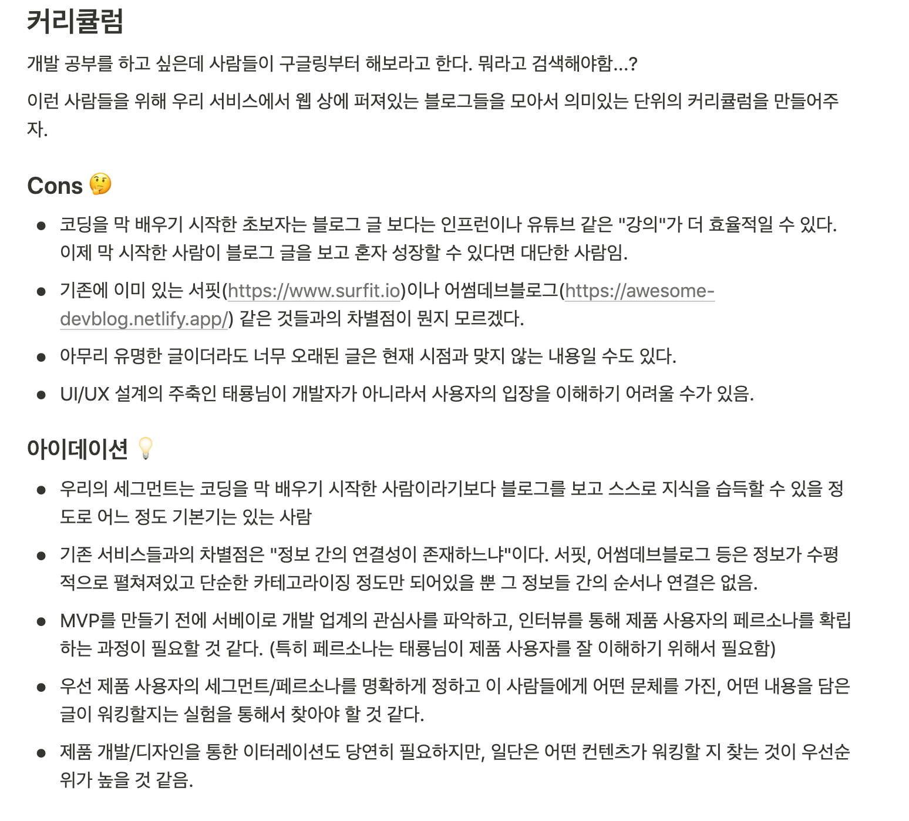
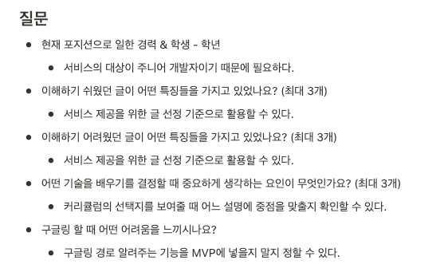
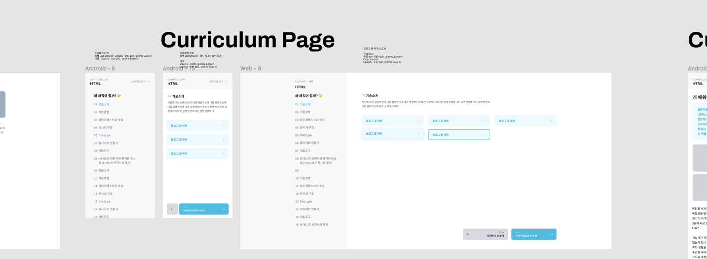
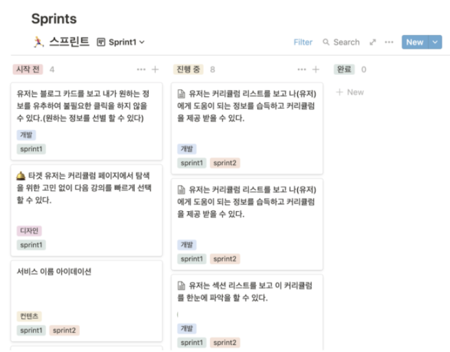

# 똑똑한 스타트업처럼 토이 프로젝트하는 비결 🚀

안녕하세요! 이번에 [루비콘 멘토링 프로젝트](https://lubycon.io/mentoring/intro/)에 합류해서 팀 프로젝트를 하게 되었는데, 그 경험이 너무 좋아서 여러분께 공유하고자 포스팅을 작성하게 되었습니다! 😄

# 🤔 원래 진행했던 프로젝트 방법

저는 원래 토이 프로젝트를 진행하면,

1. 브레인 스토밍으로 아이디어 내기
2. 팀원끼리 괜찮다고 생각하면 바로 기능 분석하기
3. 개발하기
4. 릴리즈하기

이런 방식으로 토이 프로젝트를 진행했습니다.

대부분이 이렇게 진행하셨을텐데요, 이렇게 진행하는 프로젝트에는 문제가 있습니다. 🤨

1. 정말로 니즈가 있는지 모름
    - 원하는만큼의 반응을 얻기 힘듦
2. MVP가 명확하지 않으므로 쓸데 없는 기능이 계속 붙다가 영원히 안 끝날 수 있음
3. 프로젝트 중간에 많은 변수가 생길 수 있음

그런데 루비콘에서는 이런 방식으로 프로젝트를 진행하지 않고, 프로덕트 아이데이션, 가설 설계 및 검증, MVP 기능을 정의한 다음에 애자일한 방식으로 개발을 진행했습니다. 이러한 서비스 구축과정을 공유해보려고 합니다! 

# 🍳 아이데이션

## 브레인 스토밍

먼저 아이데이션을 위한 첫 과정으로는 브레인 스토밍을 진행했습니다. 각자 생각하는 아이디어를 맘껏 발산해보고, 동의하는 아이디어에 투표를 했습니다. 투표를 하는 기준은 팀원들과 함께 정했습니다.

- 대중적이고, 누구나 공감할 수 있는 서비스
- 나에게 필요한 서비스
- 빠르게 MVP를 만들 수 있는 서비스 
- 홍보가 쉬운 플랫폼

## 아이디어 후보들 디벨롭하기

위의 기준들로 아이디어 후보를 정했으니, 그 다음으로는 아이디어를 조금 더 디벨롭 하는 과정을 거쳤습니다. 해당 아이디어로 진행했을 때 우려되는 점(Concern Point)을 생각해보고, 우려되는 점을 어떤 식으로 해결할 수 있고, 어떤 식으로 발전해나아갈 수 있는지 디벨롭을 했습니다.

위 사진은 해당 아이디어에 대해 디벨롭한 내용입니다!

그리고 오랜 시간동안 디벨롭한 결과, "**블로그 링크를 모아 학습 코스를 만들어주는 서비스**"를 만들기로 했습니다.

​    

# 💓 가슴뛰는 목표 정하기

MVP 기능을 정하기 전에, 저희끼리 가슴 뛰는 목표를 정하기로 했습니다. 공통의 목표를 정하면 중간에 엇나가는 것을 막을 수 있고(ex. 저희의 목표와는 관련이 없는 기능인 것 같아요!), 팀원들이 서비스를 바라보는 온도차를 맞출 수 있기 때문입니다.

그래서 정한 클랩팀의 목표는

> 코딩 교육계의 Top of Mind가 된다.

였습니다 ... ㅎㅎ

목표는 반드시 수치일 필요가 없고, 저희처럼 간단하게 정해도 전혀 상관 없습니다. 그저 팀원들이 모두 동의하는 '**가슴 뛰는 목표**'를 설정하는게 중요합니다. 

  

# ⚡️ MVP 필수 기능 정의

아이데이션 과정이 끝났으니 MVP를 만들기 위해 필수 기능을 정의 하는 과정을 거쳤습니다. 저희는 빠른 시간 안에 MVP를 만들어 시장에서 낸 후 유저의 직접적인 반응을 먼저 보고 점진적으로 제품을 개선해나가는 방식을 택했기 때문에 정말 필요한 기능이 아니면 모두 제외하기로 했습니다.

## 가설 세우기

팀에서 생각했던 가설은 아래와 같았습니다.

1. 검색 과정에서의 문제
    - 구글링을 했을 때 정보가 너무 많아 어려움을 겪을 것이다.

2. 검색된 자료에서의 문제

- SEO가 잘 되서 검색 결과 상단에 노출되는 글이라도 최신 정보라는 것이 보장되지 않기 때문에, 이 부분에서 불편함을 느낄 것이다.

## 가설 검증하기

클랩 팀은 가설을 검증하기 위한 방법으로 서베이를 돌리기로 했습니다. 질문을 선택할 때에도 생각나는 질문을 무작정 적는 것 보다는, 질문에 적절한 기준을 세우고 기준에 맞는 질문을 정하기로 했습니다.

- 홍보 횟수에 제한이 있기 때문에,  한번 서베이를 진행할 때 신중하게 질문을 정해야 한다.
- 질문이 **해당 서비스에 얼마나 기여를 할 수 있는지**가 명확해야 한다.

그렇게 위와 같은 질문들이 선택되었습니다!  🙌

이후 감사하게도 **128분**이 이 설문에 응답을 해주셨고, 이후 결과를 시각화해보니 저희의 가설 중 틀린 부분과 맞는 부분이 어떤 것인지 알 수 있었습니다.

### 가설이 맞아 떨어진 것

- 너무 옛날 자료가 많아 구글링에 어려움을 느끼는 사람이 많음

### 가설이 틀리거나 예상하지 못한 것

- 한글로 된 자료가 없어 구글링에 어려움을 느끼는 사람이 많음
- 검색결과가 많아 구글링에 어려움을 느끼는 사람이 적음

### 추가적으로 알 수 있었던 것

- 좋은 글의 기준
    - 참고 자료(특히 예제 코드)와 설명이 적절한 조합된 글
    - 출처 표기가 잘 되어있는 글
- 나쁜 글의 기준
    - 코드 없이 글만 많은 글
    - 중간 내용(설정, 베이스 코드)가 생략된 글
- 인기가 많은 주제의 기준
    
    - 트렌디
    
    

## MVP Requirements 정의

서베이를 통해 검증된 가설과 새로 알게된 내용을 기준으로 MVP 필수 기능을 정의했습니다.

- 커리큘럼 리스트
    - 커리큘럼 제목
    - 간단한 설명
    - 썸네일
- 커리큘럼 상세
    - 섹션 설명
    - 블로그 링크 리스트 + 글쓴이
- GA & Amplitude 붙이기

  

# 🚀 애자일하게 작업하기

MVP 기능 정의가 끝났으니, 이제 작업을 할 차례입니다! 클랩팀은 **일주일 단위로 스프린트**를 돌리는 방식을 선택했습니다.

일주일마다 유저 스토리로 **스프린트**를 만들고, **칸반**으로 현황을 관리했습니다. 스프린트가 끝나면 다음 스프린트에는 조금 더 발전된 스프린트를 위해 회고를 진행했습니다.

원래는 유저 스토리에 대한 에스티메이션을 진행하려고 했지만, 제품 개발에 더욱 집중하는 것이 생산성에 좋을 것 같다는 의사결정이 되어, 이슈 카운팅만으로 팀의 퍼포먼스를 측정하기로 했습니다.

그렇게 세 번의 스프린트만에 MVP가 완성되었습니다!  현재는 정식적으로 릴리즈하기 전에 선공개를 하고 피드백을 받기 위해 [사전신청](https://clelab.typeform.com/to/cP5Hq0wG?fbclid=IwAR3n482zDsePGQMB5pCpFCzaviAKPthrDeOggp5b5dPQ_X1ASiSrgEwJAUI)을 받고 있습니다. 

쭉 순서를 나열해보니 굉장히 길기도, 짧기도 한 여정이었는데요, 일반적으로 토이 프로젝트를 하는 과정과는 완전히 다른 경험이었습니다.

브랜딩 과정, 상태 공유 방법 등 더 자세하고 많은 내용을 담고 싶었지만 포스팅이 너무 길어질까봐 담지 못한게 아쉽네요 😭  (다음에 기회가 된다면 이에 대한 포스팅도 작성할 예정입니다!)

만약 이 포스팅을 보시는 분들이 계시다면 한 번쯤 이런 과정을 거쳐 프로젝트를 진행해보는 것을 정말 추천하고 싶습니다!

읽어주셔서 감사합니다! 🙇‍♀️