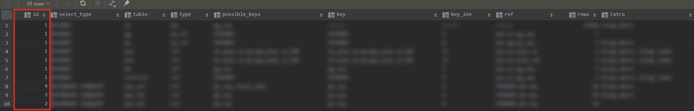
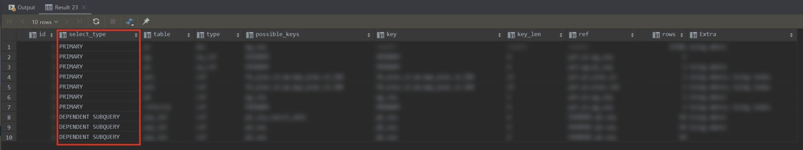
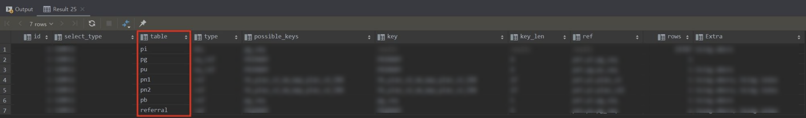
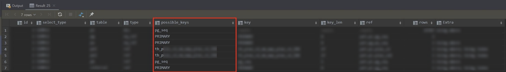
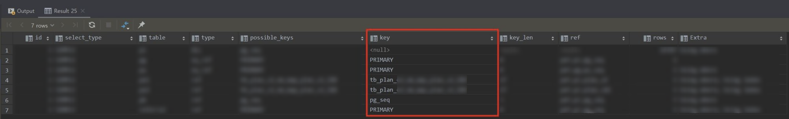
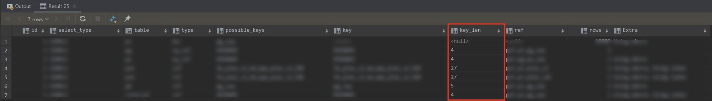
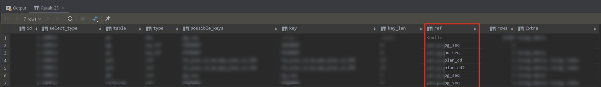
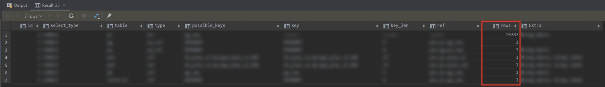
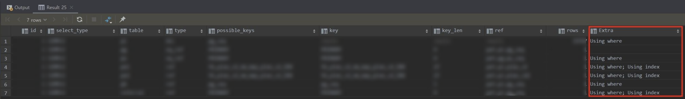

# MySQL Query EXPLAIN

# 실행 계획

쿼리의 실행 계획을 확인하는 방법은 간단하다. SELECT절 앞에 `EXPLAIN`만 추가하면 된다.

```sql
EXPLAIN SELECT *
FROM table_a t_a
INNER JOIN table_b t_b ON t_a.seq = t_b.a_seq
LEFT JOIN table_c t_c ON t_a.seq = t_c.a_seq
```

자! 이제 결과 컬럼을 하나하나 분석해보자

# 컬럼

## id



SELECT 쿼리별로 부여되는 **식별자 값**이다. 조인을 한 테이블일 경우에는 같은 id가 부여된다.

서브쿼리일 경우에는 다른 id가 부여된다. 

## select_type



SELECT 쿼리가 **어떤 타입의 쿼리**인지 표시되는 컬럼이다.

- `SIMPLE`
    
    - UNION, SUBQUERY를 사용하지 않는 **단순한 SELECT 쿼리**
- `PRIMARY`
    
    - UNION, SUBQUERY를 사용하며 **가장 바깥쪽에 있는 SELECT 쿼리**
- `UNION`
    
- UNION을 사용하는 경우, 첫 번째 구문을 제외하고 두번째 이후 단위의 쿼리
    
    ```sql
    SELECT * FROM s1
    UNION ALL
    SELECT * FROM s2 // UNION으로 표시
    UNION ALL
    SELECT * FROM s3 // UNION으로 표시
```
    
    - 이 때, 외부에 의해 영향을 받으면 `DEPENDENT UNION`이라고 한다.
    - UNION 결과를 담아두는 임시테이블을 `UNION RESULT`라고 한다.
    - UNION에 포함된 요소 때문에 캐싱이 불가능한 경우, `UNCACHEABLE UNION`이라고 한다.
- `SUBQUERY`
    
    - FROM절 이외에서 사용되는 서브 쿼리
        - SELECT : 네스티드 쿼리 (Nested Query)
        - WHERE : 서브 쿼리 (Sub Query)
        - FROM : 파생 테이블 (Derived)
    - **바깥 SELECT 쿼리에서 정의된 컬럼**을 사용하면 `DEPENDENT SUBQUERY`라고 한다.
    - 서브 쿼리가 **FROM절**에서 사용되면 `DERIVED`라고 한다.
        - 🚨 이때 파생테이블이 생성되는데, 성능상 불리하니 서브쿼리보다는 조인을 고려해보자
    - 서브 쿼리는 캐싱을 해두는데, **캐싱이 불가능한 경우** `UNCACHEABLE SUBQUERY`라고 한다.

## table


실행 계획은 쿼리 기준이 아닌, 테이블 기준으로 표시한다. 이 때, 테이블의 이름을 나타낸다. (별칭이 존재하면 별칭 표시)

- <> 안에 있는 경우에는 **임시 테이블**이라는 것을 의미한다.
    - <>안에 숫자는 **SELECT 쿼리의 id**를 뜻한다.

## type



테이블의 레코드를 어떤 방식(인덱스를 사용했는지, 풀 스캔을 했는지 ...)으로 읽었는지를 의미한다. 

- `system`
    - 레코드가 1건만 존재하는 테이블이나 한 건도 존재하지 않는 테이블을 참조
    - DB 엔진이 InnoDB인 경우에는 나타나지 않는다.
- `const` ❤️
    - WHERE 조건절에 기본 키나 고유키를 사용하여, 반드시 **1건**만 반환하는 쿼리의 참조방식
- `eq_ref` ❤️
    - **조인**을 할 때, WHERE 조건절에 기본 키나 고유키를 사용하여, 반드시 **1건**만 반환하는 쿼리의 참조방식
- `ref`
    - **여러 레코드**에 접근할 가능성이 있는 쿼리의 참조방식 (반드시 1개라는 보장이 없음)
    - NULL 비교가 추가될 경우 `ref_or_null` 🚨
- `fulltext`
    - fulltext 인덱스를 사용해 레코드를 읽는 참조방식
- `unique_subquery`
    - **IN 서브쿼리 조건절**에 기본 키나 고유키를 사용하여, 반드시 1건만 반환하는 쿼리의 참조방식
    - 위와 같지만 인덱스를 이용해 중복값을 제거할 수 있는 방식은 `index_subquery`
- `range` ❤️
    - **인덱스 특정 범위의 행**에 접근하는 방식
- `index_merge`
    - **2개 이상의 인덱스**를 이용해 각각의 검색 결과를 만들어낸 후 그 결과를 **병합**하는 방식
- `index`  🚨
    - 인덱스를 처음부터 끝까지 읽는 인덱스 풀 스캔 방식
- `ALL` 🚨
    - 테이블을 처음부터 끝까지 읽는 테이블 풀 스캔 방식
    - 가장 성능이 나쁘니 최종적으로 고려해보자

## possible_keys



**사용될 법했던 인덱스의 목록**이다.

말 그대로 사용된 인덱스가 아닌, 인덱스 후보이기 때문에 별로 필요는 없는 컬럼이다.

## keys



**최종적으로 선택받은 인덱스**들이다.

## key_len

인덱스의 각 레코드에서 몇 바이트까지 사용했는지 알려주는 값이다.

## ref



type이 `ref`(또는 `eq_ref`)라면, **참조 조건으로 어떤 값이 제공**됐는지 알려준다.

- 가끔 `func`라고 표시되는데, 연산을 거쳐 참조되었음을 의미한다.

## rows



**읽을 레코드 건수의 예측값**이다. 스토리지 엔진(ex. InnoDB)별로 산출한 예상 값이다. 말 그대로 예상이기 때문에 정확하지는 않다.

`LIMIT`가 포함되는 쿼리는 오차가 심해 별로 도움되지는 않는다.

## Extra



**성능 관련된 중요 내용**이  표시된다.

- **const row not found**
    - type 컬럼이 `const`인데, 해당 테이블에 1건도 존재하지 않는다.
- **No matching row in const table**
    - **조인**에 사용된 테이블에서 `const` 방식을 사용하는데, 일치하는 레코드가 없다.
- **Distinct**
    - `DISTINCT`을 처리하기 위해 조인하지 않아도 되는 항목은 모두 무시하고, 꼭 필요한 레코드만 읽었다.
- **Full scan on NULL key**
    - 주로 `col1 IN (SELECT col2 FROM ...)` 에서 많이 발생한다.
    - col1이 `NULL`이여서 풀스캔을 진행한다.
- **Impossible HAVING**
    - `HAVING` 조건을 만족하는 레코드가 없다.
- **Impossible WHERE**
    - 테이블 구조상 `WHERE` 조건이 항상 `FALSE`만 뜰 것 같다.
- **Impossible WHERE noticed after reading const table**
    - 레코드 다 읽어봤는데, `WHERE` 조건에 일치하는 레코드가 하나도 없다.
- **No matching min/max row**
    - 집계 함수가 있는 쿼리에서 조건이 일치하는 레코드가 하나도 없다.
- **No table used**
    - `FROM`이 없다.
- **Not exists**
    - 안티조인 < 아우터 조인이 더 낫다.
- **Range checked for each record**
    - 매 레코드마다 인덱스 레인지 스캔을 체크하고 있다.
- **Scanned N databases**
    - 메타정보(테이블, 컬럼, 인덱스 등의 스키마 정보) 찾고 있다.
- **Select tables optimized away**
    - 인덱스를 오름차순 또는 내림차순으로 1건만 읽고 있다.
- **Unique row not found**
    - 두개의 테이블이 각각 유니크 컬럼으로 아우터 조인을 수행하는 쿼리에서 아우터 테이블에 일치하는 레코드가 존재하지 않는다.
- **Using filesort**
    - `ORDER BY`를 하는데, 인덱스를 안 쓴다. 그래서 조회된 레코드들을 정렬용 메모리 버프에 복사해서 퀵 소트 알고리즘을 수행해야한다.

- **Using index**
    - 데이터 파일 안 읽고 인덱스만 읽어서 쿼리 처리할 수 있다. 굿굿 ~
- **Using index for group-by**
    - `GROUP BY`에서 인덱스 쓰고 있다.
- **Using join buffer**
    - 조인 버퍼 쓰고 있다.
- **Using temporary**
    - 임시 테이블을 썼다.
- **Using where**
    - `WHERE`을 썼다.

# 참고 링크

[https://idea-sketch.tistory.com/48](https://idea-sketch.tistory.com/48)

[https://idea-sketch.tistory.com/49?category=547413](https://idea-sketch.tistory.com/49?category=547413)