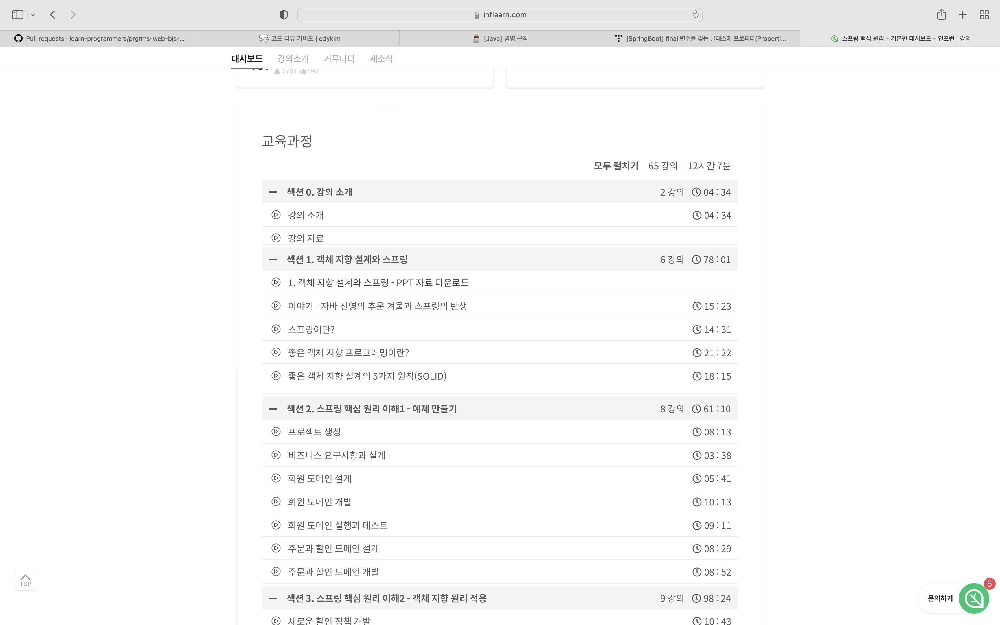
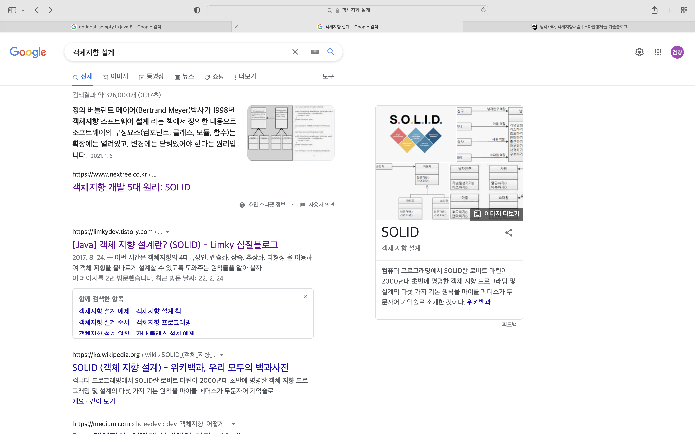
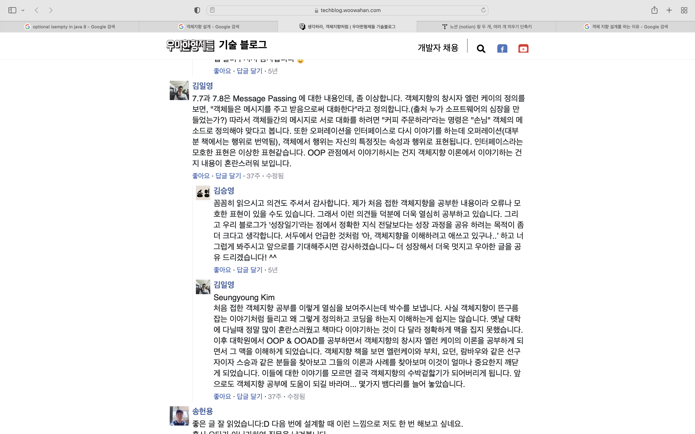
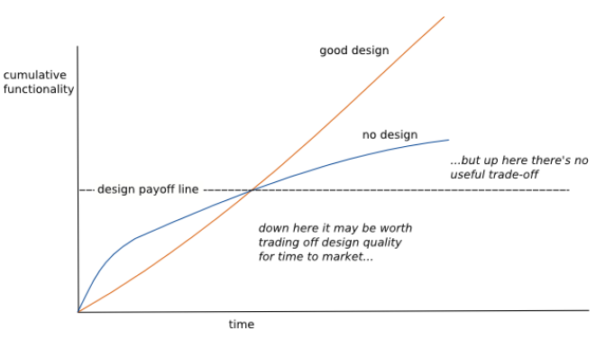

# [밋 코더] 좋은 객체 지향 설계란 무엇일까?

## 좋은 객체 지향 설계란 무엇일까?

객체지향의 사실과 오해 책을 읽고

### 객체지향 프로그래밍이 아닌 객체지향 이론

나는 객체지향을 스프링으로 처음 접했고, 강의를 들으면서 SOLID를 잘 지키면 좋은 객제지향 설계를 위한 5가지 원칙을 잘 키는 것이고, 좋은 객체지향 설계를 하는 것이다라는 생각을 하게 됐다.

강의 의도를 알지 못해 죄송합니다...

객체 지향 설계를 공부하다가 한 번쯤은 객체지향 설계에 대해 검색해본 적이 있을 것이다.  구글에서만 봐도 객체지향 설계 검색을 하면 SOLID 원칙이 나온다.

객체 지향 설계는 SOLID 원칙을 지키는 것인가?

객체지향 이론? OOP 관점?

## 객체지향 설계란 무엇인가 고민하게 되는 계기

> 💡 좋은 객체 지향 설계를 위한 5가지 원칙을 잘 지키면 객체 지향 설계를 완벽하게 하는 것인가?

책을 읽기 전 생각은 다형성을 잘 활용하면 객체지향프로그래밍 원칙을 잘 지키는 것이고, 좋은 객체지향 설계를 하는 것이라 생각했다.
하지만 이 책을 읽으면서 객체를 만드는 데 필요한 구현 매커니즘에 너무 목매어 있었다는 것을 알게 됐다. 즉, 객체지향이라는 주요 특징을 간과하고 구현에만 집중하고 있다는 것을 깨닫게 됐다.

> 💡 객체 지향의 핵심은 적절한 책임을 수행하는 역할 간의 유연하고 견고한 협력 관계를 구축하는 데에 있다.

## 객체 지향의 오해와 진실 책을 읽으면서

### 객체 지향 설계 단계를 이론적으로 정리한 내용
객체지향 설계는 객체가 아닌 행동을 중심으로 생각해야 한다.
글을 보면서 객체지향이 아닌 행동지향이라 해야하지 않나 생각을 했지만, 행동을 설계하고 협력관계를 구축하면서 해당 역할에 들어가는 객체들이 자율적이고, 교체가능하다는 것이 장점이기 때문에 객체 지향 설계라는 이름이 붙여졌다고 생각한다.

1. 행동을 생각한 협력관계 설계
2. 각 책임을 맡을 (객체가 들어갈)역할 설계
3. 책임을 정제해 메시지로 분할
4. 각 책임을 맡은 역할에 들어갈 객체 선정과 객체 설계

### 좋은 협력관계에서의 역할과 책임

- 협력
    - 협력은 요청과 응답이다. 요청과 응답을 통해 협력관계가 형성이 되고, 다양한 객체는 동일한 목적을 달성하기 위해 협력한다.
- 역할
    - 객체가 수행하는 책임의 집합은 객체가 협력 안에서 수행하는 역할을 암시하고, 동일한 역할을 수행할 수 있다는 것은 협력 내에서 동일한 책임을 수행할 수 있다는 것을 의미한다.
- 책임
    - 요청과 응답은 협력에 참여하는 객체가 수행할 책임을 정의한다.

> ⚠️ 책임을 어떻게 구현할 것인가의 문제는 객체와 책임을 고려하고 난 후에 해도 늦지 않고, 오히려 성급하게 구현하면 변경에 취약하고 다양한 협력에 참여할 수 없는 비자율적인 객체를 낳는다.

### 구현이 아닌 설계에 집중하자

> 💡 클래스의 구조와 메서드가 아니라 객체의 역할, 책임, 협력에 집중해야 한다. 객체 지향은 객체를 지향하는 것이지 클래스에 지향하는 것이 아니다.

이 책을 읽으면서 객체 지향의 핵심은 구현이 아닌 협력 관계를 구축하는 데에 유연하고 견고하게 설계할 수 있다는 점이다.

> 💡 협력 관계에서 시간이 지나면서 객체가 생성되고 소멸되는 동적인 상황들을 정적인 코드로 담아야 한다.

일반적인 프로젝트를 설계하면 객체가 생성되고 소멸되는 동적인 모든 상황들을 정적인 코드로 담아야 한다. 그렇기 때문에 시간에 흐름에 따라 유연하게 변경이 가능하면서 동시에 모든 상황들을 대비할 수 있도록  견고하게 설계해야 한다.
즉, 동적으로 발생되는 상황들과 정적으로 표현하는 코드 사이에서의 간극을 좁혀야 한다.

### 객체보다 행동을 우선해서 정의하고, 메시지를 주고 받는 객체의 관점에서 생각하자

> 💡 훌륭한 객체지향 설계자가 되기 위해 겨쳐야 할  첫 번째 도전은 코드를 담는 클래스 관점에서 메시지를 주고 받는 객체의 관점으로 사고의 중심을 전환하는 것이다.

클래스 관점에서 객체의 관점을 사고의 중심을 전환하는 방법은 나에게 어려운 과제이지만, 이 책을 읽어나가면 객체와 친해질 수 있으리라 생각을 한다.

### 책임을 정제한 메시지

책임은 객체가 협력에 참여하기 위해 수행해야 하는 행위이고, 책임을 결정, 정제 후 변환하면 여러 메시지로 분할이 된다.

> ⚠️  책임이 협력이라는 문맥 속에서 한 객체의 관점에서 무엇을 할 수 있는지를 나열하는 것이라면 메시지는 협력에 참여하는 두 객체 사이의 관계를 강조한 것이다.

객체지향 설계는 협력에 참여하기 위해 어떤 객체가 어떤 책임을 수행해야 하고 어떤 객체로 부터 메시지를 수신할 것인지를 결정하는 것으로부터 시작된다. **어떤 클래스가 필요하고 어떤 메서드를 포함해야 하는지 결정하는 것은 책임과 메시지에 대한 대략적인 윤곽을 잡은 후에 시작해도 늦지 않다.**

## 객체지향과 나와의 거리

### 나는 어떻게 객체지향을 적용하려고 있는가

이론적인 내용을 가지고 프로그래밍을 하기에는 그 사이 간극이 너무 멀고, 디자인 패턴과 같은 OOP에 대한 개념이 한참 부족하다. 
그래서 간단한 협력 관계에서 행동을 정의해보고 책임을 위임하기로 했다.

## 게시글을 예로들어 보자

### 게시판(Board)과 게시글(Post)
게시판과 게시글은 단방향 관계하고 생각하고 역할관계와 책임을 생각했다.

게시판의 역할

- 게시판은 사용자가 게시판을 들어가 게시글의 간단한 정보와 게시글의 URL 정보를 주는 역할을 한다.
    - 게시판은 해당 게시판에 맞는 게시글을 가진다. (상태를 가진다.)
    - 게시판은 사용자에게 게시판을 보여준다.(요청에 의해 응답을 하는 책임)
    - 게시판은 게시글의 간단한 정보를 가지고 있다. (게시글 리스트라는 상태를 가진다.)

게시글의 역할

- 게시글은 사용자에게 글을 보여주는 역할을 한다.
    - 게시글은 상태를 가진다.
    - 게시글은 자신의 글을 보여주는 책임을 가진다. (요청에 의해 응답을 하는 책임)
    - 게시글은 조회가 됐을 때, 방문 횟수를 증가 시키는 책임을 가진다. (요청에 의해 스스로의 상태를 변경)

### 게시글 생성이라는 게시글 상태 변경 책임은 누가 가지는걸까?
객체들은 메시지를 주고 받음으로 상대의 상태를 변화하거나 자신의 상태를 변화시킨다. 
하지만 **게시글을 작성하거나 변경하도록 상태를 요청하는 책임은 사용자에게 있다.**

> 객체에 집중하다가 게시글에게 잘못된 책임을 부여해서는 안된다.

요청에 따라 게시글이 자신의 상태를 변화시킨다. 하지만 변화시키도록 명령하는 책임은 사용자에 있다.

- 게시글은 사용자가 작성할 수 있도록 게시글 입력을 제공한다.
- 게시글은 해당 게시글을 작성한 작성자가 수정할 수 있다.
- 게시글은 해당 게시글을 작성한 작성자가 삭제할 수 있다.

### 게시글 변경에 대한 요청은 사용자의 책임이지 않을까

사용자의 역할에서 게시글을 생성하거나 변경 또는 삭제할 수 있는 책임을 가진다.

- 사용자는 게시글을 작성할 수 있는 역할을 가진다.
- 사용자는 작성한 게시글을 수정할 수 있는 역할을 가진다.
- 사용자는 작성한 게시글을 삭제할 수 있는 역할을 가진다.

## 마치면서

> 💡 책임을 어떻게 구현할 것인가의 문제는 객체와 책임을 고려하고 난 후에 해도 늦지 않고, 오히려 성급하게 구현하면 변경에 취약하고 다양한 협력에 참여할 수 없는 비 자율적인 객체를 낳는다. 

게시판과 게시글이라는 간단한 프로젝트를 진행하면서도 코드가 방대해지다보니 나의 코드를 쉽게 파악하지 못하는 경우가 허다했다.
그리고 항상 구현에 목매이면서 하드코딩하다 보면 자신의 코드를 못알아보는 경우가 많았고, 이해하는 데 시간을 많이 소비했다.
그래서 어떻게 명확하게 이해하고 해석할 수 있을까 고민을 했고, 설계의 대략적인 윤곽을 파악하기 위해 이 책을 선택했다.

> 항상 구현에 목매이면서 하드코딩하다 보면 자신의 코드를 못알아보는 경우가 많았다.

그리고 내가 내린 결론은 설계하지 않고 하드코딩부터 시작한 문제가 스노우볼처럼 커지는 것이었다.

> 나의 코드는 리팩토링 따윈 없는 no design...

프로젝트 초기 구현에 시간이 빨라 하드코딩을 시작하다 어느 정도 인지하지 못할 정도의 양으로 쌓이면 코드를 이해하는 데 시간을 과소비하는 경우다.

 
왜 개발자들이 클린 코드를 지향하는지, OOP를 지향하는지 알게되는 시간이었고, 
디자인 패턴을 이용해 효율적으로 개발할 수 있다는 것을 깨닫는 좋은 시간이었다.
물론 클래스 관점에서 객체의 관점을 사고의 중심을 전환하는 방법은 어려운 과제이지만, 
이 책을 읽어나가면 객체와 친해질 수 있으리라 생각을 한다.

## 마지막 정리

1. 모든 객체들은 협력 관계에 놓여 있다.
2. 객체 지향설계의 중점은 협력관계의 객체들의 행동이다.
3. 각 객체들은 행동을 해야하는 책임을 가진다.
4. **어떤 클래스가 필요하고 어떤 메서드를 포함해야 하는지 결정하는 것은 책임과 메시지에 대한 대략적인 윤곽을 잡은 후에 시작해도 늦지 않다.**
5. 자신이 설계한 설계 의도를 파악해 개발하자

## 참고

[생각하라, 객체지향처럼 | 우아한형제들 기술블로그](https://techblog.woowahan.com/2502/)

[[우아한테크세미나] 190620 우아한객체지향 by 우아한형제들 개발실장 조영호님](https://youtu.be/dJ5C4qRqAgA)