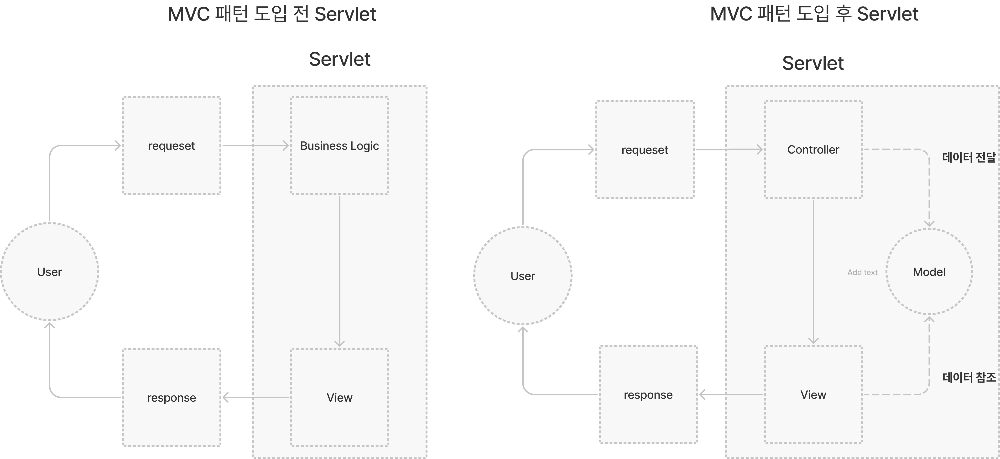
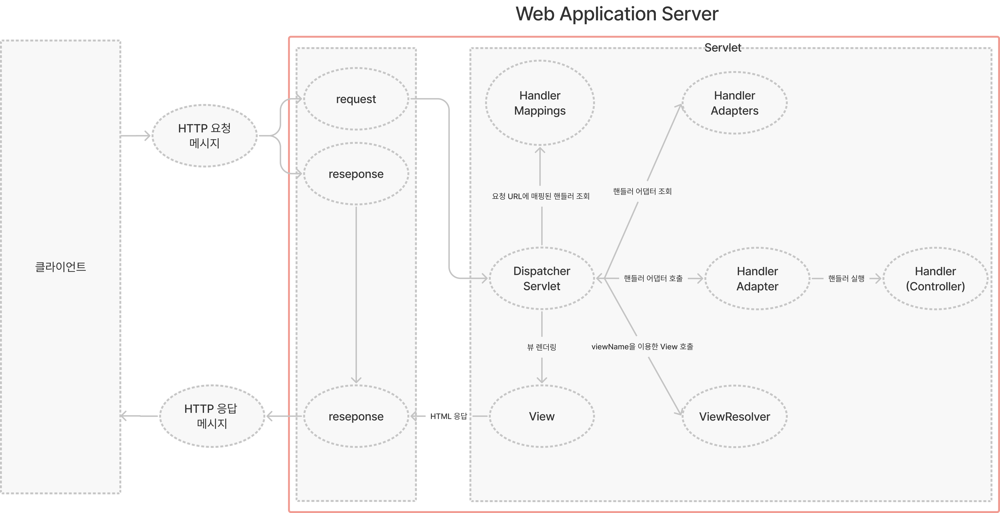

# 스프링과 MVC 패턴

## MVC 패턴 등장 배경

서블릿으로 개발할 때는  코드 상위 절반은 비즈니스 로직이고, 나머지 하위 절반은 결과를 HTML로 보여주기 위한 뷰 영역이어서 매우 지저분하고 복잡한 문제가 있다. 거기에 **진짜 문제는 비즈니스 로직과 뷰 사이 라이프 사이클이 다르다는 점**이다. 라이프 사이클이 다른 부분을 하나의 코드로 관리하는 것은 유지보수하기 **매우** 좋지 않다.

## MVC 패턴이란

> 💡 MVC 패턴은 요청부터 응답까지의 흐름에서 뷰와 모델을 분리하고자 컨트롤러를 배치했으며, **비즈니스 로직과 화면을 구분하는데 중점을 두고 있다.**

MVC는 Model, View, Controller의 약자이며, 디자인 패턴 중 하나다. 디자인 패턴은 OOP를 의미하기도 하기 때문에  Model, View, Controller를 객체 지향에서의 역할, 책임, 협력 관계를 바탕으로 한 관점으로 정리했다.

### 모델(Model)

1. 모델(model)이란 데이터와 비즈니스 로직을 관리하는 역할을 맡는다.
2. 상태에 변화가 있을 때 컨트롤러와 화면에 결과를 전달하는 책임을 가진다.
3. MVC에서 화면이 필요한 데이터를 모델이 전달해주는 모델 덕분에 화면은 렌더링 하는 일에 집중할 수 있다.

### 뷰(View)

1. 뷰는 화면을 생성하는 역할을 말한다.
2. 사용자가 볼 결과물인 화면을 생성하기 위해 모델로부터 정보를 가져오는 책임을 가진다.
3. MVC에서 화면을 생성하고, 모델에서 데이터를 요청하는 뷰 덕분에 모델에서는 비즈니스 로직에만 집중할 수 있다.

### 컨트롤러(Controller)

1. 컨트롤러는 모델과 뷰 부분으로 라우팅하는 역할을 가진다.
2. HTTP 요청을 받아서 파라미터를 검증해 모델의 상태를 변경할 수 있는 비즈니스 로직을 실행하고, 뷰에 전달할 결과 데이터를 조회해서 모델에 담는 책임을 가진다.
3. MVC에서 컨트롤러 덕분에 비즈니스 로직과 화면을 분리해 유지보수를 독립적으로 수행할 수 있도록 도와준다. 

## 서블릿에서 MVC 패턴 도입 전후

MVC 패턴 도입 하지 않은 서블릿은 비즈니스 로직을 실행하는 역할과, 화면 생성하는 역할을 동시에 진행하기 때문에, 관리가 매우 어렵지만, MVC 패턴을 사용하면 시각적인 요소나 그 이면에서 실행되는 비즈니스 로직을 서로 영향 없이 쉽게 고칠 수 있는 애플리케이션을 만들 수 있다.(화면도 마찬가지)

### 간단한 그림



### 도입 전과 후 소스 코드

### MVC 패턴을 적용하지 않은 서블릿
    
```java
@WebServlet(name = "memberFormServlet", urlPatterns = "/servlet/members/new-form")
public class MemberFormServlet extends HttpServlet {

    private MemberRepository memberRepository = MemberRepository.getInstance();

    @Override
    protected void service(HttpServletRequest request, HttpServletResponse response) throws ServletException, IOException {
        response.setContentType("text/html");
        response.setCharacterEncoding("utf-8");

        PrintWriter writer = response.getWriter();
        writer.write("<!DOCTYPE html>\n" +
                "<html>\n" +
                "<head>\n" +
                " <meta charset=\"UTF-8\">\n" +
                " <title>Title</title>\n" +
                "</head>\n" +
                "<body>\n" +
                "<form action=\"/servlet/members/save\" method=\"post\">\n" +
                " username: <input type=\"text\" name=\"username\" />\n" +
                " age: <input type=\"text\" name=\"age\" />\n" +
                " <button type=\"submit\">전송</button>\n" +
                "</form>\n" +
                "</body>\n" +
                "</html>\n");
    }
}
```
    

### MVC 패턴을 적용한 서블릿

컨트롤러
    
```java
@WebServlet(name = "mvcMemberFormServlet", urlPatterns = "/servlet-mvc/members/new-form")
public class MvcMemberFormServlet extends HttpServlet {

    @Override
    protected void service(HttpServletRequest request, HttpServletResponse response) throws ServletException, IOException {
        String viewPath = "/WEB-INF/views/new-form.jsp";
        RequestDispatcher dispatcher = request.getRequestDispatcher(viewPath);
        dispatcher.forward(request,response);
    }
}
```

뷰 파일

```html
<%@ page contentType="text/html;charset=UTF-8" language="java" %>
<html>
<head>
    <title>Title</title>
</head>
<body>
<form action="save" method="post">
    username: <input type="text" name="username" />
    age: <input type="text" name="age" />
    <button type="submit">전송</button>
</form>
</body>
</html>
```
        

## MVC 패턴 한계

MVC 패턴을 적용해도 컨트롤러는 중복이 많고, 필요하지 않은 코드들도 많다.

### 스프링 MVC 컨트롤러 단점

1. 사용하지 않는 코드가 존재한다.
    1. `HttpServletRequest`, `HttpServletResponse`와 같은 코드를 사용할 때도 있고, 사용하지 않을 때도 있지만, service() 메서드를 오버라이딩하면 어쩔 수 없이 필드로 넘어온다.
2. 공통 처리가 매우 어렵다.
    1. 기능이 복잡해질 수록 컨트롤러에서 공통으로 처리해야 하는 부분이 점점 더 많이 증가하게 되는데, 특정 호출마다 공토 처리를 할지 여부를 계속 확인해야 한다. 

## MVC 패턴 한계 해결 방법

1. 프론트 컨트롤러인 **`DispatcherServlet`**을 도입해 컨트롤러 호출 전 공통 기능 처리
2. `HandlerAdapter`(어댑터 패턴)을 이용한 프레임워크를 유연하고 확장성 있는 설계
3. `ViewResolver`를 이용해 서블릿 종속성과 `View` 이름 중복을 제거
    1. 서블릿 종속성 제거
        - 컨트롤러 입장에서 `HttpServletRequest`, `HttpServletResponse`가 꼭 필요하지 않기 때문에 요청 파라미터 정보는 자바의 Map으로 대신 넘기면 컨트롤러가 서블릿 기술을 몰라도 동작할 수 있다.
    2. `View` 이름 중복 제거
        - 컨트롤러는 뷰의 논리 이름을 반환해 실제 물리 위치 정보는 프론트 컨트롤러에서 처리하도록 단순화할 수 있다.

### 현재 스프링 서블릿에서 진행되는 흐름



## 스프링에서 보완한 MVC 패턴을 이용한 장점

1. 각 컴포넌트의 결합도를 낮출 수 있다.
    - 각 컴포넌트 간의 의존도를 낮출 수 있기 때문에 결합도를 낮추고 응집도를 높일 수 있다.
2. 코드의 재사용성을 높일 수 있다.
    - 하나의 컴포넌트 안에는 하나의 책임 만을 가지고 있기 때문에 재사용이 가능하다.
3. 구현체들 간 커뮤니케이션의 효율성을 높일 수 있다.
    - 필요한 기능만 제공하는 메시지를 제공하면서 불필요한 정보를 제공하지 않기 때문에 객체들 간의 커뮤니케이션 효율성을 높일 수 있다.(OOP의 SOLID 원칙 중 단일 책임 원칙(SRP))
    
> 💡 **스프링 MVC도 프론트 컨트롤러 패턴으로 구현되어 있고, 프론트 컨트롤러가 바로 디스패처 서블릿(`DispatcherServlet`)이다.**

여기에 애너테이션을 사용해서 컨트롤러를 편리하게 사용할 수 있다.다형성과 어댑터, 그리고 애너테이션을 이용해 기존 구조를 유지하면서, 프레임워크의 기능을 확장할 수 있다.

## 마지막 정리

### MVC 패턴 등장 배경

MVC 패턴을 사용하지 않은 **서블릿**은 유지보수가 굉장히 어렵고, 라이프 사이클이 다른 비즈니스 로직과 화면 생성 로직이 같이 연결되어 있어 유지보수가 굉장히 어렵다.

### MVC 패턴

MVC 패턴은 요청부터 응답까지의 흐름에서 뷰와 모델을 분리하고자 컨트롤러를 배치했으며, **비즈니스 로직과 화면을 구분하는데 중점을 두고 있다.**

### 서블릿에서 MVC 패턴 도입

MVC 패턴을 사용하면 사용자 인터페이스로부터 비즈니스 로직을 분리하여 시각적인 요소나 그 이면에서 실행되는 비즈니스 로직을 서로 영향 없이 쉽게 고칠 수 있는 애플리케이션을 만들 수 있다.

### MVC 패턴의 한계

MVC 패턴을 적용해도, 사용하지 않는 인자를 가져와야 했고, 공통으로  처리해야 하는 기능 호출을 어떻게 할지 매우 어렵다.

### MVC 패턴의 단점을 보완한 방법

1. 프론트 컨트롤러를 도입해 공통 처리를 할 수 있다.
2. 어댑터 패턴을 이용해 내부 로직을 변경하지 않고, 확장성 있게 설계가 가능하다.
3. ViewResolver를 서블릿과의 종속성 제거

### 스프링에서 보완한 MVC 패턴을 이용한 장점

- 각 컴포넌트의 결합도를 낮출 수 있다.
- 코드의 재사용성을 높일 수 있다.
- 구현체들 간 커뮤니케이션의 효율성을 높일 수 있다.

## 참고 글

[MVC - 용어 사전 | MDN](https://developer.mozilla.org/ko/docs/Glossary/MVC)

[Servlets and JSP Pages Best Practices](https://www.oracle.com/technical-resources/articles/javase/servlets-jsp.html)

## 참고 영상

[[10분 테코톡] 🧀 제리의 MVC 패턴](https://www.youtube.com/watch?v=ogaXW6KPc8I)

[[10분 테코톡] 👩🏻‍💻👨🏻‍💻해리&션의 MVC 패턴](https://www.youtube.com/watch?v=uoVNJkyXX0I)
