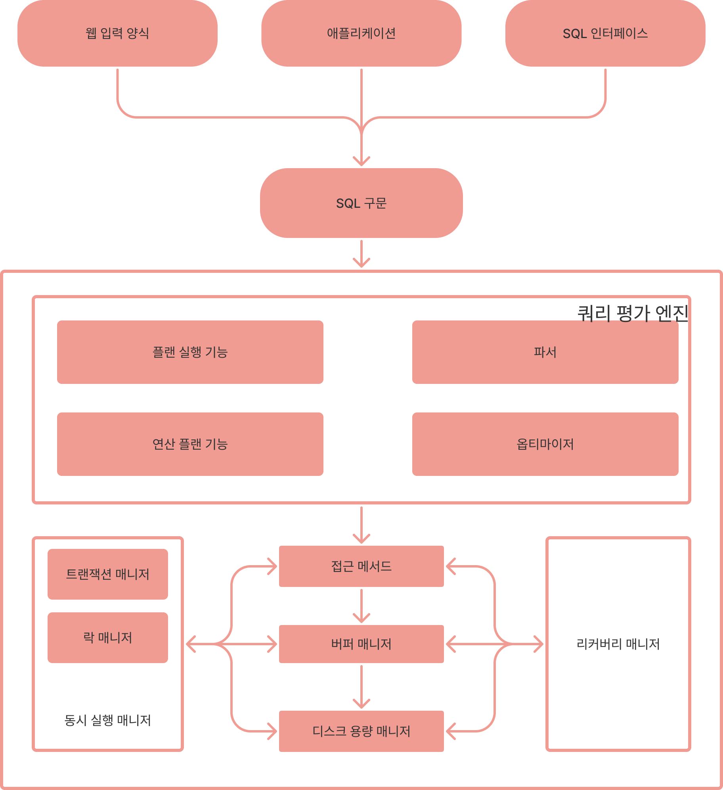

# DBMS에서 하나의 구문을 처리 할 때 발생하는 트레이드 오프

글의 내용은 하나의 구문을 처리할 때 성능을 높이는 데 중점을 뒀다. 즉, 실행 계획 변화에 따른 성능의 차이를 확인하고, 그에 따른 버퍼 매니저의 설정에 따른 성능 차이도 지켜볼 수 있다.

> 💡 하나의 구문을 처리한 관점에서는 실행 계획과 버퍼 매니저가 중요하고, 여러 구문을 처리하는 관점에서는 트랜잭션 매니저와 락 매니저가 중요하다.

# DBMS 아키텍처 개요

## DBMS 개요

DBMS가 트레이드 오프에서 어떤 선택을 하는지 알아야 하고, 그 선택을 통해 DBMS 사용자는 필요에 따라 무엇을 우선하고, 무엇을 버려야하는지 판단해야 한다. 

아래는 사용자가 선택하기 위해 알아야할 내용이다.

- RDB의 내부적인 동작 모델 이해
- 데이터 캐시, 워킹 메모리등의 메모리 관련 구조와 저장소 구조 이해
- SQL 퍼포스를 위한 핵심 개념인 실행 계획과 실행 계획을 만드는 옵티마이저 이해

## 아키텍처

내부 아키텍처처들이 조금씩 다르지만 모든 RDB는 관계 모델이라는 수학적인 이론을 바탕으로 하기 때문에 기본적인 구조는 같다. 아래는 RDB의 기본적인 아키텍처 구조이다.



1. 쿼리 평가 엔진
    - 쿼리 평가 엔진에서 사용자로부터 입력받은 SQL 구문을 분석하고, 어떤 순서로 기억장치의 데이터를 접근할지 결정한다.
    > 💡 DBMS는 쿼리 평가 엔진에서 실행 계획(쿼리 평가 엔진에서 결정되는 계획)을 토대로 접근 메서드(실행 계획을 기반으로 데이터를 접근하는 방법)를 실행한다.
2. 버퍼 매니저
    - 버퍼 매니저에서 버퍼 메모리 영역을 관리한다.
    > 💡 DBMS에서 버퍼 매니저는 디스크 용량 매니저와 함께 연동되어 작동한다.
3. 디스크 용량 매니저
    - 디스크 용량 매니저에서 어디에 어떻게 데이터를 저장할지 관리하며, 데이터의 읽고 쓰기를 제어한다.
4. 트랜잭션 매니저와 락 매니저
    - 트랜잭션 매니저
        - 트랜잭션 단위로 실행하는 명령어를 트랜잭션의 정합성(데이터들의 값이 서로 일치하는 상황)을 유지하면서 실행시킨다.
    - 락 매니저
        - 필요한 경우 데이터에 락을 걸어 다른 사람의 요청을 대기시킨다.
    - 참고사항 - 트랜잭션은 정합성을 위한 기술이다.
        [[DB] 무결성과 정합성의 차이](https://blog.naver.com/PostView.naver?blogId=remocon33&logNo=222479119313&parentCategoryNo=53&categoryNo=&viewDate=&isShowPopularPosts=true&from=search)
5. 리커버리 매니저
    - 리커버리 매니저에서 데이터를 정기적으로 백업하고 문제가 일어났을 때 복구해주는 기능을 수행한다.


# DBMS와 버퍼

DBMS를 운용하는 비용과 메모리는 한정된 희소자원이기 때문에 버퍼에서 데이터 처리와 관련된 트레이드 오프가 발생한다.

## 공짜 밥은 존재할까? & DBMS와 기억장치 관계

시스템의 데이터베이스 내부 데이터를 모두 메모리에(1차 기억장치) 올리는 것은 불가능하기 때문에 자주 접근하는 데이터를 메모리에 저장하고, 그 외에는 하드디스크(2차 기억장치)에 저장한다. 여기에서 데이터를 영속적으로 저장하기 위해서는 속도를 잃고, 속도를 얻고자 하면 데이터를 영속적으로 저장하기 힘들기 때문에 영속성과 속도 사이에서 트레이드 오프가 발생한다. 

### 버퍼를 활용한 속도 향상

버퍼는 메모리에 데이터를 올려 디스크 접근을 줄여주는 완충제 역할을 하고, 캐시는 사용자와 저장소 사이에서 데이터 전송 지연을 완화시켜준다. 

이러한 버퍼와 캐시를 관리하는 것이 버퍼 매니저이기 때문에 성능에 굉장이 중요한 영향을 끼친다. 여기에서도 **버퍼의 크기와 비용에 따른 트레이드 오프가 발생한다.**


## 메모리 위에 있는 두 개의 버퍼

DBMS가 데이터를 유지하기 위해 사용하는 메모리는 데이터 캐시와 로그 버퍼이다. 대부분의 DBMS는 이러한 두 개의 역할을 하는 메모리 영역을 가지고 있고, 용도에 따라 크기를 변경할 수 있다.

### 데이터 캐시

데이터 캐시는 디스크에 있는 데이터의 일부를 메모리에 유지하기 위해 사용하는 메모리 영역이고, 질의를 처리한다. 

- 캐시에 데이터가 존재한다면 디스크에 접근하지 않기 때문에 응답속도가 빠르다.
- 반면에 캐시에 데이터가 존재하지 않는다면 저장소에서 데이터를 찾아야 하기 때문에 응답속도가 매우 늦다.

### 로그 버퍼

로그 버퍼는 갱신처리와 관련되어 있다. 갱신 요청이 들어오면 로그 버퍼에 변경 정보를 보내고, 이 후 디스크 변경을 수행한다.


> 💡 SQL 구문 실행과 저장소 갱신을 분리(비동기 처리)해 DBMS의 SQL 구문 실행 속도를 높인다. 갱신처리를 바로 실행한다면 DBMS에 다른 요청은 저장소 안의 데이터가 변경이 끝날 때까지 대기해야하는 상황이 오기 때문에 갱신처리는 비동기로 설정되어 있다.

## 메모리의 성질이 초래하는 트레이드 오프

메모리 관점에 트레이드 오프를 생각할 때 비용과 휘발성 등 메모리 단점들을 고려해야 한다.

### 휘발성의 문제점

1. 영속적이지 않는다는 단점으로 인해 데이터의 부정합이 발생한다. 
2. 결과적으로 로그 버퍼 안 데이터를 비동기로 처리하기 때문에 데이터가 로그 파일에 반영하기 전에 장애가 발생하면 복구가 불가능하다.

### 휘발성 문제 해결을 위한 영속화

그래서 일반적인 DBMS는 커밋 시점에 반드시 갱신 정보를 로그 파일에 작성함으로 장애가 발생해도 정합성을 유지할 수 있게 한다. 즉, 데이터 갱신 처리를 확정지어 데이터를 영속화한다. 

하지만 커밋을 통해 디스크에 데이터를 동기화해 처리하기 때문에 지연이 발생하기 때문에 정합성과 성능 사이의 트레이드 오프가 발생한다. 

### 참고 : DBMS에서 커밋 시간을 줄이기 위해 적용한 방법

1. 그룹 커밋을 통한 성능 향상
2. 지속성을 포기하고 비동기 처리 사용

> 💡 성능을 위해서 로그 버퍼에 로그 레코드를 모았다가 블록 단위로 로그 파일에 출력한다.
>> 참고 : [NAVER D2](https://d2.naver.com/helloworld/407507)

## 시스템 특성에 따른 트레이드 오프


### 데이터 캐시와 로그 버퍼의 크기

초기값으로 데이터 캐시가 로그버퍼의 크기가 많은 이유는 요청으로 들어오는 검색 쿼리가 갱신 쿼리보다 많기 때문이다. 
만약 갱신이 많다고 생각이 든다면 로그 버퍼를 늘려주는 튜닝을 고려해야 한다.

### 검색과 갱신 사이 트레이드 오프

질의를 처리하는 데이터 캐시와 갱신을 처리하는 로그 버퍼 사이의 트레이드 오프이다.

> 💡 데이터 캐시 > 로그 버퍼 :  질의 처리를 위한 DBMS 튜닝(또는 초기값)

> 💡 데이터 캐시 < 로그 버퍼 :  갱신 처리에 대한 부하를 줄이기 위한 튜닝

## 추가적인 메모리 영역 워킹 메모리

DBMS는 정렬과 해시 관련 처리에 사용되는 워킹 메모리가 존재한다. 이 메모리 영역은 필요할 때 생성이 되고, 종료되면 해제되는 임시 영역이다. 
이 영역이 성능적으로 중요한 이유는 워킹 메모리 영역이 다루는 데이터 양보다 작으면 DBMS의 저장소를 사용하는 스왑 현상이 일어난다. 스왑 현상이 일어나면 성능이 현저히 떨어진다.

### 메모리가 부족하면 생기는 일

DBMS는 워킹 메모리가 부족할 때, 곧바로 SQL 구문 처리를 중단할 수 있지만 중단하지 않고 처리를 유지한다. 그렇기 때문에 메모리가 부족해지는 순간에 느려진다.

## DBMS와 버퍼 정리

DBMS를 운용하는 비용과 메모리는 한정된 희소자원이기 때문에 버퍼에서 데이터 처리와 관련된 트레이드 오프가 발생한다.

- 영속성과 속도 사이의 트레이드 오프
- 버퍼의 크기와 비용에 따른 트레이드 오프
- 데이터 캐시와 로그 버퍼 사이의 용량 트레이드 오프(검색과 갱신 사이 트레이드 오프)
- 데이터 정합성과 성능 사이의 트레이드 오프

# DBMS와 실행 계획

## 데이터에 접근하는 방법은 어떻게 결정할까

RDB에서 데이터 접근 절차를 결정하는 모듈은 쿼리 평가 엔진이고, 쿼리 평가 모듈은 파서, 옵티마이저와 같은 여러 개의 서브 모듈로 구성되어 있다.

- 파서
    - 요청받은 SQL 구문이 올바른지 분석하고 SQL 구문을 정형적인 형식으로 변환하는 역할을 한다. (변환하면 DBMS에서 후속 처리가 효율적이다.)
- 옵티마이저
    - 옵티마이저는 인덱스 유무, 데이터 분산, 편향 정도, DBMS 내부 매개변수 등의 조건을 고려해 선택 가능한 많은 실행 계획을 작성하고(플랜 생성), 이들의 비용을 연산(비용 평가)해 가장 낮은 비용을 가진 실행 계획을 선택한다.
- 카탈로그 매니저
    - DBMS의 내부 정보를 모은 통계 정보가 저장되어 있다.
- 플랜 평가
    - 플랜 평가는 옵티마이저에서 여러 실행 계획을 받아 최적의 실행 결과를 선택하는 역할을 한다.

## 옵티마이저와 통계 정보

저장소에서 갱신 처리를 할 때마다 카탈로그 정보가 갱신되지 않기 때문에 카탈로그 정보가 실제 테이블과 인덱스 정보와는 일치하지 않는 경우가 많다. 
그래서 옵티마이저는 과거 정보를 가지고 계획을 세우기 때문에 최적의 플랜이 선택되지 않는 경우가 많다.

## 최적의 실행 계획이 작성하게 되려면

카탈로그 통계 정보를 수동으로 갱신하거나, 정기적으로 정보 갱신 작업을 수행하는 경우, 그리고 갱신 처리가 수행되는 시점에 통계 정보를 갱신하는 방법이 있다. 
DBMS가 최적의 플랜을 선택하려면 필요한 조건이므로 갱신 시점을 확실하게 검토해야 한다.

[//]: # (## DBMS와 실행 계획 정리)

### 카탈로그와 옵티마이저

저장소에서 갱신 처리를 할 때마다 카탈로그 정보가 갱신되지 않기 때문에 카탈로그 정보가 실제 테이블과 인덱스 정보와는 일치하지 않는 경우가 많아서 최적의 플랜이 선택되지 않는 경우가 많다. 
그래서 카탈로그 통계에 최신 정보가 저장되게 해야 한다.

> ⚠️ DBMS가 최적의 플랜을 선택하려면 필요한 조건이므로 갱신 시점을 확실하게 검토해야 한다.

### 결합과 옵티마이저

SQL 지연이 일어나는 경우는 대부분 결합과 관련되고, 결합을 사용하면 실행 계획이 상당히 복잡해지므로 옵티마이저에서 최적의 실행 계획을 세우기 어렵다. 
그래서 DBMS의 성능을 높이기 위해 결합 알고리즘과 테이블 접근 순서의 중요성을 알아야 한다.

## 실행 계획이 SQL 구문이 성능을 결정

DBMS는 실행 계획을 바탕으로 데이터 접근을 수행하는데 데이터 양이 많은 테이블에 접근하거나 복잡한 SQL 구문을 실행하면 반응 지연이 발생하는 경우가 많다. 
지연이 발생하는 이유 중 하나는 통계 정보가 부족한 경우도 있지만, 최적의 경로가 설정되도 느린 경우도 있다. 그리고 정보가 최신이라도 SQL 구문이 복잡하면 옵티마이저가 최적의 접근 경로를 선택하지 못할 수도 있다.

## 실행 계획 확인 방법

1. MySQL 명령어
    
    ```sql
    EXPLAIN EXTENDED SQL 구문
    ```
    
2. SQL 구문 지연이 발생하면 제일 먼저 실행 계획을 살펴야 한다. 기본적인 SQL 구문 실행 계획은 테이블 풀 스캔의 실행 계획, 인덱스 스캔의 실행 계획 그리고 간단한 테이블 결합의 실행 계획이 존재한다.

## 테이블 풀 스캔의 실행 계획

레코드 전체를 검색하는 단순한 SQL 구문의 실행 계획이고 실행 계획을 출력하면 조작 대상 객체와 객체에 대한 조작의 종류 그리고 조작 대상이 되는 레코드 수가 존재한다.

- 조사 대상 객체
    - 어떤 객체를 조작하는지에 대한 정보
- 객체에 대한 조작의 종류
    - 어떤 조작을 하는지 종류
        
    > ⚠️ 실행 계획에 작성된 cost(비용)로 평가의 지표로 사용해서는 안된다.
        
- 조작 대상이 되는 레코드 수
    - 각 조작에서 얼만큼의 레코드가 처리되는 지 적혀있고, SQL 구문 전체의 실행 비용을 파악하는 데 중요한 지표가 된다.
    - 실행 계획에서 얼마 만큼의 레코드가 처리되는지에 대한 정보는 카탈로그의 정보를 이용해 실행 비용을 측정한다.

## 인덱스 스캔의 실행 계획

SQL 구문에 간단한 식별자를 이용해 찾는 조건절을 추가한 경우

- 조작이 되는 레코드 수
    - 테이블 하나에서 식별자를 찾으면 접근 대상은 반드시 하나이기 때문에 Rows가 1이다.
- 접근 대상 객체와 조작
    - 조건절을 추가한 경우 인덱스를 사용해 스캔을 수행한다는 것을 볼 수 있다.
    - 일반적으로 스캔하는 모집합 레코드 수에서 선택되는 레코드 수가 적다면 테이블 풀 스캔보다 빠르게 접근을 수행한다.
    - 특정 데이터 양을 분기점으로 인덱스 스캔이 풀 스캔보다 효율적인 접근을 하게 되며 카탈로그 정보에 의해 동작이 변경된다는 것을 알 수 있다.

## 간단한 테이블 결합의 실행 계획

SQL 지연이 일어나는 경우는 대부분 결합과 관련되고, 결합을 사용하면 실행 계획이 상당히 복잡해지므로 옵티마이저에서 최적의 실행 계획을 세우기 어렵다. 
그래서 DBMS의 성능을 높이기 위해 결합 알고리즘과 테이블 접근 순서의 중요성을 알아야 한다.

### DBMS 결합 종류

- Nested Loops
    - 한 쪽 테이블을 읽으면서 레코드 하나마다 결합 조건에 맞는 레코드를 다른 쪽 테이블에서 찾는 방식이다.
- Sort Merged
    - 결합 키로 레코드를 정렬하고 순차적으로 두 개의 테이블을 결합하는 방법이고 워킹 메모리를 필요로 한다.
- Hash
    - 결합 키값을 해시값으로 매핑하는 방법이고, 워킹 메모리를 필요로 한다.

### 객체에 대한 조작 종류

실행 계획은 일반적으로 트리 구조이고 중첩 단계가 깊을 수록 먼저 실행된다. Nested Loops 결합을 예로 들자면, 
Nested Loop 전에 Index scan을 실행되는 것을 보면 결합보다 테이블 접근이 먼저 수행되는 것을 알 수 있다. 
이렇듯 순서에 어떻게 결합하느냐에 따라 실행 계획이 달라진다.

## 실행 계획의 중요성

최근 옵티마이저는 꽤 우수하지만 완벽한 것은 아니다. 그래서 힌트 구를 사용해 실행 계획을 수동으로 변경하면, 
옵티마이저에게 강제적으로 명령해 사용자가 원하는 실행 계획을 설정할 수 있다.

실행 계획을 변경하려면 어떤 선택지가 있는지 알아야 한다.

- SQL 구문과 그런 SQL 구문들이 어떠한 접근 경로로 데이터를 검색하는지 알아야 한다.
- SQL 구문을 작성할 때 효율적으로 테이블을 설정해야 하고, SQL 구문이 어떤 실행 계획이 나올지 예측할 수 있어야 한다.

# 마지막으로

- 데이터베이스는 다양한 트레이드 오프의 균형을 잡으려는 미들웨어
- 특히 성능적인 관점에서 데이터를 저장소와 메모리 중에 어디에 위치시킬지의 트레이드 오프가 중요하다.
- 데이터베이스는 갱신보다 검색과 관련된 데이터 캐시의 비중을 높에 설정되어 있지만 실제 시스템에 로그 버퍼와 데이터 캐시 중 어떤 곳의 비중을 높일지 판단해야 한다.
- 데이터베이스는 SQL을 실행 가능한 절차로 변환하고자 실행 계획을 만든다.
- **사용자가 실행 계획을 읽는 것은 데이터베이스의 이상을 어기는 일이지만, 성능을 위해서라면 고려해야 한다.**

## 정리

- DBMS에서 영속성과 속도 사이에서 트레이드 오프
    - 메모리와 하드디스크 간의 트레이드 오프
- DBMS에서 버퍼의 크기와 비용에 따른 트레이드 오프
    - 기역비용에 의한 트레이드 오프
- DBMS에서 정합성과 성능 사이의 트레이드 오프
    - 갱신처리를 비동기처리할지 동기 처리할지의 트레이드 오프
- 질의를 처리하는 데이터 캐시와 갱신을 처리하는 로그 버퍼 사이의 트레이드 오프
    - 데이터 캐시와 로그 버퍼 사이의 트레이드 오프
