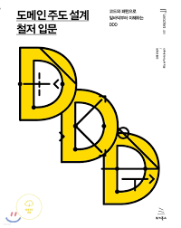

# 내가 바라본 도메인 주도 설계

## 도메인 주도 설계를 접근한 이유

도메인 주도 설계에 접근하게 된 계기는 프로젝트를 명확하게 이해하기 위해서, 유효성 검사를 어디에 배치하는게 괜찮은지, 그리고 비즈니스에 맞는 서비스를 제공하고 싶어서였다.

## 기존 설계에 대한 문제

### 의사소통 비용 문제

원래의 문제점은 개발자는 요구 사항을 기술 얼어로 번역하고 솔루션에 집중에 문제를 숨기는 경향이 있는데 이 과정에서 많은 의사소통 비용이 낭비된다.

### 용어 불확실성

동일한 개념을 다른 용어로 사용한다거나 다른 개념을 동일한 용어로 사용한다.

### 기술 의존적인 코드

기술적인 코드와 도메인을 분리하지 않아서 책임이 불분명하고 관리하기 어렵다.

## 기존 설계에 대한 해결책

1. 가독성을 높여 분석하고 이해하는 시간을 절약할 수 있도록 보편적인 언어를 사용한다.
2. 이벤트 스토밍을 통해 용어를 정의하고, 도메인에 대한 이해도를 높인다.
3. 도메인 모델과 기술적인 코드를 분리해 도메인에 집중할 수 있도록 관리한다.

## 도메인 주도 설계

> 💡 **도메인에서 중요한 것은 문제 해결을 위해 생성된 도메인의 본질이 무엇인지 보다는 문제 해결을 위해 도메인을 어떻게 분류하는지가 중요하다.**

## 도메인과 도메인 모델, 그리고 도메인 객체

### 도메인

도메인은 소프트웨어로 해결하고자 하는 문제의 영역이다. 사용자가 무엇에 대해 말하고 원하는지 이해하려면 해당 도메인에 대한 지식이 필요하다.

### 도메인 모델

도메인 모델은 목적을 가진 의사소통 수단이고, 도메인에서 모델링은 사건 혹은 개념을 추상화하는 작업이다. 현실에 있는 모든 것을 반영하는 것이 아닌, 상황에 따라 취사 선택을 해 문제 해결에 필요한 정보만을 추출해야 한다.

### 도메인 객체

도메인 모델을 소프트웨어 형태의 동작하는 모듈로 나타낸 것이 도메인 객체다.

## 도메인 주도 설계를 진행하면서

### 개발자가 이용자들이 겪는 문제를 해결하려면 이용자의 세계를 배워야한다.

이용자에게 유용한 소프트웨어를 개발하려면 가치 있는 지식과 그렇지 않은 지식을 신중하게 구분해 가치있는 지식만 도메인 모델에 담아야 한다.

### 다양한 서비스를 제공하는 서비스는 Best Practice가 아닐 확률이 높다.

다양한 설계 방법을 이용해 적절한 상황에 맞는 설계가 필요하기 때문에 도메인 모델링을 통해 문제를 해결한다.

> 💡 **도메인 주도 설계는 이런 고찰을 반복하는 설계를 통해 이용자의 세계와 소프트웨어 구현을 연결 짓은 것이 그 목적이다.**

## 도메인을 지키기위한 노력

### 엔티티와 값 객체

값 객체는 데이터만 담는 구조체가 아닌 데이터와 데이터의 행동을 한 곳에 모아 자신만의 규칙을 갖는 도메인 객체로 만드는 것이고, 엔티티는 식별자가 존재하고, 생애주기가 존재하는 도메인 객체를 의미한다.

> 💡 값 객체와 엔티티를 통해 해당 소프트웨어가 어떤 도메인 지식에 관심있는지를 알 수 있다.

### 서비스

도메인 서비스를 이용해 엔티티에서 정의하기 힘든 행동을 도메인 서비스에 구현해 어색함을 해결할 수 있고, 애플리케이션 서비스를 이용해 객체를 조작해서 이용자의 목적을 달성할 수 있다.

### 의존 관계 제어

기술에 의존적인 코드가 만들어지지 않도록 의존 관계 제어를 통해 도메인 로직을 기술적 요소에 분리해 소프트웨어를 유연하게 만들어 관리 해야한다.

### 아키텍처

아키텍처를 이용해 코드가 무질서하게 흩어지는 것을 방지하고, 도메인을 파악하는데 도움을 준다. 도메인 주도 설계에서 아키텍처는 도메인 객체를 소프트웨어 구현으로부터 지킨다.

### 애그리게이트

애그리게이트는 관련 객체를 하나로 묶은 군집이다. 애그리게이트로 묶어서 바라보면 좀 더 상위 수준에서 도메인 모델 간의 관계를 파악할 수 있다.

### 이벤트 스토밍

동일한 개념을 다른 용어로 사용한다거나 다른 개념을 동일한 용어로 사용해서 혼란을 주는 상황과 문제를 해결하기 위해 필요한 지식을 수집하기 어려운 상황을 사전에 예방하기 위해서 이벤트 스토밍을 진행한다.

## 도메인 주도 설계를 적용하려는 노력

원활한 진행을 위해 토이 프로젝트를 진행하면서 용어 정리와 도메인에 대한 이해가 필요하다고 판단했다. 그래서 이벤트스토밍을 진행하자고 동료 개발자들에게 설득하려 했지만, 기한이 짧다고 받아들여지지 않았다. 결론은 도메인 주도 설계를 도입하기 위해서는 이러한 과정이 왜 필요하고 중요한지를 잘 알고 상대방을 설득할 줄 알아야 한다는 것이다.

## 마지막으로

- 도메인 주도 설계를 이용해 프로젝트를 관리하자
- 도메인 모델과 기술적인 코드를 분리하지 않으면 관리하기 어렵다.
- 도메인 객체 안에 도메인 규칙을 선언하면 객체를 이해하는데 도움이 될 뿐더러 관리도 용이해진다.
- 이벤트 스토밍을 진행하면 의사소통 비용을 줄일 수 있따.
