# 운영체제의 공통적인 구조

### 책 - 실습과 그림으로 배우는 리눅스 구조

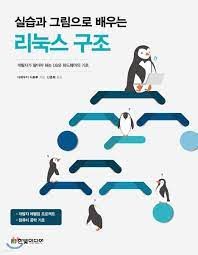

## 목차

1. [컴퓨터의 구조](#컴퓨터의-구조)
2. [프로그램](#프로그램)
3. [프로세스](#프로세스)
4. [디바이스 조작](#디바이스-조작)
5. [커널 모드와 사용자 모드](#커널-모드와-사용자-모드)
6. [OS에서 저장 장치](#OS에서-저장-장치)

## 컴퓨터의 구조

### 컴퓨터의 일반적인 구조

컴퓨터 시스템이 동작할 때, 하드웨어에서는 다음 순서가 반복된다. 입력 장치 혹은 네트워크 어댑터를 통해 컴퓨터에 처리 요청이 들어온다. 그 다음 메모리에 있는 명령을 읽어 CPU에서 실행하고 그 결과값을 다시 메모리의 다른 영역에 기록하게 되고, 메모리의 데이터를 저장 장치에 기록 또는 네트워크를 통해 다른 컴퓨터에 전송하거나 디스플레이 등의 출력 장치를 통해 결과값을 출력한다. 출력하면 다음 처리 요청을 받게 되며 과정을 반복한다.

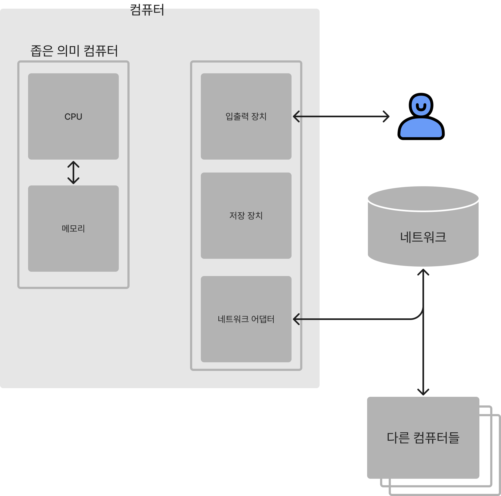

> 💡 이러한 순서를 반복해서 사용자에게 필요한 하나의 처리로 정리한 것을 프로그램이라 한다. 프로그램은 크게 애플리케이션, 미들웨어, OS(운영체제)로 나눌 수 있다.

## 프로그램

프로그램은 컴파일된 결과물뿐만 아니라, 프로그래머가 작성한 소스 코드까지도 포함한다.

참고 : [https://ko.wikipedia.org/wiki/컴퓨터_프로그램](https://ko.wikipedia.org/wiki/%EC%BB%B4%ED%93%A8%ED%84%B0_%ED%94%84%EB%A1%9C%EA%B7%B8%EB%9E%A8)

### 프로그램의 종류

- 애플리케이션
    
    사용자가 직접 사용하는 영역이다. 
    예를 들어 컴퓨터의 오피스 프로그램 또는 스마트폰이나 태블릿에 있는 애플리케이션이 있다.
    
- 미들웨어
    
    여러 여플리케이션이 공통으로 사용하는 기능을 묶어서 애플리케이션의 실행을 도와준다. 
    예를 들어 웹 서버, 데이터베이스 등이 있다.
    
- OS(운영체제)
    
    하드웨어를 직접 조작하여 애플리케이션이나 미들웨어의 실행에 필요한 기능을 제공한다. 
    예를 들어 리눅스 ,MS 윈도우, OSX 등이 있다.
    

### 프로그램 동작

애플리케이션과 미들웨어 그리고 OS는 서로 연동되어서 동작한다.

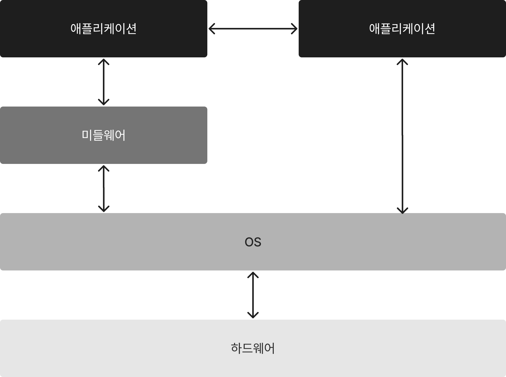

## 프로세스

**프로세스**(**process**)는 컴퓨터에서 연속적으로 실행되고 있는 컴퓨터 프로그램을 말한다. 종종 스케줄링의 대상이 되는 작업(task)이라는 용어와 거의 같은 의미로 쓰인다.

참고 : [https://ko.wikipedia.org/wiki/프로세스](https://ko.wikipedia.org/wiki/%ED%94%84%EB%A1%9C%EC%84%B8%EC%8A%A4)

### 프로그램과 프로세스 관계

**일반적으로 OS는 여러 프로그램을 프로세스라고 하는 단위로 실행한다**. 각 프로그램은 하나 또는 여러 개의 프로세스로 구성되어 실행되고, 리눅스를 포함한 대부분의 OS는 여러 프로세스를 동시에 실행할 수 있다.

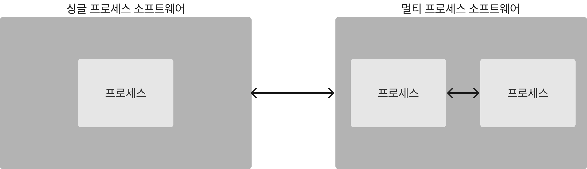

## 디바이스 조작

OS가 없는 경우 여러 개의 프로세스가 각각 디바이스를 조작하는 코드를 작성해야 하는 번거로움이 생긴다. 이렇게 해도 동작은 하겠지만 다음과 같은 단점이 있다.

- 모든 애플리케이션 개발자가 디바이스의 스펙을 상세히 알아야만 디바이스를 조작할 수 있다.
- 개별 개발이므로 개발 비용이 커진다.
- 멀티 프로세스가 동시에 디바이스를 조작할 경우 예상 외 동작이 발생할 수 있다.

### **디바이스 드라이버가 없을 때 디바이스 조작**

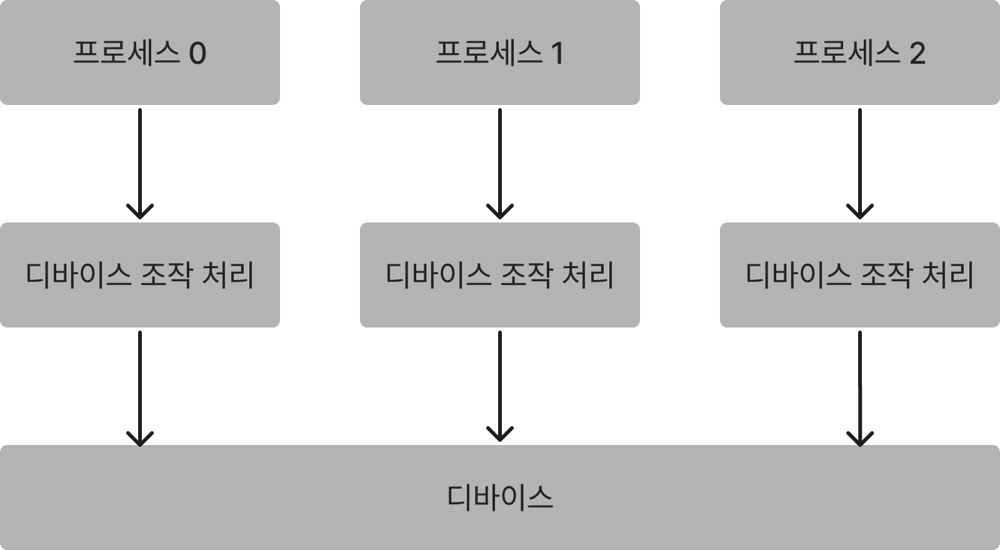

### **디바이스 드라이버를 사용한 디바이스 조작**

운영체제는 디바이스 드라이버를 통해서 모든 프로세스가 디바이스를 조작하게 해 다음과 같은 단점들을 보완하고 있다.

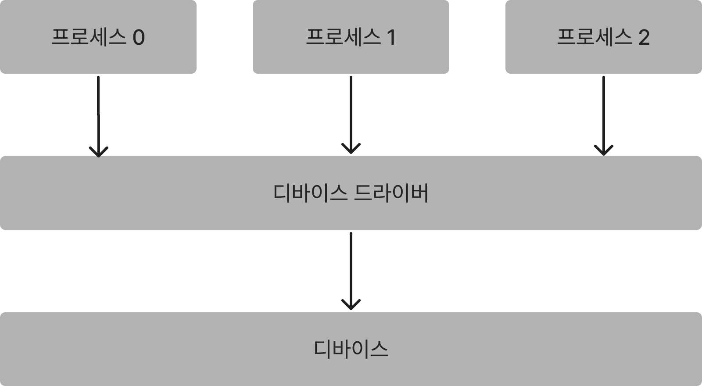

### 디바이스 공통 조작

추가로 OS가 존재하는 경우에 디바이스의 종류가 같으면 같은 인터페이스로 조작하도록 되어 있다.

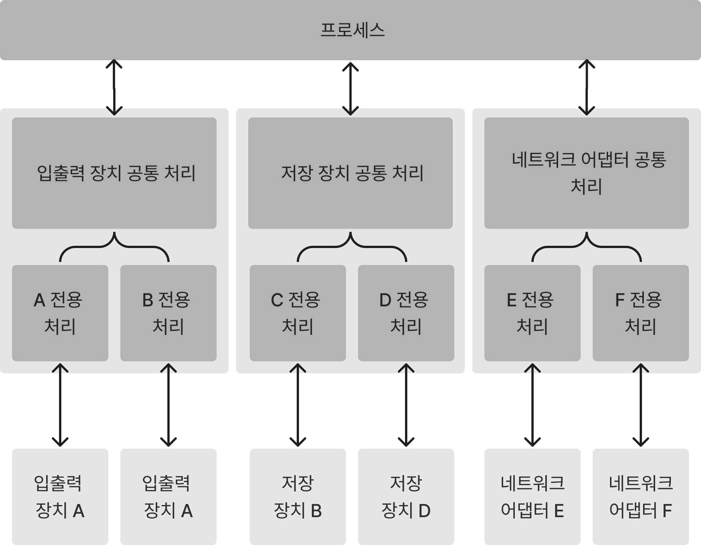

## 커널

커널(Kernel) 사용자의 조작을 처리하며 OS가 움직일 수 있도록 하는 OS의 핵심부분이다.

참고 : [https://jihooyim1.gitbooks.io/iknowosbasic/content/contents/01.html](https://jihooyim1.gitbooks.io/iknowosbasic/content/contents/01.html)

### 커널 모드와 사용자 모드

프로그래머의 버그나 해킹 목적으로 의도된 특정 프로세스가 디바이스 드라이버를 통해 디바이스에 접근함이라는 룰을 깨면 멀티 프로세스가 동시에 디바이스를 조작하려고 시도하는 상황이 발생한다. 이러한 문제를 피하고자 CPU에 있는 기능을 이용해 프로세스가 직접 하드웨어에 접근하는 것을 차단한다. 

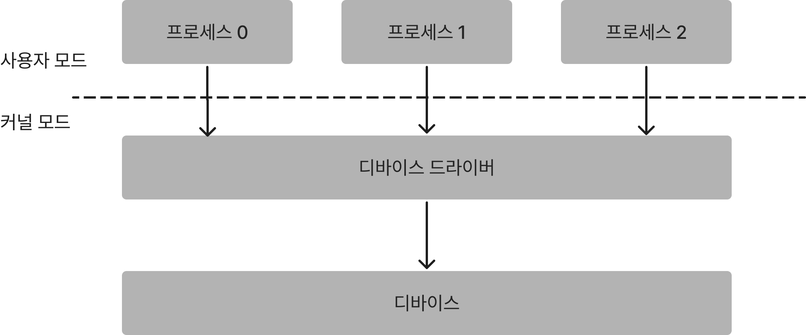

**CPU에는 커널 모드와 사용자 모드라 하는 두 가지 모드가 있으며 커널 모드로 동작할 때만 디바이스에 접근할 수 있다. 디바이스 조작외에도 프로세스 관리 시스템 처리, 프로세스 스케줄링 처리, 메모리 관리 시스템 처리를 일반적인  프로세스로 실행하면 문제가 된다.**

> 💡 **디바이스 드라이버는 커널 모드로 동작하고 프로세스는 사용자 모드로 동작한다.**

### 커널

위 프로세스 관리 시스템, 프로세스 스케줄링, 메모리 관리 시스템 처리도 커널 모드에서 동작하는데, 커널 모드에서 동작하는 OS의 핵심 부분이 되는 처리를 모아 담당하는 프로그램을 **커널**이라 부른다.  커널은 시스템에 탑재된 CPU나 메모리 등의 리소스를 관리하고 있으며 리소스의 일부를 시스템에 존재하는 각 프로세스에 적절히 분배한다.

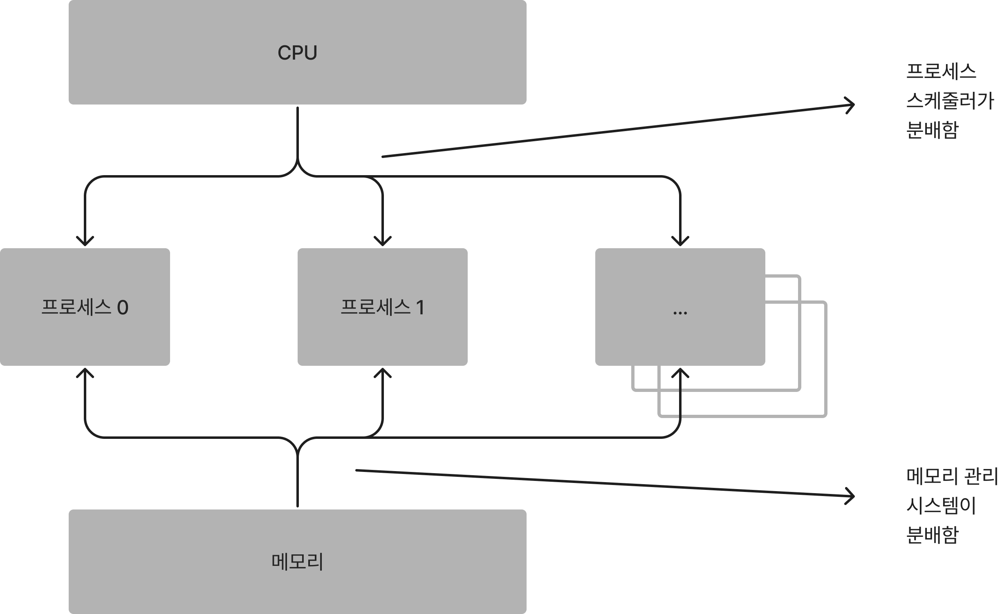

> 💡 프로세스가 디바이스 드라이버를 포함한 커널이 제공하는 기능을 사용하려 할 때, **시스템 콜**을 통해 커널에 요청한다.

### 프로세스에서 커널에 요청하기 위해 시스템 콜을 하는 동작

시스템 콜은 CPU의 특수한 명령을 실행해야만 호출된다. 

1. 프로세스는 보통 사용자 모드로 실행되고 있지만, 커널에 처리를 요청하고자 시스템 콜을 호출하면 CPU에서는 인터럽트 이벤트가 발생한다.
2. 인터럽트 이벤트가 발생하면 CPU는 사용자 모드에서 커널 모드로 변경되며 요청한 내용을 처리하기 위해 커널이 동작하기 시작한다.
    
    > ⚠️ 커널은 프로세스가 요청한 내용을 처리하기 전, 프로세스의 요구가 유효한지 확인한다. 요구 사항이 맞지 않는다면 커널은 시스템 콜을 실패했다고 처리한다.
    
3. 요청한 내용 처리가 끝나면 커널 내의 시스템 콜 처리가 종료된다.

## OS에서 저장 장치

### OS에서 저장 흐름

프로그램 실행에 있어서 다양한 데이터가 메모리 중심으로 CPU의 레지스터나 저장 장치 같은 기억장치 사이에 전송된다. 이러한 기억장치는 크기, 가격, 전송, 속도 등에 장단점이 있으며, 기억장치 계층이라 일컫는 계층 구조를 구성하고 있다.  프로그램을 빠르고 안정적으로 동작시키기 위해서 기억장치를 유용하게 활용해야 한다.

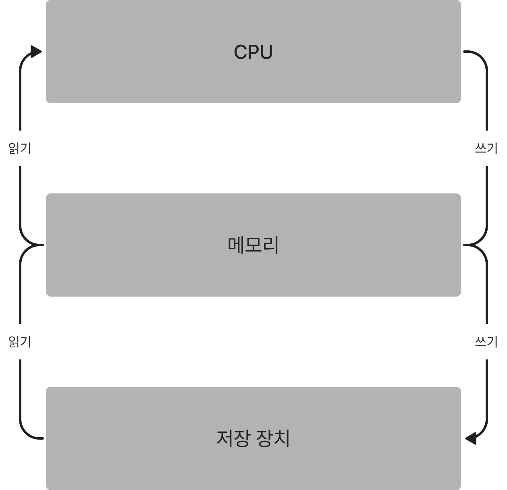

### OS와 파일시스템

저장 장치에 보관된 데이터는 디바이스 드라이버에 직접 요청해서 접근할 수 있지만, 더 간단히 접근하기 위해 파일시스템이라는 프로그램을 통해 접근한다.

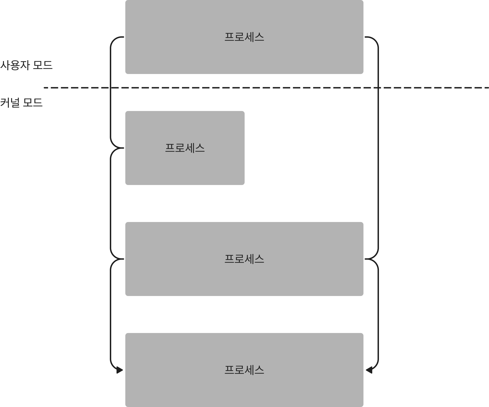

파일시스템을 통해 저장 장치에 접근

### OS와 저장장치

컴퓨터 시스템은 저장 장치가 반드시 필요하다. 시스템이 작동하려면 먼저 저장 장치로부터 OS를 읽어야 한다. 추가로 시스템이 작동하면서 생성된 메모리상의 데이터는 전원이 꺼지면 손실되므로 전원이 꺼지기 전, 그 내용을 저장 장치에 기록해야 한다.
