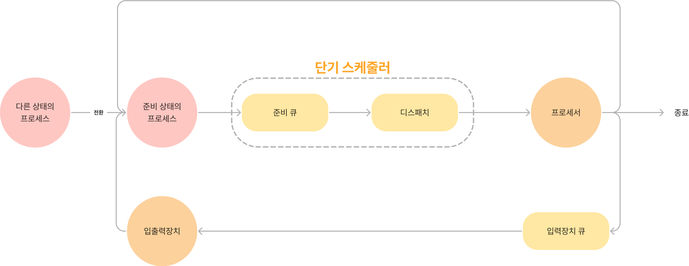
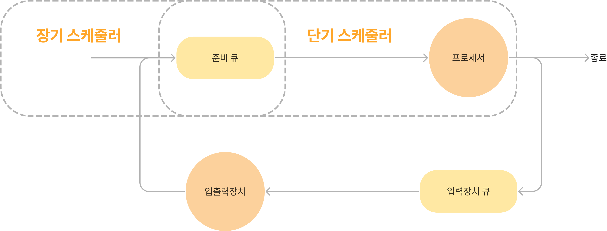
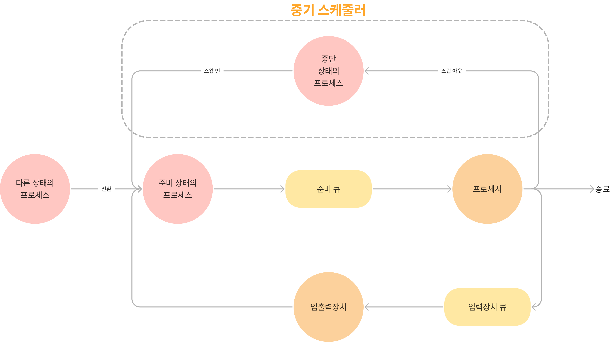

# 운영체제 - 스케줄링

## 목차

- 스케줄링
- 스케줄링시 고려 사항
- 상황에 따른 스케줄링
- 단기 스케줄링에서 비교 기준

## 스케줄링

### 스케줄링

시스템의 목표인 프로세스의 이용률을 높이고 시스템간의 작업 능력을 향상시키고 작업의 응답 시간을 최소화하기 위한 과정이다.

### 스케줄링 여부에 따른 작업

스케줄링 해야하는 작업

스케줄링 해야하는 작업은 사용자 프로세스와 시스템 프로세스가 있다.

스케줄링 하지 않는 작업

스케줄링 하지 않고 실행하는 작업은 인터럽트와 오류 처리, 그리고 사용자의 시스템 호출 등의 처리가 있다.

## 스케줄링시 고려 사항

- 자원 할당의 공정성
- 단위 시간당 처리량 향상
- 자원 사용(사용률 ⬆️)
- 예측 가능성
- 적절한 응답 시간 유지

## 상황에 따른 스케줄링

### 단기 스케줄러(CPU 스케줄러)

**단기 스케줄러란?**

레디 큐에 들어있는 프로세스들 중 하나를 선택하고 CPU를 할당해 실행 상태로 만드는 기능을 담당한다. 프로세스의 레지스터를 적재(Context Switching)이라 하고, 사용자 상태(User Mode)로 전환한다. 해당 동작은 디스패처(Dispatcher)가 진행한다. 

**단기 스케줄러는 매우 자주 호출된다.**

단기 스케줄러는 CPU에 프로세스들을 매핑해주고 모든 프로세스들을 공정성 있게 할당하기 위해 변경한다. 그렇기 때문에 자주 호출된다.(시분할 시스템에 의해서 진행된다.)

> 💡 디스패처는 프로세스를 디스패치한다. 디스패치란 실제 CPU에 할당하는 것을 의미한다.

### 장기 스케줄러(잡 스케줄러)

**장기 스케줄러란?**

실행을 하기 위해 주기억장치로 각각의 프로세스들을 탑재하는 기능을 담당한다. 여기에서 발생하는 스케줄링을 작업 스케줄링, 승인 스케줄링, 또는 장기 스케줄링이라 불린다.

**장기 스케줄러는 단기 스케줄러보다 호출되는 빈도수가 적다**

시분할 시스템에는 필요하지 않은 부분이고 일괄 처리 배치 시스템에서만 사용된다. 일괄 처리 시스템에서 다중 프로그래밍 정도를 제어한다.

### 중기 스케줄러

**중기 스케줄링이란?**

시분할 시스템의 주기억장치에서 프로세스들을 임시로 제거해 다중 프로그래밍 정도를 완화시키거나 프로세스들의 혼합성을 개선하기 위해 사용된다. 이 방식을 스와핑이라 한다.

**스와핑이란**

많은 프로그램들을 동시에 수행하는 등 현재 주 기억 장치에서 프로세스들을 임시로 보조 기억 장치의 특정 영역으로 뺴내서 메모리에 탑재된 프로세스의 수를 줄여주는 방법이다.

> 💡 메모리에서 빠지는 스왑 아웃이 발생한 후 다시 실행하기 위해 스왑 인이 발생하면 준비 상태의 프로세스가 된다.

## 단기 스케줄링을 선택하는 기준

단기 스케줄링인 CPU 스케줄링은 효율적인 스케줄링을 선택하기 위한 비교 기준이 존재한다.

- CPU 이용률은 높게
- 처리율을 높게
- 총 처리 시간을 낮게
- 대기 사긴을 낮게
- 응답 시간을 낮게
