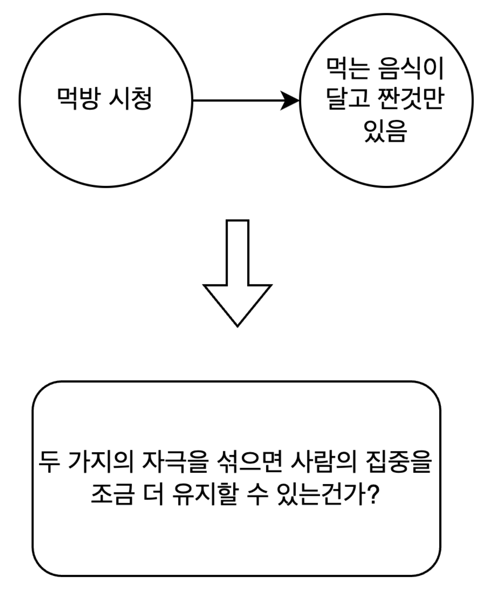
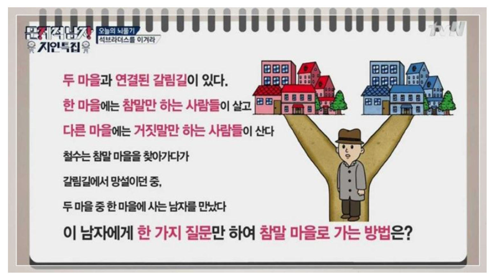
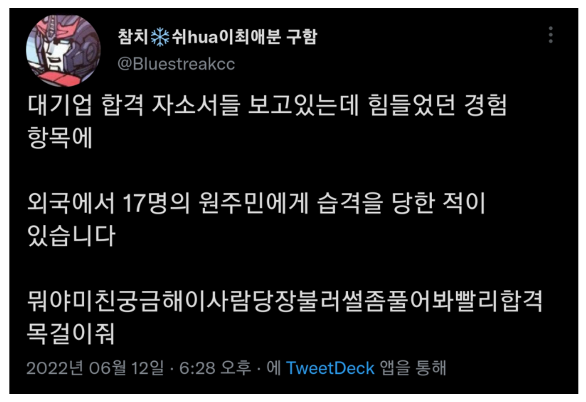
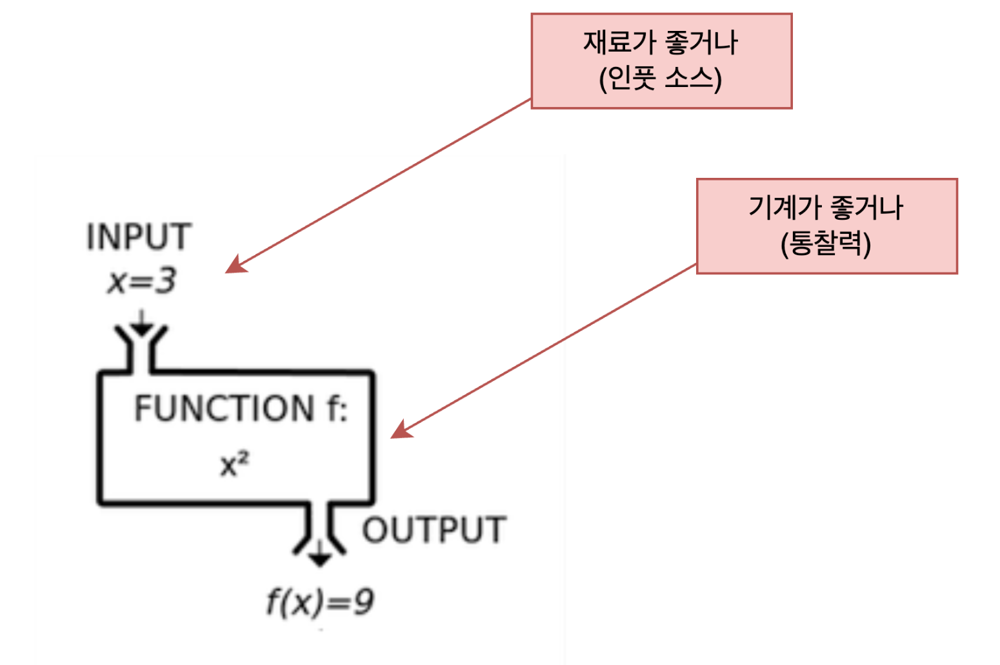

# 고정관념으로 자신의 한계를 정하진 않나요?

이전 밋코더를 참여하면서 다른 포스트를 읽기 어려웠다. 관심사가 아니면 이해하지 않으려는 본인의 고정관념이 크게 작용한 문제가 가장 컸다. 고정관념때문에 자신의 한계를 그어버리는 안좋은 습관을 해결하기 위해 정리했다.

 

### 자신의 문제를 고착화하고 있지 않은가

경영학은 전형적인 시스템을 전제로 한 지식이다. 현재의 경영학은 현재 시스템을 전제로 어떻게 잘 해나갈까 연구하는 학문이기 때문에 현재 시스템의 문제점을 더 단단하게 고착시켜버린다.

개발도 마찬가지다. 개발도 현재 시스템에서 어떻게 잘 해결할 수 있는지 고민하기 때문에 문제점을 더 단단하게 고착시킬 수 있다.

> `개발자는 코딩하는 사람이 아닌 문제를 해결하는 사람이다. 때로는 가장 좋은 해결 방법이 정책을 바꾸고 프로그래밍을 안하는 것일 수도 있다. 우리가 풀고자 하는 문제를 정확이 이해하는 일에 노력이 80%가 소모되어야 한다.`
>
> - [배달의민족 CEO에게 뽑고 싶은 개발자를 물어보았다](https://www.youtube.com/watch?v=3H4umWD5bwI)

기술은 필연적으로 전문화를 요구한다. 과학적 지식을 전문화하는 과정에서 교양 지식이 필요하지 않을 수 있지만 교양은 전문 영역 사이에어서 유연한 사고를 도와준다.

결론 : **전문화가 진행되어도 전문성의 경계를 넘을 수 있는 정신 능력을 키울 필요가 있다.**

 

### 지식에 한계를 두지 말자

인풋을 정의할 때 중요한 점은 특정 영역에만 한정짓지 않아야 한다. 배움의 계기는 지금 여기에서 우리 자신에게 이미 주어지고 있다. 만약 인풋을 뽑지 못한다면 인풋 소스를 한정해버리는 우리의 마음가짐이 문제다.

> 전문성이 높은 지식은 우리를 먹여 살릴 지식이니 열심히 학습하지만, 그렇지 않은 지식은 가볍게 지나간다.

전문성이 낮은 지식이라면 여러분의 사고를 유연하게 해 통찰의 범위를 확장할 수 있는 기회다. 기회가 된다면 지식의 본질을 파악하고 가설을 세워서 새로운 통찰을 얻어보자.

같은 감각으로 집중하는 건 한계가 있지만, 두 가지의 자극을 섞으면 사람의 집중을 조금 더 유지할 수 있다는 통창을 얻을 수 있다.

> 배우기만 하고 생각하지 않으면 얻는 것이 없고, 생각하기만 하고 배우지 않으면 위태로워진다.
> - 공자 \<논어\>

생각만 하고 배우지 않으면 독선에 빠질 우려가 있다. 한 줌짜리 지식과 빈약한 경험만을 바탕으로 한 자신만의 생각에 빠지지 않도록 노력할 필요가 있다.

> 독선 : 자기 혼자만이 옳다고 믿고 행동하는 일

 

### 통찰을 얻자

> 왜 당신은 타인의 보고를 믿기만 하고 자신의 눈으로 관찰하거나 살펴볼 생각을 하지 않는가?
> - \<대화\> 갈릴레로 갈릴레이

유명 정보 기관에서 수집하는 정보는 일반인도 접촉 가능한 정보가 대부분이다. 하지만 우리와 다른 행보를 하는 이유는 정보로부터 고도의 통찰을 얻어내는 능력이 우월하기 때문이다.

 

### 통찰이 힘들다면

통찰을 끌어내는 것이 아닌 정보를 모아 차별화를 이룰 수 있다. 다른 사람과 압도적으로 구별되는 인풋으로 지적 베이스를 구축할 수 있다.

좋은 결과가 나오기 위해서는 재료(**인풋 소스**)가 좋거나 기계(**통찰력**)가 좋아야 한다.

 

### 마지막으로

요약 : 지식의 한계로 자신의 영역을 한정짓는 질은 하지말자. 통찰하지 않는다면 작동하지 않는 API에 요청하는 꼴, 통찰의 깊이를 넓히기 어렵다면 모으는 정보를 차별화하자.

`독합은 어떻게 삶의 무기가 되는가`라는 책을 읽으며 스스로의 한계를 한정짓는 모습이 비춰졌다. 책을 통해 사고 전환을 할 수 있었고, 다른 분들의 포스트를 읽는 데 거부감이 없어졌다. 목표하는 건 모든 포스트를 읽고 코멘트를 최소 하나씩 남기는 일이다.

