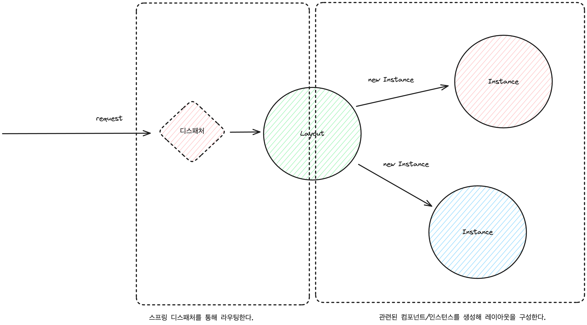
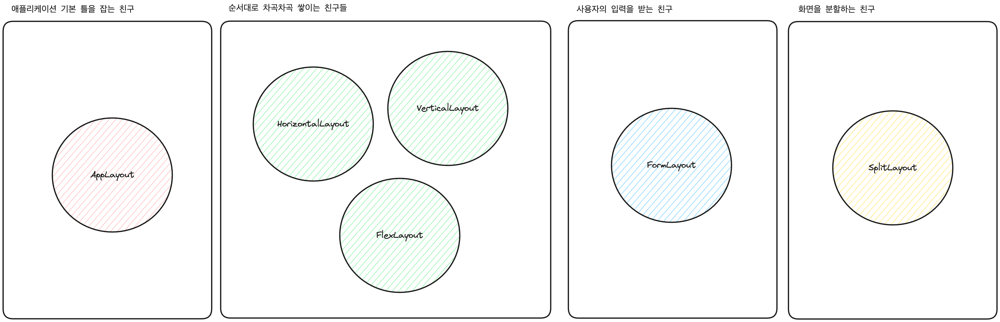

## vaadin 파헤치기

백오피스 일부로 vaadin 을 활용해볼까 생각 중이다. 
선택하게 된 계기는 다음과 같다.

- 적절한 UI 템플릿을 제공하고 있다. 약간 퍼블리싱된 PHP를 여러 페이지로 걸쳐 만드는 느낌이다.
- [문서](https://vaadin.com/docs/latest/tutorial)가 되게 깔끔하게 정리되어 있다.
- 모듈화를 잘해서 관리를 잘 할 수 있어보인다.

장점도 명확한 만큼 단점도 그렇다.

- 확장성이 조금 떨어진다.
- 약간의 응용을 하기 위해선 많은 공부가 필요해보인다.
- 사용하면 이 프로젝트를 수정하는 사람이 있을까 걱정된다.

### Build

스프링을 활용하고 있어 동작은 쉽게 유추 할 수 있다.
디스패처를 활용해 라우팅하고 호출되면 그에 맞는 인스턴스를 호출하거나 생성해 컴포넌트를 만들고 만든 컴포넌트로 레이아웃을 구성해 반환하게 된다.



### Component

`Component`는 요소의 상위 수준 추상화다.
`Component`를 활용해 부모-자식 관계, 속성 값을 지정 하게 된다.

`Component`는 각각의 `attributes`와 `element`를 가진다.
`element`는 DOM 에서 표현하는 양식이며 `<html>`, `<p>` 등의 형식을 표현한다.

### Layout

vaadin 은 Layout 이라는 클래스를 활용해 HTML 구조를 잡고 있다.



- AppLayout : 네비게이션, 드로어, 컨텐츠로 분리해 애플리케이션 레이아웃을 구축한다.
- HorizontalLayout : `Component`를 나란히 한 행에 배치됨. 너비는 컨텐츠에 좌우됨. 
- VerticalLayout : `Component`를 맨 위에서 아래로 열에 배치
- FlexLayout : 플렉스 박스를 구현
- FormLayout : 사용자의 입력을 받기 위한 양식
- SplitLayout : 두 개의 컨텐츠 영역과 그 사이에 드래그 가능한 분할 핸들 가능

화면을 만들고 싶다면 Layout 을 상속받으면 된다.

```java
@PageTitle("Upload image")
@Route(value = "upload", layout = MainLayout.class)
@RouteAlias(value = "", layout = MainLayout.class)
@RolesAllowed("USER")
public class UploadimageView extends HorizontalLayout {

    public UploadimageView() {
        //...
    }
}
```

화면에 레이아웃을 추가하고 싶다면 다음처럼 레이아웃을 선언하고 add 메서드로 추가하면 된다.

```java
@PageTitle("Upload image")
@Route(value = "upload", layout = MainLayout.class)
@RouteAlias(value = "", layout = MainLayout.class)
@RolesAllowed("USER")
public class UploadimageView extends HorizontalLayout {

    public UploadimageView() {
        VerticalLayout layout = new VerticalLayout(new Text("hello"));
        add(layout);
    }
}
```

add 를 통해 부모-자식 관계가 형성되고 있다.

```java
public interface HasComponents extends HasElement, HasEnabled {
    default void add(Collection<Component> components) {
        Objects.requireNonNull(components, "Components should not be null");
        components.stream()
                .map(component -> Objects.requireNonNull(component,
                        "Component to add cannot be null"))
                .map(Component::getElement).forEach(getElement()::appendChild);
    }
}
```

> 약간 Has 가 has-a 와 is-a 관계에서 차용한 것 처럼 보인다. 상속 관계가 아니라 속한다라는 의미 같다.

### Event

`event`와 `eventListener`를 등록하기도 쉽다. 어떤 형태의 이벤트를 볼지 그리고 어떤 타입의 이벤트를 발행시킬지 만 선언하면 된다.
버튼 이벤트는 click 이라는 이벤트를 읽으면 ComponentEvent 를 활용해 이벤트를 발행하게 된다.

```java

public class EditImageForm extends FormLayout {
    BeanValidationBinder<ImageInfo> binder = new BeanValidationBinder<>(ImageInfo.class);
    private Button save = new Button("Save");

    public EditImageForm() {
        save.addClickListener(event -> fireEvent(new SaveEvent(this, binder.getBean())));
    }

    public static abstract class EditImageFormEvent extends ComponentEvent<EditImageForm> {
        private final ImageInfo image;

        protected EditImageFormEvent(EditImageForm source, ImageInfo image) {
            super(source, false);
            this.image = image;
        }

        public ImageInfo getImage() {
            return image;
        }
    }

    public static class SaveEvent extends EditImageFormEvent {
        SaveEvent(EditImageForm source, ImageInfo image) {
            super(source, image);
        }
    }
}
```

폼 형식에 이벤트 리스너도 동일하다. 
발생한 이벤트가 무엇인지 힌트를 제공하고 그에 맞게 어떤 동작을 취할지 정의하면 된다.

```java

public class EditImageForm extends FormLayout {
    private ImageService imageService = new ImageService();

    public EditImageForm() {
        //...
        addSaveListener(addListener(SaveEvent.class, event -> imageService.saveContact(event.getImage())));
        //...
    }
}
```

### 이것저것 하면서 느낀점

이벤트를 넘겨줄 때 원하는 객체를 바인딩해서 넘겨준다.
좋은 기능인데 해당 객체를 수정해서 반환하면 동일한 인스턴스에서 내부 값이 변경되어 버린다.
코드를 막 치고 있어서 `setter` 를 활용하는건지 리플렉션이 되는건지 잘 모르겠다.
그런데 이건 좀 위험해 보인다.

상위 코드가 정말 잘 깨진다. 자식 요소에서 선언한 코드가 상위 요소에도 전파됐다.
솔직히 뭐가 문제인지 파악하기도 어렵다.
쉽게 사용하려고 접근했는데 어느순간부터 내부 코드를 다 읽고 있다...

### 정리하자면

`vaadin`은 `component`를 활용해 여러 요소들을 정의한다. 
그리고 layout 을 템플릿 화 해 쉽게 활용 할 수 있도록 도와준다.
`event`는 어떤 `event`를 기다릴지, 어떤 `event`를 발생시킬지 선언만 하면 된다.

생각보다 쉽지만 상위 클래스의 행위를 변경하게 되면서 잘 꺠지기 쉬운 구조처럼 보인다.
그리고 명령 기반 실행 흐름이 간헐적으로 나타나는 것을 보면 자바 코드로 UI를 그리는건 단점이 더 많아 보인다.
그럼에도 자바 언어를 잘 다룬다면 단위 테스트와 통합 테스트를 쉽게 작성 할 수 있어 관리 포인트가 줄어들 수 있다.

차마 추천은 못하겠다. 그런데 재밌긴 했다.
