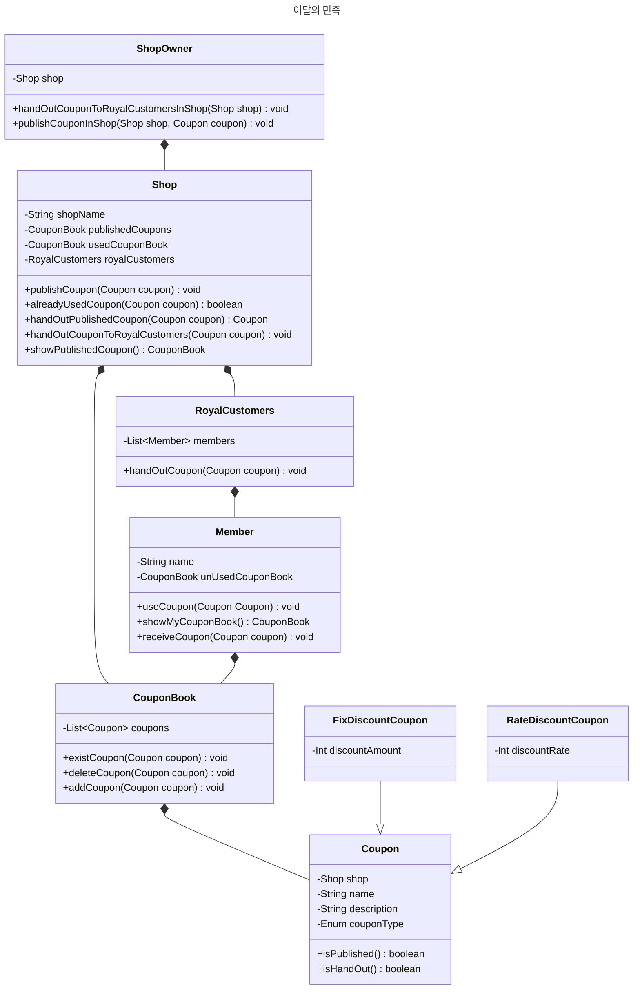
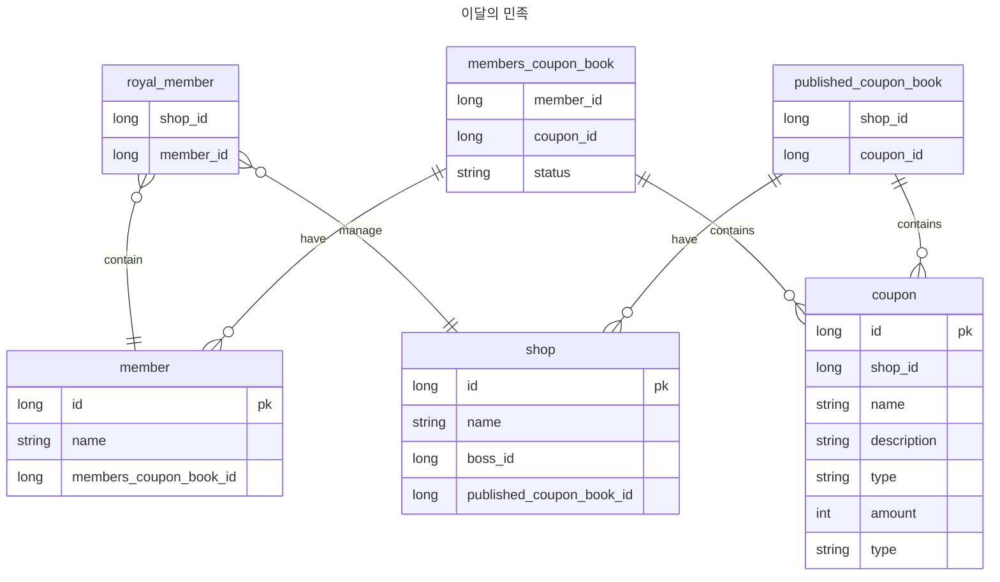

# 헥사고날 학습 전 모델링

## 개요

사내 스터디에서 헥사고날 아키텍처를 학습하기로 하면서 백문이불여일타를 목적으로 간단한 미션 형식으로 아키텍처를 구성해보기로 했다. 작성된 미션은 다음과 같다.

> 서비스는 MSA로 구성되며 이 중 쿠폰 서비스를 사용자에게 전달해야 하는 미션을 받았습니다. 팀은 각 요구사항을 토대로 도메인 설계를 진행하고 요구사항을 만족해야합니다!

멋진 헥사고날을 구축하기 위해서는 높은 도메인 이해도를 가지고 군더더기 없는 객체 간의 상호작용을 그려나갈 필요를 느꼈고, 도메인 이해부터 모델링을 수행해 나가기로 했다.

### 도메인 이해

단어들은 생소해서 이커머스 쿠폰 도메인을 학습했다. 관련 좋은 글이 있어서 공유한다.

- [쿠폰의 할인 금액은 누가 책임지는가](https://brunch.co.kr/@inun/23)
- [쿠폰의 종류와 발행 이벤트는 어떻게 구분할까](https://brunch.co.kr/@inun/24)
- [쿠폰 서비스의 엣지 케이스는 무엇이 있을까](https://brunch.co.kr/@inun/26)

위 세 가지 모두 이해하여 견고한 서비스를 만들면 좋겠지만 해당 스터디는 헥사고날 아키텍처 이해를 목적으로 모였기 때문에 [`쿠폰의 종류와 발행 이벤트는 어떻게 구분할까`](https://brunch.co.kr/@inun/24)에 집중하기로 마음먹었다. 정리하자면 다음 요소에 집중해보려 한다.

- 쿠폰은 어떤 대상을 할인하기 위한 쿠폰인가
- 어떻게 할인을 적용할 것인가
- 사용자의 어떤 행동으로 쿠폰을 발급할 것인가

그 밖에 세세한 정책도 고민했다.

- 발급한 쿠폰의 변경 가능성이 있는가 → 줬다 뺏는 일만큼 부정적인 경험이 없다고 생각한다.

### 요구사항 정리

사내 스터디에서 작성된 요구사항은 다음과 같다.

1. 회원은 쿠폰 발급 버튼을 눌러 쿠폰을 발급한다.
2. 가게 주인은 특정 회원들에게 정기적으로 쿠폰을 발급한다.
3. 동일한 쿠폰은 하루에 하나씩만 발급 가능하다.
4. 쿠폰은 정액쿠폰, 정률쿠폰을 발급 받을 수 있다.

나는 세 가지 요소로 정리해보기로 했으니 그에 맞게 정리하면 다음과 같다.

- 쿠폰은 OOO 대상을 할인하기 위한 목적이다.
    - 가게에 진열된 상품 대상
- 회원은 OOO 행동으로 쿠폰을 발급받는다.
    - 가게에 접근해 쿠폰 발급 버튼을 누르는 행동
    - 가게 주인이 가게 쿠폰을 가져갔던 손님들에게 쿠폰을 뿌리는 행동
- 쿠폰의 할인 정책은 OOO 방법을 적용한다.
    - 고정금액을 할인하는 정액제 방법
    - 비율로 할인하는 정률제 방법

### 프로그래밍 요구사항 정리

- 발급받은 쿠폰 식별자는 시간대별로 순서가 보장되어야 한다.

> ID는 시간대별 순서가 보장되도록 고민한 이유는 쿠폰은 유효기간이 존재하고 제약 조건도 많아 사용자의 기억속에 휘발성이 많다고 생각해서이다. 그래서 시간 지역성을 띈다고 생각했고 한 번 조회할 때마다 하나의 블록을 읽어오는 InnonDB의 특성을 잘 살릴 수 있어보였다.

## 객체 모델링

### 객체 모델링에서 집중한 일

상품 수입, 가공, 진열, 판매하는 과정을 거치면서 종이로된 쿠폰을 사용한다면 각 과정마다 어떤 영향을 미칠지 그리고 코드로 작성된 도메인 서비스와의 괴리감은 어떻게 낮출 수 있을지 고민했다.

### 쿠폰북의 개념

다들 어릴적에 전단지에 작성된 쿠폰북 봤을테다. 나만 나이 먹은게 아닐 것이다. 내가 가게를 연다면 이런 전단지 사이에 쿠폰을 실어 사용자에게 전달하면 좋겠다는 생각이 들었다.

그럼 회원은 쿠폰북을 가지며 사용할 때마다 쿠폰을 꺼내 하나씩 사용할 수 있게 되고 **쿠폰북에서 쿠폰을 사용하여 소진하게 된다.**

그럼 이미 사용했던 쿠폰을 찾으려면 어떻게 해야할까? 사용했던 쿠폰은 가게 사장님이 가져가지 않았을까 생각했고, 쿠폰을 보면서 사용자가 단골인지 아닌지도 확인 할 수 있을테다. 이런 관점으로 객체를 만들기 시작했다.

### 객체 모델링

객체를 만드려면 역시 어떤 책임을 가져 행위를 하는지 고민해보고 다음과 같이 정리했다.

## 데이터 모델링

### 데이터 모델링에서 집중한 일

객체 모델링과 데이터 모델링의 차이점은 어디에 저장이 되는가이다. 객체는 메모리에 적재되어 생성 소멸에 자유롭지만 데이터는 영속화되어 고정된 크기를 영구적으로 차지하게 되어 부담으로 이어지게 된다. 이런 문제를 해결하기 위해 정규화를 통해 인지 부조화가 없을 정도의 중복 제거를 진행했다.

### 데이터 모델링

객체를 기반으로 중복된 데이터를 제거하고 연관된 데이터끼리 묶은 다음 관리하기 어려운 다대다를 풀어줬다. 다개다를 풀어주면서 식별자를 노출할까 고민했지만, 노출하지 않았다. 식별자를 가지고 수행할 일이 없다고 생각했다.

## 모델링을 끝마치면서

### 느낀점

헥사고날 아키텍처의 장점은 테스트가 쉬워지고 유스케이스를 표출할 수 있으며 동시 작업이 쉬워진다는 장점이 있다. 또한 객체지향 모델링은 인지 부조화를 줄여 가독성을 높여주기 때문에 객체지향적인 모델링을 헥사고날 아키텍처로 구성해 외부 인프라 요소에 격리 한다면 모든 장점을 누릴 수 있음을 유추해 볼 수 있었다.

시작은 헥사고날 아키텍처이지만 객체 모델링으로 끝나버렸다. 헥사고날 아키텍처를 위한 초석이라 생각해주면 좋겠다. 다음에는 패키지 구조와 함께 어떻게 격리를 진행했는지, 영속성 계층을 어떻게 관리 할 수 있을지에 대한 고민을 해보겠다. 그럼 안녕.
