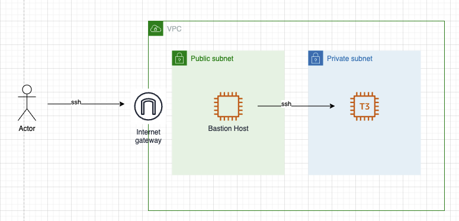
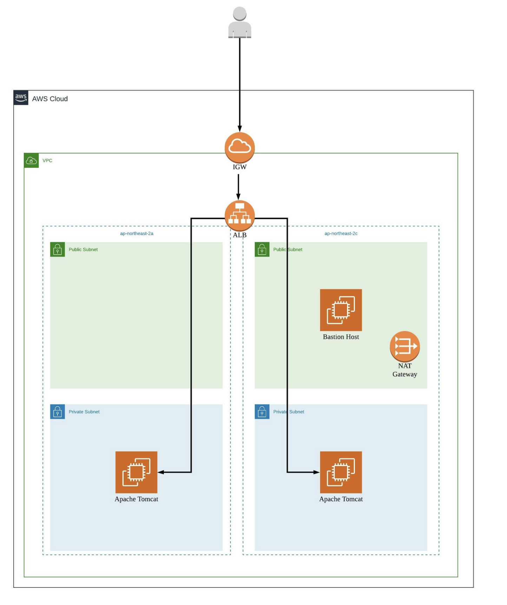
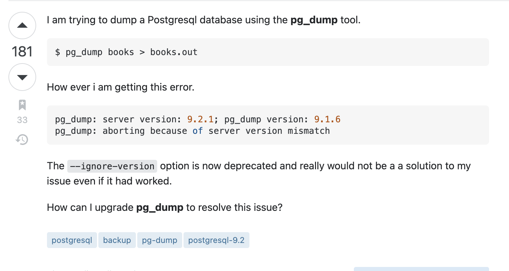

# bastion host, load balancer, scp

> 최근에 aws쪽을 다뤄야 하는 상황이 있었습니다. 
> 그 상황에서 겪었던 이슈들을 기록해 두고자 작성하였습니다.
> 몰랐던 개념과 겪었던 문제들, 수행했던 방법들을 기록하려 합니다.
> 정확하지 않은 내용이 있을 수 있습니다. 바로 잡을 수 있도록 알려주세요!!

## bastion host

#### 발생한 문제
- 서비스 인스턴스에 어떻게 접근해야 할지를 알지 못했습니다.
- aws 세팅을 클라우드 업체에서 처리해 주었고 저는 전달받은 세팅을 다루어야 했습니다.

#### 문제 원인 
- bastion host의 개념 자체를 몰랐습니다.

#### 알게 된 내용
bastion host란 내부와 외부 네트워크 사이에서 게이트 역할을 수행하는 호스트를 뜻합니다.   
bastion host란 일종의 문지기 역할 입니다.    

bastion은 중세시대에 성 외곽을 보호하기 위해 돌출된 부분을 의미합니다.   

이러한 개념이 ec2 인스턴스를 보호하기 위해 접목된 것이 bastion host 입니다.    
아래는 bastion host를 접목한 그림 입니다.    

private subnet에 위치한 t3 앞에 bastion host가 위치해 있는것을 확인할 수 있습니다.   

서비스 인스턴스로의 ssh 접속은 불가능 합니다.     
서비스 인스턴스는 public ip를 할당 하지 않았고 private subnet에 위치해 있습니다.    
서비스 인스턴스의 security group에는 bastion host가 속한 security group의 22번 포트를 허용합니다.    

t3 인스턴스로의 ssh 접속시에는 두 단계를 거쳐야 합니다.    
1. bastion host 접속
2. 서비스 인스턴스 접속

bastion host를 사용함으로써 내부 네트워크에 공격에 대한 방어를 할 수 있다고 요번에 알게 되었습니다.    

--- 

## load balancer

#### 발생한 문제
- route53에서 a레코드를 로드밸런서 쪽으로 연결 하였지만 계속 timeout 에러가 발생하였습니다.

#### 문제 원인
- load balancer의 가용영역이 private subnet으로 세팅이 되어 있었습니다.

#### 접근 방법
1. 네임서버 기입에 문제가 없는지 확인했습니다.
   서브 도메인 레코드를 생성 후 a레코드에 ip를 직접 연결하니 문제가 없었습니다. (ip는 별도의 ip를 사용하였습니다)
2. target group의 security group, port에는 이상이 없는지 확인했습니다.
   security group에는 이상이 없었습니다. port 또한 health check를 통해 이상이 없음을 확인했습니다.
3. route53, target group의 설정 문제는 없다고 판단, load balancer에 문제가 있다고 범위를 좁혔습니다.
4. load balancer의 vpc 설정은 문제 없었습니다. 
   가용영역에 private subnet이 설정되어 있었고 aws에서의 경고 문구가 출력되고 있음을 확인하였습니다.
5. 가용영역의 subnet을 vpc 내의 public subnet으로 변경하니 Timeout 에러는 겪지 않게 되었습니다.
  
#### 알게 된 내용
- load balancer의 가용영역에는 public subnet을 사용하여야 합니다.   
load balancer의 가용영역이란 로드밸런서가 접근할 수 있는 서브넷을 의미합니다.    
public subnet은 외부 그리고 내부 서브넷과 통신이 가능하므로 public subnet을 거쳐 로드밸런싱 대상으로 트래픽을 전달하면 외부와 내부 서브넷의 통신이 가능해집니다    
- 프라이빗 서브넷에 있는 ec2 인스턴스를 연결하려면 백엔드 인스턴스에서 사용하는 프라이빗 서브넷과 동일한 가용 영역에 퍼블릭 서브넷을 생성합니다. 그런 다음 퍼블릭 서브넷을 로드 밸런서와 연결합니다. (aws에 나온 방법)

---

## postgresql pg_dump, scp

#### 발생한 문제
- 디비의 테이블중 유저 데이터만 dump file을 생성 해야 했습니다.
- 테스트 서버에서 실 서버로 옮긴 후 dump 파일을 밀어 넣어야 했습니다. 
- pg_dump 파일을 생성할 때 서버와의 버전이 맞지 않다는 이유로 명령어를 수행할 수 없었습니다.

#### 문제 원인
- 기존 테스트 서버의 Rds 스냅샷 크기가 너무 컸습니다.
- 유저 데이터만 빼와 실서버에 밀어 넣어 주기로 결정하였습니다.
- psql 파일의 버전 업데이트가 필요했습니다.

#### 접근 방법
1. 테스트 서버에 pg_dump 명령어를 입력하니 버전이 맞지 않다는 에러가 발생했습니다.
(아래 사진은 예시 입니다!)
 
=> `sudo apt-get install -y postgresql-client-13` 를 통해 버전을 맞춰주었습니다.
2. pg_dump 명령어중 -t 옵션을 이용하여 users 테이블만 dump를 해주었습니다.
=> `pg_dump -h [host] -U [user] -d [database] -t 'users' -f [filename];`
3. scp 명령어를 통해 테스트 서버 -> 로컬 -> bastion host -> 실서버로 옮겨 주었습니다.
4. 실서버에서 `psql [database] < [sql filename]` 을 통해 데이터를 밀어 넣어 주었습니다.   
sql 파일 내에는 테이블 생성 명령어 부터 작성이 되어 있습니다.     
필요 없는 설정은 지우고 COPY.users 명령어 부터의 실행만 남겨 두었습니다.    
이로 인해 데이터만 실서버에 생성시킬 수 있었습니다.    

#### 알게 된 내용
- scp는 기본 값으로 22번 포트를 사용합니다.     
물론 변경도 가능합니다.     
이때는 `-P` 옵션을 사용합니다     
- bastion host의 접근을 허용해 두었으므로 별도의 포트를 열어둘 필요가 없었습니다.
- identity file을 지정해서 사용해야 하는 경우 `-i` 옵션을 사용합니다.
`scp -i [identity file] [로컬 경로] [리모트 경로]`
- 폴더를 복사하는 경우 `-r` 옵션을 사용합니다.

----
출처

* https://hello-world.kr/1
* https://aws.amazon.com/ko/premiumsupport/knowledge-center/public-load-balancer-private-ec2/?nc1=h_ls
* https://stackoverflow.com/questions/12836312/postgresql-9-2-pg-dump-version-mismatch
* https://twpower.github.io/138-send-file-using-scp-command
