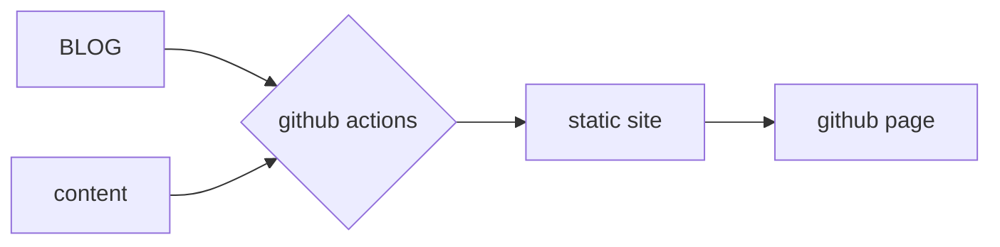

# Github actions으로 Github Pages 자동으로 배포하는 파이프라인 만들기(1)



이 글은 submodule로 컨텐츠를 제공받아 static page를 빌딩하는 github actions 파이프라인을 구축하는데에 목적이 있다. 

## Github Pages

`github.io`로도 잘 알려진 github pages는 정적 사이트를 호스팅해준다. github에 `{username}.github.io` 로 repository를 생성하면 자동으로 호스팅해준다. 

단, dynamic한 resource가 아니라 static한 page만을 렌더링해서 호스팅해주기때문에 서버를 돌릴 순 없다. static 한 resource를 직접 만들어서 배포하거나, static site generator를 사용하자.

따라서,  `{username}.github.io` 으로 github repository를 생성하자.

설정에서 source 브랜치를 마스터가 아닌 다른 곳으로 설정하거나, custom domain을 통해 domain을 변경할 수 있다. 소스코드와 빌드된 static file이 한 레포에 공존하는게 보기 싫으니까 빌드된 파일만을 담을 수 있는 브랜치를 생성/지정해서 소스파일을 담자. `gh-pages` 브랜치로 설정해준다.


## Static Site Generator

정적 리소스를 만들어주는 웹프레임워크. Jekyll, Hugo, Gatsby, Next.js, Nuxt 등등 지원되는 오픈소스 프레임워크들이 많이 있다. 2021년 5월말 현재 github star 기준으로 가장 유명한 static site generator들은 아래와 같다. 

자세한 내용은 [여기서 확인](https://jamstack.org/generators/).


각자 장단이 있지만 지금은 vue.js기반의 ssg를 선택할 계획이어서 Nuxt를 활용하기로 하자.

npm을 통해 nuxt를 다운받고,  create-nuxt-app을 통해 프로젝트를 생성한다. 이 과정에서 module에서는 contents와 rendering module에서는 SSG 옵션을 선택하도록 하자.


## Submodule

blog가 될 repo에 content도 함께 담아 repo를 업데이트 해도 되지만, 그렇게 하면 만약 여러명이 업데이트를 하는 블로그라면 블로그 자체가 되는 static site 레포에 대한 권한을 빼고 컨텐츠 수정 / 삭제 / 업데이트 권한만을 주는 것이 불가능하다. 이를 해결하기 위해 submodule 기능을 통해 content와 static site가 되는 레포를 분리하여 사용하려 한다.

submodule  기능에 대해 잠깐 설명하자면, `git-scm`에서는 서브모듈을 "두 프로젝트를 서로 별개로 다루면서도 그 중 하나를 다른 하나 안에서 사용"하는 기능이라고 설명한다. submodule은 repo안에 다른 히스토리를 가지는 repo를 하나의 디렉토리로 집어넣는 기능이다. 하위 repo는 clone을 통해 상위 레포 안에 포함되고, 히스토리는 각자 관리된다.

먼저 생성했던 blog를 위한 레포와 별개로  `1st_blog` 레포를 생성해준다(강제되는 이름이 아니다!). initial commit을 올린 뒤에, 이전에 생성했던 blog repo에서 git submodule 을 추가해준다.

nuxt.js의 경우 content 폴더안에 있는 파일을 인식해서 static resource를 인식하게 되어있기때문에, content 폴더를 프로젝트 내에 생성한 뒤, `content` 폴더를 path로 가지는 target path 아래에 서브모듈을 추가하자. 

```bash
git submodule add https://github.com/{username}/{reponame} {target_path}
```

`.gitmodules`  파일에 submodule 관련 설정파일이 생긴 것을 확인했다면,  commit, push한다.


## GitHub Actions

제 3의 라이브러리나 CI/CD툴을 사용할 필요 없이 github에서 곧바로 실행할 수 있는 workflow. repository에 변화가 생기는 순간 트리거 될 조건이 있는지 판단해서 트리거된다. 이에 따라 기존 CI/CD툴은 push를 통한 trigger만을 확인할 수 있던 것과 달리, github actions는 issue나 PR이 생성되는 순간, PR에 comment가 달리는 순간 [등등등](https://docs.github.com/en/actions/reference/events-that-trigger-workflows) 에도 trigger될 수 있다. yaml 파일 형식으로 정의해 활용할 수 있다.

우리의 목표는 github repo에 소스코드가 업데이트 되는 순간 github actions 가 자동으로 static page를 빌드하고, static resource를 기반으로 배포되게 하는데에 목적이 있으므로, master의 코드가 변경되는 push 시점과 pull request 트리거 시점으로 잡는다.

```yaml
name: CI						# workflow의 이름 부분.

on:
  push:
    branches:
      - master
  pull_request:
    branches:
      - master
```
그리고 나면 workflow가 실제로 할 job들을 나열하고, 설명해줘야 한다.

```yaml
jobs:
  Build:
    runs-on: ${{ matrix.os }}

    strategy:											# 작업을 위한 매트릭스를 정의한다.
      matrix:
        os: [ubuntu-latest]				# 지금같은 경우는 최신버전의 ubuntu
        node: [14]								# node 버전은 14
```

해당 job이 어떤 step을 진행할지 선언하자.

```yaml
    steps:
      - name: Checkout 🛎
        uses: actions/checkout@master
        with: 
          submodules: true
          # submodule 여부를 알려준다. 알려주지 않은 상태에서 서브모듈을 레퍼런스로 활용하면 `unresolved reference`가 발생한다.
      
      - name: update submodules 🔍					 # submodule repo 업데이트!
        run: git submodule update --init --recursive

      - name: Setup node env 🏗							# nuxt 실행을 위한 node 환경 세팅
        uses: actions/setup-node@v2.1.2
        with:
          node-version: ${{ matrix.node }}

      - name: Cache node_modules 📦				# node module caching, ci단에서 매번 세팅하는걸 방지하기 위해서 캐싱작업.
        uses: actions/cache@v2
        with:
          path: ~/.npm
          key: ${{ runner.os }}-node-${{ hashFiles('**/package-lock.json') }}
          restore-keys: |
            ${{ runner.os }}-node-

      - name: Install dependencies 👨🏻‍💻	# dependency setting
        run: npm ci

      - name: Run linter 👀								# lint test
        run: npm run lint
      
      - name: Build 👷‍♀️									# build!!!
        run: npm run generate

      # 여기서는 깔끔하게 해결하기 위해서 peaceiris/actions-gh-pages@v3를 활용했지만,
      # 사실 브랜치에 만들어진 static file을 push할 수 있게 하는 로직만 구현해 주면 된다.
      - name: Deploy 🚀										
        uses: peaceiris/actions-gh-pages@v3
        with:
          github_token: ${{ secrets.GITHUB_TOKEN }}
          publish_dir: ./dist

```


static generating과 CI/CD 파이프라인은 다음 글에서 소개하도록 하겠다.