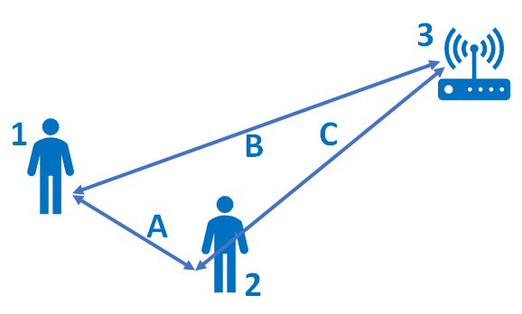

# Test Driven Development-2

> 보통의 TDD Cycle

1. 테스트 작성 (Write a test)  

    생각하고 있는 연산을 어떻게 코드로 작성할 지 고민해본다.  
  현재 이야기를 쓰고 있다고 생각하고, 작성할 코드가 가지고 있었으면 하는 인터페이스를 디자인한다. 정확한 연산을 위해 필요한 모든 것들을 상상하고 이야기에 포함시킨다.

2. 작성된 테스트 돌아가게 하기 (Make it run)  

    빠르게 테스트를 돌아가게 하는 것(getting bar to go to green) 이 다른 요소들도 좌지우지한다.   
  만약 해결 방법이 간단하고 명확하다면, 테스트를 작성해라. 해결 방법이 간단하고 명확하지만 시간이 걸릴 것 같다면, 적어 놓고 중요한 문제로 돌아간다.  
  이 원리는 경험 있는 개발자들에게도 어려울 수 있다. 그들은 좋은 개발 기술(Good engineering)들의 규칙들만 알고 있다.  
  빠르게 테스트를 돌아가게 하는 것은 모든 찝찝함(sins) 을 뒤로 미뤄둔다. 아주 잠깐동안만.

3. 코드 수정 (Make it right)  

    시스템은 돌아간다(무시한 찝찝함을 뒤로 미뤄둔 채). 이제 올바른 개발로 돌아갈 시간이다. 모든 중복된 코드를 없애고 테스트가 돌아가게 만든다.

  최종 목표는 동작하는 깨끗한 코드(직역, `clean code`)이다. 깨끗한 코드는 이따금씩 최고의 개발자들도 작성하기 힘들고, 나같은 대다수의 개발자들에게서는 대부분 거의 불가능한 일이다.   
  그래서 우리는 코드를 잘게 쪼개고 주도권을 가져야 한다(의역, `divide and conquer`). 먼저 우리는 어떤 문제에 있어서 '돌아간다'(that works) 부터  해결할 것이다. 그 후에 '깨끗한 코드'를 해결한다.  
  이 과정은 '깨끗한 코드'를 먼저 해결한 후 모든 것들을 결정된 디자인에 결합하면서 '돌아간다'를 해결하는 Architecture-driven development와 반대의 과정이다. 

<br />

> 빠르게 테스트를 성공시키는 팁

1. 속여라 (Fake it)  

      최종 코드를 가지기 전까지 상수(constant)를 반환하고 점차 변수(variable)들로 변환시킨다.

      ```java
        @Test
        public void testMultiplication() {
          Dollar five = Dollar(5);
          assertEquals(new Dollar(10), five.times(2);)
        }

        // Constant
        int times() {
          return 10;
        }

        // Variables
        private int amount;

        public Dollar(int amount) {
          this.amount = amount;
        }

        int times(int multiplier) {
          return amount *= multiplier;
        }
      ```

2. 명확한 구현을 사용해라 (Use Obvious Implementation)

    작성하는 테스트가 문제 없이 진행 되고, 다음 implementation이 명확할 경우에는 바로 구현한다. (물론 테스트를 계속 돌리며 내게 명확한 구현이 컴퓨터에게도 명확한지 확인하면서☺️) 만약, 테스트가 실패하면 다시 Faking implementation 으로 돌아가서 리팩토링한다.

    ```java
    @Test
    public void testArea() {  
        Square s = new Square(2.0);
        assertEquals(4.0, s.area());
    }

    private double side;

    public Square(double side) {
      this.side = side;
    }

    public double area() { 
      return side * side;
    }

    ```    

3. 삼각측량 (Triangulation)  

      
    만약 두 기지국 사이의 거리를 알고 있고 라디오 신호가 오는 방향을 알고 있다면, 우리는 신호의 범위와 방향을 계산할 수 있는 충분한 정보를 가지고 있다는 뜻이다. 이 계산을 삼각측량이라고 한다.

    [Picture: 'Basic Overview: Tracking Radio Signals']("https://hvdnnotebook.blogspot.com/2018/11/basic-overview-tracking-radio-signals.html)

    <br />
    <br />
    <br />

    비유적으로 우리는 두 개 이상의 예시가 있을 경우에만 코드를 보편화(generalize)시킨다. 그 전 테스트와 코드 사이의 중복은 무시한다. 두번째 예시가 더 보편화된 해결 방법을 필요로 할 때만 코드를 보편화 시킨다.

      ```java
      // Fake it, no generalizing
      public boolean equals(Object object) {
        return true;
      }

      @Test
      public void testEquality() {
        //First example
        assertTrue(new Dollar(5).equals(new Dollar(5)));
      }

      // Writing the second example..

      @Test
      public void testEquality() {
        //First example
        assertTrue(new Dollar(5).equals(new Dollar(5)));
        //Second example
        assertFalse(new Dollar(5).equals(new Dollar(6)));
      }

      //Now we generalize the code
      public boolean equals(Object object) {
        Dollar dollar = (Dollar) object;
        return amount == dollar.amount;
      }
    ```


