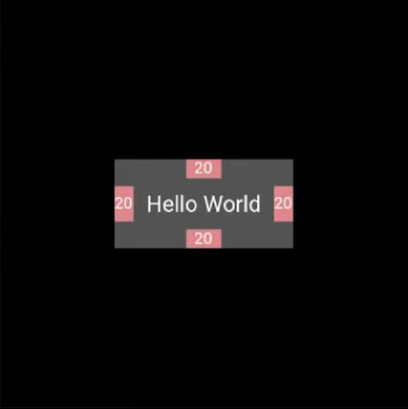

a# How Flutter works?
<a id="top"></a>

## `Contents`  
### [1. Flutter의 세 가지 요소](#1)  
&emsp; [1-1. Widget](#1-1-widget)  
&emsp; [1-2. Element](#1-2-element)  
&emsp; [1-3. RenderObject](#1-3-renderobject)  
### [2. Flutter는 어떻게 상태 변화를 매니징하는가](#2)  
### [3. Widget Parenting](#3)  
### [4. Children이 있는 Widget 업데이트하기](#4)  
### [5. Retrospective](#5)
### [6. References](#6)

---

<br />

<!-- ## Everything is `Widget` -->
## 모든 것이 "`위젯`"  
<!-- ### "A widget is an immutable description of part of a user interface" -->
### "위젯은 유저 인터페이스 중 변하지 않는 일부이다"

<br />

---

<br />

[Back to top](#top)  
## <a id="1"></a>`1. Flutter의 세 가지 요소` 

### 1-1. Widget
  - Element의 configuration을 
  <!-- - Describes the configuration for an Element -->
  <!-- - Holds the configuration that you provide for the UI   -->

### 1-2. Element
  - 위젯의 구현화
  - 트리의 특정한 위치에 위젯을 더함
  - UI의 업데이트, 변화를 매니징 (lifecycle)
  <!-- - Instantiation of a Widget of a particular location in the tree -->
  <!-- - Manages updating, changing UI and controls everything (lifecycle) -->
  <!-- - Holds slot in UI hierarchy, manages reference and tree   -->

### 1-3. RenderObject
  - 레이아웃을 인지하고 UI를 표현
  <!-- - handles size, layout, and painting -->
  <!-- - Knows about the layout and paints the UI -->

<!-- In a nutshell, -->
<!-- Widget | Element | RenderObject -->
<!-- | :---: | :---: | :---: -->
<!-- UI의 Configs | represents an actual piece of the UI | knows about size, layout, painting, and composing -->
<!-- has a public API | holds refs, manages trees | -->


---

### `Example 1`

```dart
Padding( // Widget (configs: padding, child)
  padding: const EdgeInsets.all(20), // RenderObject가 패딩 20을 그림(paint)
  child: RichText(
    text: TextSpan(
      text: 'Hello World',  // RenderObject가 'Hello World'를 그림(paint)
    ),
  ),
);
```

&emsp;&emsp;&emsp;&emsp;&emsp;&emsp;&emsp;&emsp;&emsp; 👇🏼



<br />

### `Padding`
  1. Widget `configure`  
    - 패딩을 얼마나 줄 것인지  
    - 어떤 child를 가질 것인지
<!-- two responsibilities
1 how much pad  
2 what its child is   -->

  2. Elements `manage`  
    - Widget과 RenderObject를 매니징함
<!-- manage the widget and renderObject -->

  3. RenderObject `paint`  
    - RichText를 그리고 패딩을 줌
<!-- - Set its size to child + padding
- Offset the child   -->

<br />
<br />
<br />

### `Example 1`

```dart
  void main() => runApp(
    RichText(
      text: TextSpan(
        text: 'Hello World',
      ),
    ),
  );
```

<!--  takes the widget and put at the top of the tree -->
```dart
  void runApp(Widget app) {
    WidgetsFlutterBinding.ensureInitialized()
    ..attachRootWidget(app) // 위젯을 트리에 insert 함
    ..scheduleWarmUFrame();
  }
```
&emsp;&emsp;&emsp;&emsp;&emsp;&emsp;&emsp;&emsp;&emsp; 👇🏼

Widget | Element | RenderObject
| :---: | :---: | :---:
`RichText`  |  | 

<!-- Flutter Asks Widget to create RenderObjectElement -->
```dart 
  // Flutter가 Widget에게 RenderObjectElement를 만들게끔 요청 (inflate)
  abstract class LeafRenderObjectWidget extends RenderObjectWidget {
    const LeafRenderObjectWidget({ Key key }) : super(key: key);

    @override
    LeafRenderObjectElement createElement() => 
      LeafRenderObjectElement(this);
  }
```
&emsp;&emsp;&emsp;&emsp;&emsp;&emsp;&emsp;&emsp;&emsp; 👇🏼

Widget | Element | RenderObject
| :---: | :---: | :---:
`RichText`  |← `LeafRenderObjectElement` | 

<!-- // Flutter asks Element to create RenderObject -->
<!-- // When it does that, the Widget passes all of the configuration required to paint whatever the widget it is
  // number of text-related properties -->
```dart
  @override
  void mount(Element parent, dynamic newSlot) {
    super.mount(parent, newSlot);
    _renderObject = widget.createRenderObject(this); // Flutter가 Element에게 RenderObject를 만들게끔 요청
    assert(( { _debugUpdateRenderObjectOwner(); return true; }()));
    assert(_slot == newSlot);
    attachRenderObject(newSlot);
    _dirty = false;
  }

  // 위 요청 시, Widget은 위젯을 그리기 위한 모든 configuration을 전달
  @override
  RenderParagraph createRenderObject(BuildContext context) {
    assert(textDirection != null || debugCheckHasDirectionality(context));
    return RenderParagraph(text, // Text 관련 properties 
      textAlign: textAlign,
      textDirection: textDirection ?? Directionality.of(context),
      softWrap: softWrap,
      overflow: overflow,
      textScaleFactor: textScaleFactor,
      maxLInes: maxLines,
      locale: locale ?? Localizations.localeOf(context, nullOk: true),
      );
  }
```
&emsp;&emsp;&emsp;&emsp;&emsp;&emsp;&emsp;&emsp;&emsp; 👇🏼

모든 작업 수행 후 Widget tree

Widget | Element | RenderObject
| :---: | :---: | :---:
`RichText`  |← `LeafRenderObjectElement` →| `RenderParagraph`

<br />

---
[Back to top](#top)  
## <a id="2"></a>`2. Flutter는 어떻게 상태 변화를 매니징하는가`
<!-- ## `2 When things change` -->

아래의 코드를 실행시킨다고 가정해보자. 실제로는 runApp을 두 번 실행하는 경우는 없다.
```dart
  void main() {
    runApp(
      RichText(
        text: TextSpan(
          text: 'Hello World',
        ),
      ),
    );

    runApp(
      RichText(
        text: TextSpan(
          text: 'Hello MeetCoder',
        ),
      ),
    );
  }
```

이미 만들어진 첫번째 Widget tree에 두번째 RichText Widget('Hello MeetCoder')를 통해 상태를 변화 시킬 때 Flutter는 이미 만들어짙 트리에서 다시 사용할 수 있는 것들이 있는 지 찾아본다.

&nbsp; | Widget | Element | RenderObject
|:--: | :---: | :---: | :---:
1 | `RichText`: 'Hello World' |← `LeafRenderObjectElement` →| `RenderParagraph` 'Hello World'
2 | `RichText`: 'Hello MeetCoder' | 

<!-- I've already done with one job to create a tree  
I'm going to replace it and look for what I can re-use for it -->

아래의 코드를 실행시켜 위젯의 재사용 가능 여부를 확인한다.
```dart
  static bool canUpdate(Widget oldWidget, Widget newWidget) {
    return oldWidget.runtimeType == newWidget.runtimeType
      && oldWidget.key == newWidget.key;
  }
```

확인 후, 기존 RichText Widget('Hello World')를 새 RichText Widget('Hello MeetCoder')로 대체한다.
Widget | Element | RenderObject
| :---: | :---: | :---:
`RichText`: 'Hello MeetCoder' |← `LeafRenderObjectElement` →| `RenderParagraph` 'Hello World'

Widget이 변경된 후 LeafRenderObjectElement는 기존에 가리키던 Widget과 새로운 Widget의 configuration이 다를 수 있기 때문에 아래 코드를 실행한다.
<!-- Element lost what it was pointing to, so it needs to do something  
It calls -->
```dart
  @override
  void updateRenderObject(BuildContext context, RenderParagraph renderObject) {
    assert(textDirection != null || debugCheckHasDirectionality(context));
    renderObject
      ..text = text
      ..textAlign = textAlign
      ..textDirection = textDirection ?? Directionality.of(context)
      ..softWrap = softWrap
      ..overflow = overflow
      ..textScaleFactor = textScaleFactor
      ..maxLines = maxLines
      ..locale = locale ?? Localizations.localeOf(context, nullOk: true);
  }
```

updateRenderObject 실행 후의 Widget tree  

Widget | Element | RenderObject
| :---: | :---: | :---:
`RichText`: 'Hello MeetCoder' |← `LeafRenderObjectElement` →| `RenderParagraph` 'Hello MeetCoder'

LeafRenderObjectElement가 새로운 RenderObject를 만드는 것이 아니고 기존에 존재하던 RenderObject의 value들만 업데이트하게 된다.

이렇게 새로운 상태를 업데이트 하는 동안 새로 만들거나 없앤 것이 없기 때문에 Performance에서 이점이 있다.
<!-- Didn't create or destroy during this job -> performance -->

<br />

--- 
[Back to top](#top)  
## <a id="3"></a>`3. Widget Parenting`
```dart
  void main() => runApp(
    Center(
      child: RichText(
        text: TextSpan(
          text: 'Hello World',
        ),
      ),
    ),
  );
```
초기의 Widget tree
Widget | Element | RenderObject
| :---: | :---: | :---:
Center | &nbsp; | &nbsp;
⬇ | &nbsp; | &nbsp;
`RichText`: 'Hello World' | &nbsp; | &nbsp;

<!-- Flutter asks the Widget What's your element -->
Flutter는 Widget들에게 차례대로 기존의 lifecycle을 적용한다.   

- 첫번째 Center Widget의 Element 생성(createElement())

Widget | Element | RenderObject
| :---: | :---: | :---:
Center |← `SingleChildRenderObjectElement` →| &nbsp;
⬇ | &nbsp; | &nbsp;
`RichText`: 'Hello World' | &nbsp; | &nbsp;

- Center Widget의 configuration을 바탕으로 한 RenderObject 생성(createRenderObject())  
- Center Widget 생성 완료

Widget | Element | RenderObject
| :---: | :---: | :---:
Center |← `SingleChildRenderObjectElement` →| `RenderPositionedBox` (knows only where to put the child)
⬇ | &nbsp; | &nbsp;
`RichText`: 'Hello World' | &nbsp; | &nbsp;

- 두번째 RichText Widget의 Element 생성

Widget | Element | RenderObject
| :---: | :---: | :---:
Center |← `SingleChildRenderObjectElement` →| `RenderPositionedBox` (knows only where to put the child)
⬇ | ⬇ | &nbsp;
`RichText`: 'Hello World' |← `LeafRenderObjectElement`| &nbsp;

- RichText Widget의 configuration을 바탕으로 한 RenderObject 생성

Widget | Element | RenderObject
| :---: | :---: | :---:
Center |← `SingleChildRenderObjectElement` →| `RenderPositionedBox` (knows only where to put the child)
⬇ | ⬇ | ⬇
`RichText`: 'Hello World' |← `LeafRenderObjectElement `→| `RenderParagraph`: 'Hello World'

<br />

---
[Back to top](#top)  
## <a id="4"></a>`4. Children이 있는 Widget 업데이트하기`
<!-- `4. Updating widgets with children` -->

```dart
  void main() {
    runApp(
      Center(
        child: RichText(
          text: TextSpan(
            text: 'Hello World',
          ),
        ),
      ),
    ),

    runApp(
      Center(
        child: RichText(
          text: TextSpan(
            text: 'Hello MeetCoder',
          ),
        ),
      ),
    ),
  };
```

Children이 있는 Widget도 위 설명들과 다르지 않다. 요점은 canUpdate를 통해 업데이트 할 수 있는 Widget들은 최대한 재사용하는 것이다.

- 같은 Center Widget & RIchText Widget의 configuration만 업데이트 ('Hello World' > 'Hello MeetCoder')

Widget | Element | RenderObject
| :---: | :---: | :---:
Center |← `SingleChildRenderObjectElement` →| `RenderPositionedBox` (knows only where to put the child)
⬇ | ⬇ | ⬇
`RichText`: 'Hello World' |← `LeafRenderObjectElement` →| `RenderParagraph`: 'Hello World'
Center | &nbsp; | &nbsp;
⬇ | &nbsp; | &nbsp;
`RichText`: 'Hello MeetCoder' | &nbsp; | &nbsp;

- Center Widget 자체는 자신의 child 말고는 다른 정보가 없기 떄문에 나머지 Element, RenderObject는 기존의 state 유지
<!-- Center only have the position, so everything remains the same  -->

Widget | Element | RenderObject
| :---: | :---: | :---:
Center |← `SingleChildRenderObjectElement` →| `RenderPositionedBox` (knows only where to put the child)
⬇ | ⬇ | &nbsp;
`RichText`: 'Hello MeetCoder' |← `LeafRenderObjectElement` →| `RenderParagraph`: 'Hello World'

- 새로운 RichText ('Hello MeetCoder')의 configuration을 바탕으로 한 RenderObject 생성(by updateRenderObject())  

Widget | Element | RenderObject
| :---: | :---: | :---:
Center |← `SingleChildRenderObjectElement` →| `RenderPositionedBox` (knows only where to put the child)
⬇ | ⬇ | ⬇
`RichText`: 'Hello MeetCoder'  |← `LeafRenderObjectElement` →| `RenderParagraph`: 'Hello MeetCoder'


--- 

[Back to top](#top)  
## <a id="5"></a>`5. Retrospective`

Flutter를 이용해서 앱을 개발 해 봐야 겠다는 생각으로 공식 홈페이지에 있는 Tutorial들을 따라 해보고 있었다. 어떻게 개발하는 지에만 치중하다 보니까 코드를 작성하면서도 의문이 끊이지가 않았다. 어떻게 개발하는 지가 아니고 어떻게 작동하는 지 찾아보다가 Flutter 유튜브 공식 채널에 좋은 영상이 있어서 블로그 글로 남겨봤다.   2021년 3월에 Flutter 2.0이 소개 되면서 API에도 많은 변경이 있었던 것 같은데 Flutter의 동작 원리는 변함이 없어서 2019년 영상을 바탕으로 작성했다.

중요한 게 무엇인지 알고는 있지만 어떻게 시작하는 지, 무엇부터 시작해야 하는가에 대해서 접근하는 방법이 아직 익숙하지가 않은 것 같다. 인지 후 실행을 계속 연습하고 또 연습해서 낭비하는 시간을 줄이고 더 생산적이고 능동적으로 코딩하며 살아야겠다!

---

[Back to top](#top)  
## <a id="6"></a>`6. References`
[`How Flutter renders Widgets, Youtube`](https://www.youtube.com/watch?v=996ZgFRENMs)


