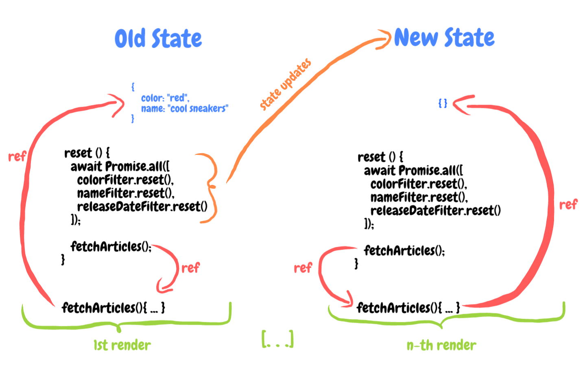

react 프로젝트에서 본격적으로 functional component를 사용한 이후로 처음 맞닥뜨린 이슈는 useState가 비동기로 동작하는 것이었습니다.

setter를 호출한 뒤, 바로 값을 가져다 쓰면 업데이트 되지 않은 값이 참조되는😥 문제인데요...

아마 함수형 컴포넌트를 사용하시는 분이라면 한번쯤 고민해봤을 문제라고 생각합니다!

그리고 저처럼 왜 react는 이걸 비동기로만 쓰게 해놓은거야😡 라며 화내보신 분도 분명.. 분명 한분쯤은 있으리라 생각합니다.

글의 원문은 함수형 컴포넌트에서 useState를 동기식으로 사용하는 방법과, react 팀이 왜 이 기능을 기본 기능으로 추가하지 않는지를 모두 설명해 줍니다!

원문을 참조하시려면 [useStateWithPromise: a custom hook to await state updates of useStat](https://ysfaran.github.io/blog/post/0002-use-state-with-promise/)를 읽어보세요!

## 문제

일반적으로 우리는 상태가 업데이트 될 때 까지 기다린 후, 다음 작업을 해야 되는 문제를 가지고 있습니다. 상태의 업데이트가 비동기적으로 일어나기 때문에 우리는 순차적인 방식으로 코드를 작성할 수 없어요. 예전 리액트 버전은 콜백을 제공해 이 문제를 다루었습니다. 글을 필터링하는 기능을 가진 클래스 컴포넌트를 예로 들어보겠습니다.

```jsx
class FilterSidebar extends React.Component {
  constructor(){
    this.state ={
      filters: {},
      articles: []
    }
  }

  fetchArticles = async () => {
    const fetchedArticles = await API.getArticles(this.state.filters);
    this.setState({articles: fetchedArticles})
  }

  reset = () => {
    this.setState({filters: {}}, this.fetchArticles);
  }

  setColorFilter = (color) =>  {
    this.setState(state => ({filters: {...state.filters, color}));
  }

  // more filters & render ...
}
```

- fetchArticles: filters 로 필터링된 상태를 기반으로 API 서버에서 articles 를 가져옵니다.
- reset : setState 를 통해 모든 filters 를 제거한 후, 콜백으로 fetchArticles 를 실행합니다. 이런 방식으로 실행하면 filters 가 반드시 초기화 된 후 fetchArticles가 실행되는 것을 보장할 수 있습니다.

함수형 컴포넌트는 이를 조금 다르게 구현합니다.

```jsx
const FiltersSidebar = () => {
  const [articles, setArticles] = useState([]);
  const [filters, setFilters] = useState({});

  const fetchArticles = async () => {
    const fetchedArticles = await API.getArticles(filters);
    setArticles(fetchedArticles);
  };

  const reset = () => {
    setFilters({});

    // uuhh, ouhh .. fetchArticles will use old state of "filters"
    fetchArticles();
  };

  const setColorFilter = color => {
    setFilters(currentFilters => ({ ...currentFilters, color }));
  };

  // more filters & return ..
};
```

문제는 useState가 반환하는 setter(위 예시에서는 setFilters, setArticles)가 콜백을 제공하지 않는다는 것입니다😢 우리는 useEffect와 useRef를 사용해 이 문제를 해결할 수 있습니다.

```jsx
const FiltersSidebar = () => {
  const [articles, setArticles] = useState([]);
  const [filters, setFilters] = useState({});
  const resettingRef = useRef(false);

  const fetchArticles = async () => {
    const fetchedArticles = await API.getArticles(filters);
    setArticles(fetchedArticles);
  };

  const reset = () => {
    resettingRef.current = true;
    setFilters({});
  };

  useEffect(() => {
    if (resettingRef.current) {
      resettingRef.current = false;
      fetchArticles();
    }
  }, [filters]);

  // ...
};
```

조금 못생겼지만 동작은 합니다...

그런데 filter의 로직이 더 복잡해져서 우리가 그 로직을 custom hooks으로 분리하고 싶다고 가정해 봅시다. 커스텀 훅의 모습은 아래와 같을 것입니다.

```jsx
const useStringFilter = (initialValue = "") => {
  const [value, setValue] = useState(initialValue);

  // maybe more complex stuff here

  const reset = () => {
    setValue(initialValue);
  };

  return {
    value,
    setValue,
    reset
  };
};

// and filters for other types like useDateFilter etc..
```

그리고 우리 컴포넌트는 이렇게 바뀔 것입니다.

```jsx
const FiltersSidebar = () => {
  const [articles, setArticles] = useState([]);

  const colorFilter = useStringFilter();
  const nameFilter = useStringFilter();
  const releaseDateFilter = useDateFilter();

  const fetchArticles = async () => {
    const filters = {
      color: colorFilter.value,
      name: nameFilter.value,
      releaseDate: releaseDateFilter.value
    };
    const fetchedArticles = await API.getArticles(filters);
    setArticles(fetchedArticles);
  };

  const reset = () => {
    colorFilter.reset(); // will trigger a state update inside of useStringFilter
    nameFilter.reset(); // will trigger a state update inside of useStringFilter
    releaseDateFilter.reset(); // will trigger a state update inside of useDateFilter

    // fetchArticles will use old state of colorFilter, nameFilter and releaseDateFilter
    fetchArticles();
  };

  // ...
};
```

**_이제 무엇을 해야 할까요?_**

useEffect와 useRef를 사용한 방법보다 더 간단하고 명확한 방법은 없습니다. 왜냐하면 우리는 다양한 상태의 업데이트가 이루어질때 까지 기다려야만 하기 때문이죠. 그리고 바로 이것이 우리의 진짜 문제입니다!

## 해결책

커스텀 훅을 이용해 이 문제를 해결할 수 있습니다. 이 훅을 useStateWithPromise 라고 부르겠습니다.

```jsx
const useStateWithPromise = initialState => {
  const [state, setState] = useState(initialState);
  const resolverRef = useRef(null);

  useEffect(() => {
    if (resolverRef.current) {
      resolverRef.current(state);
      resolverRef.current = null;
    }
    /**
     * Since a state update could be triggered with the exact same state again,
     * it's not enough to specify state as the only dependency of this useEffect.
     * That's why resolverRef.current is also a dependency, because it will guarantee,
     * that handleSetState was called in previous render
     */
  }, [resolverRef.current, state]);

  const handleSetState = useCallback(
    stateAction => {
      setState(stateAction);
      return new Promise(resolve => {
        resolverRef.current = resolve;
      });
    },
    [setState]
  );

  return [state, handleSetState];
};
```

이 훅을 완전히 이해하는 것은 중요치 않습니다. 하지만 useStateWithPromise가 무엇을 반환하는지는 반드시 이해해야 합니다. useState와 동일하게 getter와 setter를 반환하지만, 약간의 차이가 있습니다 : setter가 Promise를 반환한다는 것입니다! 그렇다면 setter에 await를 사용할 수 있겠죠!

이제 우리는 기존의 useState 코드를 우리의 커스텀 훅인 useStateWithPromise로 변경해 보겠습니다.

```jsx
const useStringFilter = (initialValue = "") => {
  const [value, setValue] = useStateWithPromise(initialValue);

  const reset = () => {
    // this will return a promise containing the updated state
    return setValue(initialValue);
  };

  return {
    value,
    setValue,
    reset
  };
};
```

그리고 마지막으로 상태 업데이트에 await를 붙여 동기적으로 작동하게 해 보죠.

```jsx
const FiltersSidebar = () => {
  // ...

  const reset = async () => {
    // wait for all state updates to be completed
    await Promise.all([
      colorFilter.reset(),
      nameFilter.reset(),
      releaseDateFilter.reset()
    ]);

    // fetchArticles will STILL use old state of colorFilter, nameFilter and releaseDateFilter
    fetchArticles();
  };

  // ...
};
```

음... 잠시만요... fetchArticles가 여전히 업데이트 되지 않은 상태를 참조합니다.

함수형 컴포넌트가 어떻게 동작하는지를 생각해보면 말이 되긴 합니다.

바닐라 자바스크립트 관점에서 코드를 보면(리액트를 제외하고) reset은 단순히 함수 내부의 함수일 뿐입니다. 따라서 매번 호출이 일어날 때 마다(리액트 용어로는 함수가 렌더될 때 마다) reset은 새로운 레퍼런스를 가진 새로운 함수가 됩니다. Promise.all을 통해 실행한 상태 업데이트를 await로 모두 대기한 후에도, reset은 여전히 기존의 "낡은" fetchArticles의 레퍼런스를 참조하고 있을 것입니다. 당연히 상태 또한 낡은 상태를 참조할 것이고요! 그러나 상태가 업데이트 되면서, 업데이트된 상태를 참조하는 reset과 fetchArticles가 생성될 것입니다.



우리는 resetted라는 상태를 하나 추가해서 이 문제를 해결할 수 잇습니다.

```jsx
const FiltersSidebar = () => {
  // ...
  const [resetted, setResetted] = useState(false);

  useEffect(() => {
    if (resetted) {
      fetchArticles();
      setResetted(false);
    }
  }, [resetted]);

  const reset = async () => {
    await Promise.all([
      colorFilter.reset(),
      nameFilter.reset(),
      releaseDateFilter.reset()
    ]);

    setResetted(true);
  };

  // ...
};
```

이제 setRestted(true)가 컴포넌트 렌더링을 트리거할 것입니다. 그리고 이 경우에는 useEffect 안의 fetchArticles가 최신 상태의 state를 참조한다고 보장할 수 있습니다.

## 해결책?

useStateWithPromise를 구현했을 때 저는 이 방법이 완벽하며, 왜 리액트는 이런 기능을 제공하지 않는지 궁금했습니다. 그런데 시간이 지나고 보니... 왜 리액트에 이런 기능이 포함되지 않는지 알게 되었습니다.

_이런 방식은 일반적인 함수형 컴포넌트의 디자인에 적합하지 않기 때문입니다._

클래스 컴포넌트를 사용할 때는 다양한 mutable references들을 사용했습니다. (예를 들어, this.state는 this.setState를 호출할 때 마다 업데이트된 상태를 참조합니다). 하지만 mutable references를 사용하는 것은 함수형 컴포넌트에서는 안티패턴이 됩니다. 왜냐하면 함수형 컴포넌트를 사용할 때는 가능한 항상 immutable data를 사용해야 하기 때문입니다. 그 이유는 다음과 같습니다.

_mutable references는 사이드 이펙트를 발생시킬 수도 있기 때문입니다!_

만약에 상태가 non-primitive type인 경우. 예전 것을 변경하기 보다는 차라리 새로운 객체를 생성하는 것을 권장합니다.

```jsx
const MyComponent = () => {
  const [immutableData, setImmutableData] = useState({ a: "a", b: "b" });
  let [mutableData, setMutableData] = useState({ a: "a", b: "b" });

  const setNewData = () => {
    // good: new reference!
    setImmutableData({ a: "new a", b: "new b" });

    // bad: same reference!
    mutableData.a = "new a";
    mutableData.b = "new b";
    setMutableData(mutableData);
  };

  useEffect(() => {
    console.log("immutable data changed");
  }, [immutableData]);

  // will never be called because mutableData will always have same reference
  useEffect(() => {
    console.log("mutable data changed");
  }, [mutableData]);

  return (
    <>
      <ChildComponent data={immutableData} />
      {/**
       * changing mutableData without the state setter, (e.g. mutableData.a = "new a")
       * could cause unwanted side effects, because ChildComponent wouldn't be rerendered,
       * so e.g. no useEffect statements inside ChildComponent would be triggered
       */}
      <ChildComponent data={mutableData} />
    </>
  );
};
```

이제 다시 우리의 예제로 돌아가 봅시다.

- 각 상태 업데이트(ex. reset, filter)는 렌더를 발생시킨다.
- 각 렌더는 reset과 fetchArticles에 대한 새로운 레퍼런스를 생성한다.
- 각 fetchArticles 레퍼런스는 각기 다른 immutable state를 가리킨다.
- reset 함수 내부의 await 이후, fetchArticles는 오래된 상태를 사용할 것이다. 왜냐하면 fetchArticles가 오래된 버전이기 때문이다.

즉 문제의 핵심은 우리가 각 렌더 이후에 생성되는 다양한 버전의 fetchArticles를 가지고 있다는 것입니다. 각 fetchArticles는 각기 다른 상태를 가리킵니다. 왜냐하면 함수형 컴포넌트의 상태는 immutable하기 때문입니다.

## 결론

리액트가 이 기능을 함수형 컴포넌트에 추가하지 않는 것에는 이유가 있었습니다. 개발에 여유가 있거나, 아키텍처를 (새로)빌드할 수 있는 능력이 있다면 useStateWithPromise를 꼭 사용해야 하는지에 대해 반드시 고민해봐야 합니다. 저도 이 기능을 프로덕션에 적용한 적이 있습니다. 하지만 그 때는 시간이 없었고, 고객도 코드 리팩토링에 많은 시간을 소비하기 원하지 않았기 때문에 그렇게 했었죠. 다음 프로젝트에서, 저는 이것과 비슷한 문제를 접할 수 있었고 다른 방식으로 문제를 해결했습니다. 예를 들어, 우리 예제의 진짜 문제는 우리가 다양한 훅들 안에 다양한 상태를 가지고 있지만 그것들을 쉽게 리셋하지 못한다는 점이었습니다(우리는 각각의 필터에서 reset을 호출해 주어야 했습니다). 만약 모든 필터 상태가 한 장소에서 관리되었다면, 그것을 리셋하는게 훨씬 쉬웟겠죠. 이런 접근 방법은 초기화 값을 저장해주면 되기 때문에, 사실 상태의 업데이트를 기다릴 필요도 없습니다.

최종 결론 : 만약 정말로 useStateWithPromise같은 동기화 함수를 이용해 상태의 업데이트를 await로 기다려야만 한다면, 당신의 아키텍처가 이상적인 형태가 아니어서 수정이 필요하거나 혹은 당신이 정말 정말 특별한 케이스에 해당하는 것입니다.😉
