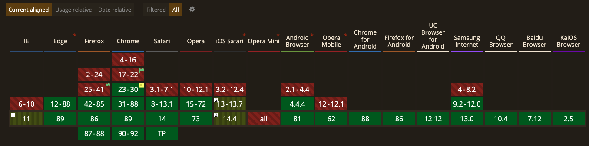
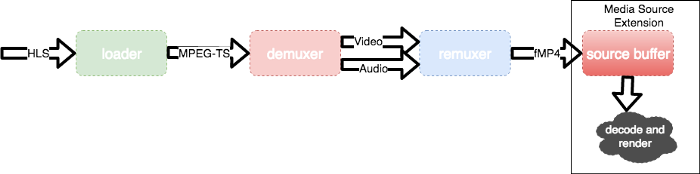

최근에는 라이브 스트리밍 서비스를 쉽게 찾아볼 수 있습니다. 예전부터 조금씩 성장해왔던 즐길거리 위주의 개인방송 뿐만 아니라, 최근에는 라이브 커머스 등 다양한 산업에서 라이브 스트리밍이 이용되고 있어요.

웹에는 이러한 서비스를 위한 다양한 프로토콜이 있습니다. 대표적으로 MPEG-DASH, HLS, MSS, HDS 등이 있는데요. 그 중 HLS 라는 프로토콜은 HTTP에 기반한 만큼 사용이 간편해 대중적으로 사용되고 있습니다. HTTP 기반이라 인기있다니... 뭔가 REST Api가 떠오르네요🙂. 검색해보니 실제로 비슷한 이유로 다른 프로토콜보다 선호되는 경향이 있다고 합니다. HTTP를 사용하기 때문에 다른 프로토콜에 비해 방화벽 설정이 쉽고, 기존 웹 서비스를 위한 인프라를 그대로 사용할 수 있어 인기가 많다고 합니다.

오늘은 웹에서 HLS 클라이언트를 구현하는 hls.js를 소개하고, react-hls-player 모듈을 살펴보며 리액트에서는 hls.js를 어떻게 구현할 수 있는지 함께 알아보았으면 합니다! 사실... 저도 이번 프로젝트에서 처음 본 거라서 이제부터 알아가보려 합니다...🤣

# hls.js

hls.js의 README를 함께 읽어보며 대충 이녀석이 어떤걸 하는지 알아봅시다! 원문의 내용은 [hls.js](https://github.com/video-dev/hls.js/)에서 인용했습니다.

> hls.js is a JavaScript library that implements an HTTP Live Streaming client. It relies on HTML5 video and MediaSource Extensions for playback.

hls.js는 HLS client 구현을 위한 라이브러리이며, video 태그와 MediaSource Extension(MSE)에 의존성이 있네요. MSE는 별도의 플러그인 없이 javascript로만 미디어 스트리밍을 생성하며, video, audio 태그에서 이를 재생할 수 있는 기능들을 제공합니다(참조:[Media Source API, MDN](https://developer.mozilla.org/en-US/docs/Web/API/Media_Source_Extensions_API)). 대부분의 브라우저에서는 MSE를 지원하므로, 사실상 결론은 브라우저 기능만으로 HLS 클라이언트를 구현할 수 있다는 말이네요!

(물론... 항상 그렇듯 모든 브라우저가 제공하지는 않습니다...)

> It works by transmuxing MPEG-2 Transport Stream and AAC/MP3 streams into ISO BMFF (MP4) fragments. Transmuxing is performed asynchronously using a Web Worker when available in the browser. hls.js also supports HLS + fmp4, as announced during WWDC2016.

여러가지 프로토콜명이 나오는데요... 글만 봐서는 잘 이해가 안되네요... 그래서 그림을 찾아왔습니다!

HLS의 서비스 아키텍처 입니다.

이 그림에서 주목할 것은 인코딩된 미디어 데이터를 segmenter가 여러 개의 fragment로 분할해, 웹 서버로 전달한다는 점 입니다. fragment로 분할한다는 내용은 그림에 없지만... 어쨌든 그렇습니다😅. 궁금하신 분들은 [HTTP Live Streaming[HLS]](https://idlecomputer.tistory.com/93)를 참조해 주세요! 저희가 지금 기억해야 하는 부분은 미디어 데이터를 쪼개서 웹 서버로 보낸다는 것입니다. 쪼개서 보내는 이유는 HTTP가 단방향 통신을 하기 때문입니다. 요청,수신,요청,수신 아주 대표적인 특징이죠! 연결이 뚝뚝 끊기기 때문에 데이터도 뚝뚝 잘라서 보내줘야 합니다. 스트리밍 데이터를 그대로 흘리려면 웹소켓을 사용해야 합니다.

다음 그림은 실제로 hls.js가 사용하는 파이프라인 구조입니다.

구조를 잘 보면 HLS 서버가 보내는 스트림 데이터를 loader, demuxer, remuxer를 사용해 MSE가 실행할 수 있는 포맷인 MP4(또는 fmp4)로 변환합니다. HLS의 스트림 데이터는 loader를 거치는 순간 segment단위로 쪼개집니다. 이 그림의 파이프라인은 segment를 기반으로 작동합니다. 그리고 최종적으로는 MSE가 제공하는 버퍼에 저장되고, 차례대로 렌더링됩니다.

위 그림과 다른 특징 중 하나는 이 과정이 브라우저 내에서 일어난다는 점입니다. 덕분에 더 간결한 아키텍처를 가져갈 수 있고, 부하를 분산시킬수도 있습니다.

결론 : _hls.js는 MSE가 바로 재생할 수 없는 HLS 데이터를 받아, 재생 가능한 MP4 fragment로 바꿔준다. 그리고 MSE 버퍼에 있는 데이터를 video 태그에서 실행시킨다!_

# react-hls-player
