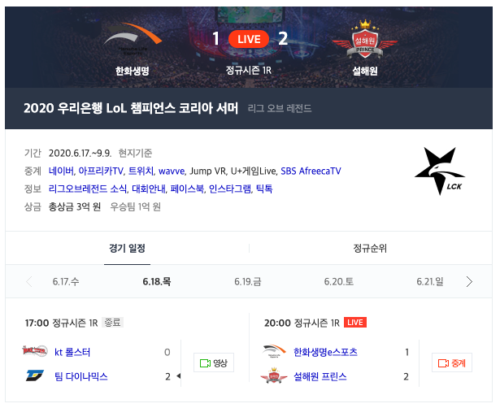
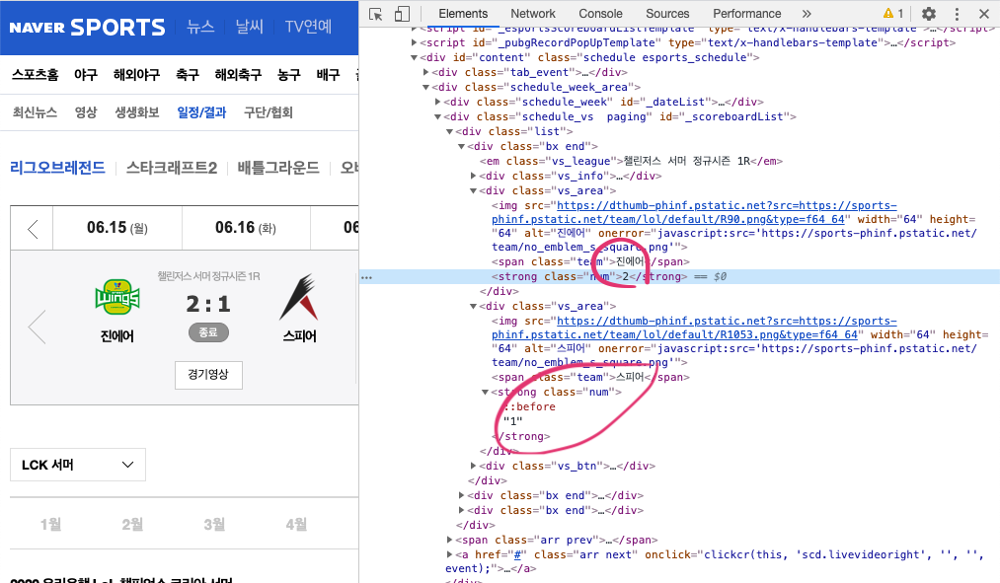
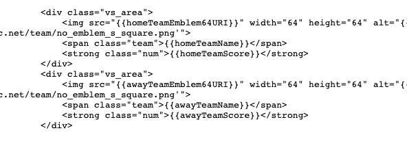
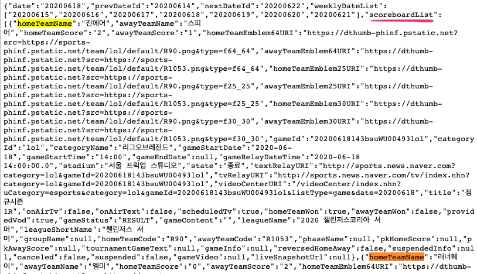
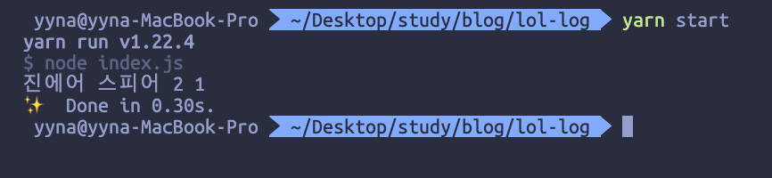
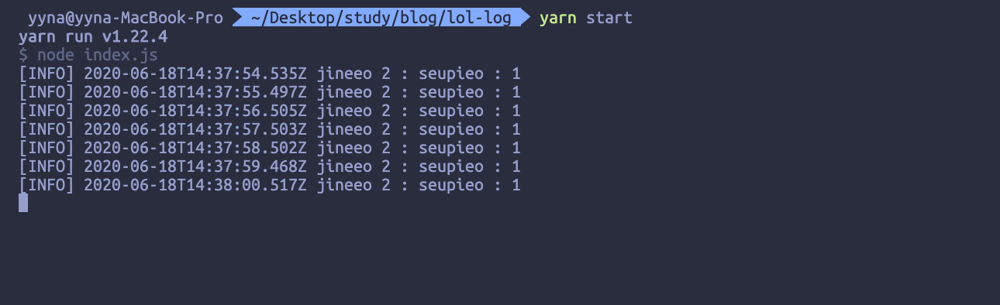
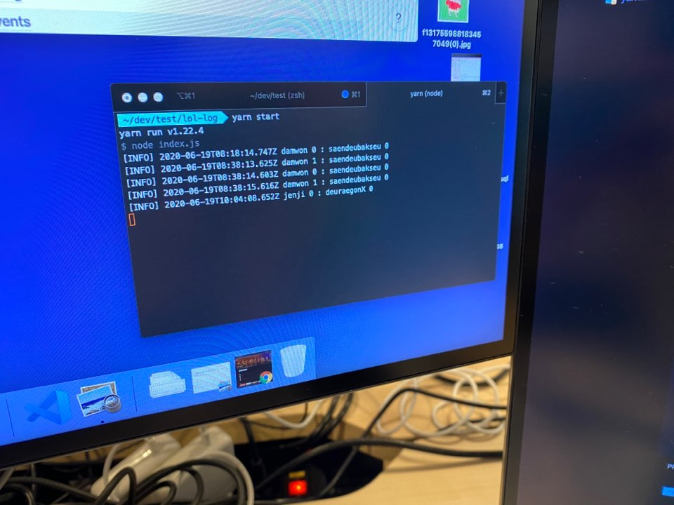

# 회사에서 LCK 스코어 확인하기

어제 LCK 서머가 시작되었는데요. 🐷  
5시부터 경기를 시작하지만 회사에 있을 시간이라 아쉽게도 경기를 볼 수 없습니다. 이어폰 꼽고 몰래 듣기엔 너무 흥미로워서 일이 손에 안잡히기 때문에... 누가 이기나 스코어라도 확인하고자 이 프로그램을 제작하게 되었습니다.

## 어디서 점수 정보를 가져와볼까?



네이버, 아프리카 TV 등 여러 플랫폼에서 경기를 중계해줍니다. 저는 트위치에서 주로 중계를 보지만 네이버가 웹 상에서 스코어를 제공하기 때문에 네이버가 적합할 것으로 판단했습니다.

[Naver Sports - e스포트&게임 - 리그오브레전드](https://sports.news.naver.com/esports/schedule/index.nhn?category=lol)에 가면 오늘 경기의 스코어를 확인할 수 있습니다.

## 어떻게?



위 스크린샷을 보면 element에 스코어와 팀 이름이 들어있는 것 같지만 웹 프론트엔드의 데이터는 주로 DOM이 로드된 후 바꿔지기 되므로 보이는 값을 믿으면 안됩니다. 소스 보기를 통해 스코어 데이터가 어디에 있는지 정확히 확인해야합니다.



확인해보면 역시 원하는 값이 들어있지 않습니다. 아닌 경우도 있지만 대부분 우리가 원하는 값은 script에 있습니다. `homeTeamName` 라는 키워드로 검색을 해보면 아래쪽에 위치한 script 내에 `scoreboardList` 라는 변수에 원하는 값들이 들어있음을 확인할 수 있습니다.



개발자라면 누구나 짝사랑하는 정규표현식💕을 사용해서 해당 값을 가져옵니다.

```javascript
// index.js
const axios = require('axios');

async function fetchScore(url) {
  const { data } = await axios.get(url);
  const regex = /scoreboardModel\: (.*)/;
  const found = data.match(regex);
  const { scoreboardList } = JSON.parse(
    found[1].substring(0, found[1].length - 1)
  );
  const {
    homeTeamName,
    awayTeamName,
    homeTeamScore,
    awayTeamScore,
  } = scoreboardList[0];
  console.log(homeTeamName, awayTeamName, homeTeamScore, awayTeamScore);
}

fetchScore(
  'https://sports.news.naver.com/esports/schedule/index.nhn?category=lol'
);
```

```
node index.js
```



👏👏👏👏 원하는 값이 잘 나옵니다. 하지만 한글이 나오면 의심스럽기 때문에 [hangul-romanization](https://www.npmjs.com/package/hangul-romanization)라는 라이브러리를 통해 한글을 로마자로 표기해줍니다. 그리고 조금 로그처럼 포맷을 바꿔줍니다.



나쁘지 않네요. 하지만 계속 같은 값을 볼 필요는 없겠죠? [lodash](https://www.npmjs.com/package/lodash)의 isEqual 함수를 이용해서 값이 바뀌는 경우에만 로그를 찍도록 해줍니다.



위 사진은 6월 19일 경기의 스코어를 가져오는 모습입니다. 5시 담원과 샌드박스의 경기가 시작되고 5시 38분 쯤 담원이 승리를 따낸 걸로 보입니다. 그리고 다시 0:0 스코어로 찍히는데 데이터 동기화가 제대로 안 된것 같습니다. interval 시간을 좀 늘려도 되겠군요. 담원이 2번째 경기도 승리를 한것 같은데 바로 다음 경기 정보로 넘어가는 바람에 2:0으로 찍히는 부분도 안나오는 문제가 있네요......ㅎㅎㅎㅎ 역시 실제로 실행해보니 수정해야 할 부분이 꽤 있군요.

사실 저희 회사는 자유로운 분위기라서 회사에서 몰래 보려는 목적보단 가끔 스코어만 확인하고 싶은 저의 마음을 담아 간단한 스크립트를 작성해봤는데 재미있네요. 설해원이 한화를 이기다니.... 이상 모든 경기를 처음부터 끝까지 볼 체력이 없는 회사원의 슬픈 코딩이었습니다...

## 전체 코드

```javascript
const axios = require('axios');
const romanization = require('hangul-romanization');
const _ = require('lodash');

let info = {
  homeTeamName: undefined,
  awayTeamName: undefined,
  homeTeamScore: undefined,
  awayTeamScore: undefined,
};

async function fetchScore(url) {
  const { data } = await axios.get(url);
  const regex = /scoreboardModel\: (.*)/;
  const found = data.match(regex);
  const { scoreboardList } = JSON.parse(
    found[1].substring(0, found[1].length - 1)
  );
  const {
    homeTeamName,
    awayTeamName,
    homeTeamScore,
    awayTeamScore,
  } = scoreboardList[0];
  const new_info = {
    homeTeamName,
    awayTeamName,
    homeTeamScore,
    awayTeamScore,
  };

  if (!_.isEqual(info, new_info)) {
    info = new_info;
    logScore(homeTeamName, awayTeamName, homeTeamScore, awayTeamScore);
  }
}

function logScore(homeTeamName, awayTeamName, homeTeamScore, awayTeamScore) {
  const date = new Date();
  const log = `[INFO] ${date.toISOString()} ${romanization.convert(
    homeTeamName
  )} ${homeTeamScore} : ${romanization.convert(
    awayTeamName
  )} : ${awayTeamScore}`;
  console.log(log);
}

setInterval(() => {
  fetchScore(
    'https://sports.news.naver.com/esports/schedule/index.nhn?category=lol'
  );
}, 1000);
```
