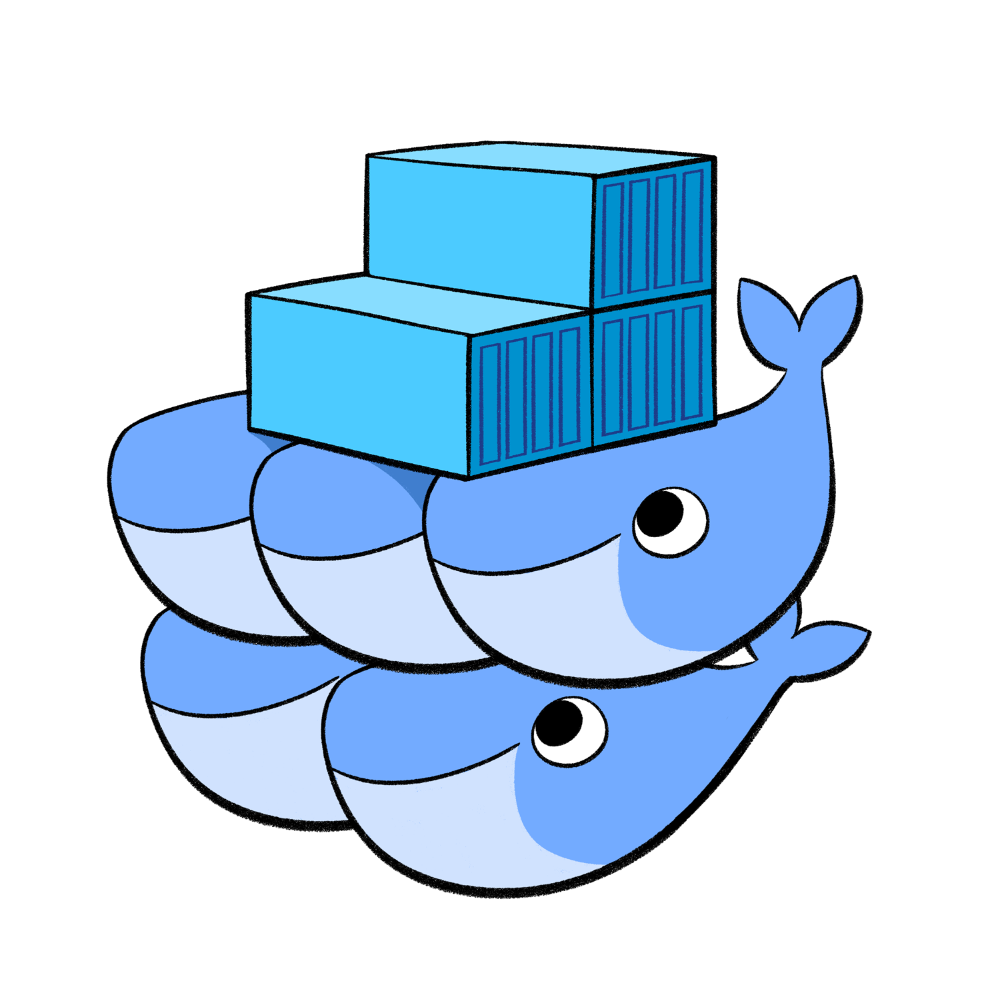
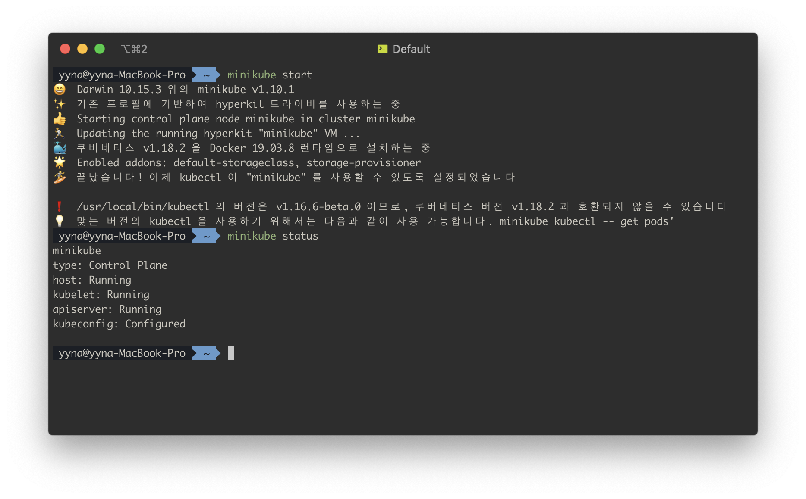
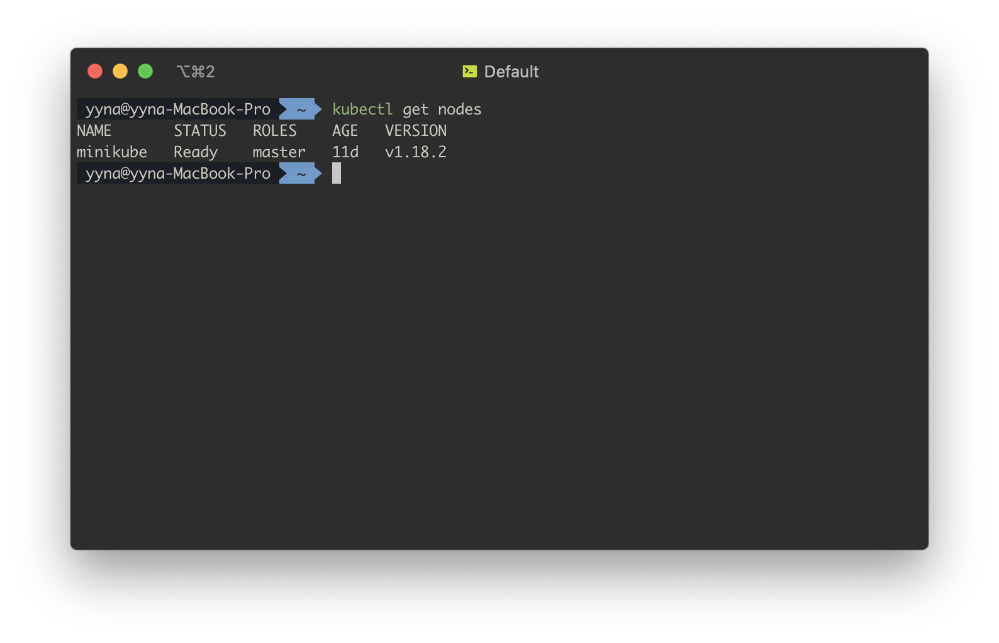

# Kubernetes 큰그림 훑기

## Container Ochestration 이란

여러 컨테이너의 배포 프로세스를 최적화, 자동화하는 것을 컨테이너 오케스트레이션이라고 합니다.
많이 쓰이는 툴 세가지를 소개하자면 다음 3가지가 있습니다.

1. docker swarm
   

   - 쉽지만 Auto scailing 기능이 조금 부족한 편

2. Kubernetes
   

   - 가장 유명함
   - 처음 시작하기엔 어려운 편
   - GCP, Azure, AWS 에서 지원함

3. Mesos
   
   - 처음 시작하기 어렵지만 많은 기능이 있음

## 쿠버네티스로 할 수 있는 것들

하나의 이미지로 1000개의 컨테이너 실행시키기

```
kubectl run --replicas=1000 my-web-server
```

2000개로 늘리기

```
kubectl scale --replicas=2000 my-web-server
```

새로운 이미지로 하나씩 rolling update하기

```
kubectl rolling-update my-web-server --image=my-web-server:2
```

과거 이미지로 하나씩 rollback 하기

```
kubectl rolling-update my-web-server --rollback
```

(물론 완벽한 자동화가 된다면 이런 명령어를 입력할 일도 없어지겠죠? 쿠버네티스로 어떤 것들을 할 수 있는지 참고만 해주시면 될 것 같습니다.)

## 쿠버네티스 아키텍처

위에서 언급한 기능들을 쿠버네티스는 어떻게 해내고 있는지 알아보려면 먼저 쿠버네티스 아키텍처에 대해 이해해야 합니다.

쿠버네티스는 전체 클러스터를 관리하는 마스터와 컨테이너가 배포되는 노드로 구성되어 있습니다. 모든 명령은 마스터의 API 서버를 호출하고 노드는 마스터와 통신하면서 필요한 작업을 수행합니다.


- Node (Minion): Kubernetes가 설치된 물리 또는 가상머신, 컨테이너가 배포될 곳, Worker Node 라고도 한다.
- Cluster: Node 그룹, 한 노드가 죽어도 다른 노드에 접근할 수 있도록 한다. Node가 많으면 로드를 분산할 수 있음, 위 그림이 하나의 클러스터라고 볼 수 있음
- Master: Kubernetest가 설치된 노드 중 하나이나 마스터로 설정된 노드이다. 다른 노드들을 모니터링하고 Worket Node들을 오케스트레이션 하는 일을 담당한다.

## 쿠버네티스를 구성하고 있는 것들

- API 서버: 외부에서 쿠버네티스 기능을 사용하기 위해서 제공된다.
- etcd: key store. 클러스터 관리를 위한 데이터들을 key-value 형태로 저장한다. 마스터 노드들 사이에 충돌이 없도록 lock 을 구현하는 역할을 맡고있다.
- kubelet: 각 노드에서 컨테이너가 제대로 작동하도록 한다.
- Container Runtime: 컨테이너를 실행시키는데 사용되는 프로그램이다. 도커가 여기에 해당한다.
- Controller: 오케스트레이션의 중추 역할을 한다. 노드, 컨테이너 또는 end point가 제대로 작동하지 않는지 확인한다.
- Scheduler: 여러 노드들이 일을 나눠서 하도록 한다.

### Master - Worker 노드


### Pod (파드, 포드)

- 쿠버네티스는 컨테이너를 노드에 직접 배포하지 않고 Pod 라는 쿠버네티스 오브젝트에 감싸서 배포한다.
- 쿠버네티스에서 만들 수 있는 가장 작은 단위이다.
- Pod는 주로 1개의 컨테이너만 가지지만 여러개의 컨테이너를 가지는 경우도 있다. 예를 들면 사용자가 입력한 데이터를 처리한다거나 사용자가 업로드한 파일을 처리하는 Helper 컨테이너가 필요할 경우이다.
- 한 Pod 내의 컨테이너 들은 함게 생성되고 죽는 운명의 공동체이다.

## 로컬에서 사용해보기

- Minikube  
  로컬에서는 Master, Worker 노드를 따로 구성하기가 어렵기 때문에 minikube 라는 Master와 Worker 노드가 합쳐진 형태의 클러스터를 사용합니다.
  

  

  minikube 라는 하나의 node 가 생성되었습니다.
  

- kubectl  
  쿠버네티스 클로스터를 관리하기 위한 명령어 도구입니다. 다음과 같이 사용합니다.

  ```
  kubectl run hello-minikube
  kubectl cluster-info
  kubectl get nodes
  ```

- Pod 배포하기
  다음 명령어로 nginx 이미지로 Pod를 배포할 수 있습니다.
  ```
  kubectl run nginx --image nginx
  ```
