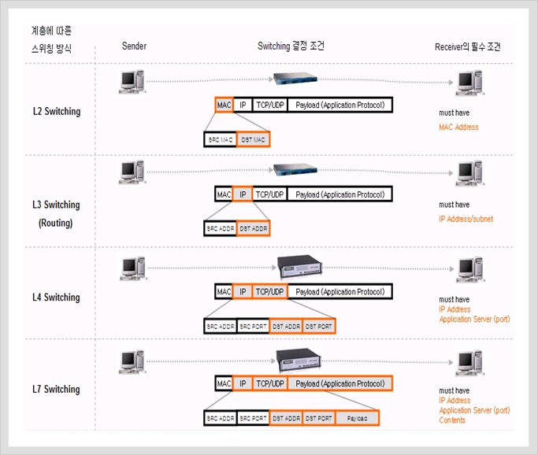
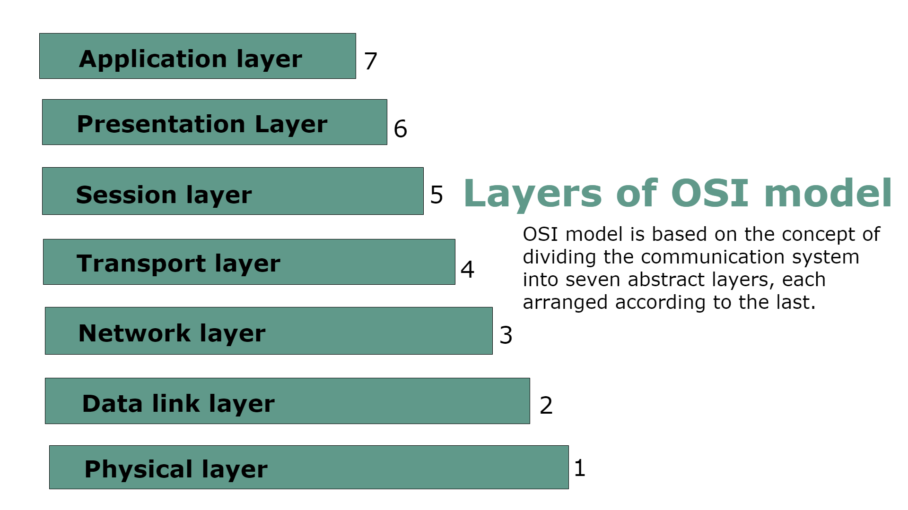

# 로드 밸런싱이란 무엇인가?

## 로드 밸런싱

로드 밸런싱이란 백엔드 서버 그룹에 네트워크 트래픽을 효율적으로 분산시키는 것을 말합니다. 트래픽을 여러 서버에 골고루 분산시켜서 반응 속도를 높여줍니다. 차가 막히는 시간에 교통 체증을 완화해주는 교통경찰의 모습과 비슷합니다.

## 로드 밸런서는 어떻게 작동할까요

### 스위치의 종류 - L4/L7

네트워크를 공부하다보면 OSI 7계층에 대해 많이 듣게되는데요. 네트워크 패킷이 클라이언트와 서버에서 왔다갔다 하는 동안 올바른 도착지에 도달하기 위해 각 계층에서는 이 패킷을 적당한 곳으로 안내해줍니다. 아래 그림을 보면 스위칭에 대해 쉽게 이해할 수 있을 겁니다.

로드밸런서로 많이 사용되는 스위치의 종류로는 L4, L7이 있습니다. 이름에서 알 수 있듯이 L4는 Transport Layer에서 L7은 Application Layer에서 어느 서버로 요청이 전달될 지 결정됩니다.

하나의 포트 번호에 하나의 서버가 매칭되는 경우 L4 스위치를 사용합니다. Transport Layer에서 확인하는 TCP/UDP 패킷 정보만 확인하면 어떤 서버로 요청을 보내야 할 지 판단할 수 있기 때문입니다. AWS CLB(Classic Load Balancer)가 L4 스위치에 해당합니다.

L4 스위치가 서비스 단위 로드밸런싱을 할 수 없다는 단점을 극복하기 위해 포트+데이터 페이로드 패턴을 이용한 L7 스위치를 이용한 로드밸랜서가 등장했습니다. 아래 예시와 같이 URL 기반, 또는 이메일 내용/제목 기반 등 Application Layer에서 데이터를 볼 수 있다는 점을 활용한 스위칭이 가능합니다. AWS ALB(Application Load Balancer)가 L7 스위치에 해당합니다.

두 가지의 로드 밸런서를 각자 상황에 맞게 사용하면 됩니다.

### Proxy 서버

로드 밸런서는 네트워크와 클라이언트 사이에서 중계 역할을 하는 Proxy 서버의 일종입니다. 외부망에서 내부망으로 중계를 해주는 Reverse proxy를 사용합니다.  
예전에는 SSL 인증서를 각 서버마다 붙여줘야 했다면 이젠 Proxy 서버에만 인증서를 붙여줘도 요청을 전달받는 서버와 클라이언트 사이의 요청과 응답이 암호화되는 편리함도 생겨났습니다.

### 로드 밸런싱 알고리즘

위 예시에선 서버가 종류별로 하나씩만 존재했지만 서버의 수는 늘어날 수 있습니다. L7 스위칭 예시에서 `naver.com/book` 으로 요청이 많이 들어온다면 해당 요청을 나눠 받을 서버가 더 필요합니다. 서버 증설 후 두 개의 서버가 `naver.com/book` 으로 들어온 요청을 나눠서 받습니다.  
그렇다면 로드밸랜서는 어떻게 요청을 나눠줄까요? 로드 밸런싱에는 여러 알고리즘이 있습니다.

- Round Robin: 요청이 서버에 순서대로 하나씩 전달됩니다. 서버가 4개 있을 경우, 1 -> 2 -> 3 -> 4 -> 1 -> 2 -> 3 -> 4 이런 식으로 반복됩니다. AWS Classic Load Balancer가 이 방식을 사용합니다.
- Lease Connections: 이름에서 알 수 있듯이 가장 적은 연결 수를 가지고 있는 서버에 요청을 전달합니다. 누가 가장 적은 연결 수를 가지고 있는 지 알고 있어야하기 때문에 컴퓨팅 자원을 소모한다는 단점이 있습니다.
- Least Time: 빠른 응답 속도를 보이고 적은 연결 수를 가지는 서버에 요청을 전달합니다.
- Hash: 사용자가 지정한 key 값을 해싱해서 요청 보낼 서버를 결정합니다.
- IP Hash: 위의 Hash 알고리즘의 한 방식입니다. 클라이언트의 IP 주소에 따라 요청을 서버에 전달합니다.
- Random with Two Choices: 임의로 두 서버를 선정 후 둘 중 더 적은 연결을 가지고 있는 서버에 요청을 전달합니다.

각 알고리즘 마다 장단점이 있으니 각자 상황에 맞게 사용하면 됩니다.

---

참고 링크

- [프록시(Proxy)란 무엇인가](https://milkye.tistory.com/202)
- [What Is Load Balancing?](https://www.nginx.com/resources/glossary/load-balancing/)
- [https://intellipaat.com/community/48047/what-is-the-difference-between-elb-and-alb-in-aws](https://intellipaat.com/community/48047/what-is-the-difference-between-elb-and-alb-in-aws)
